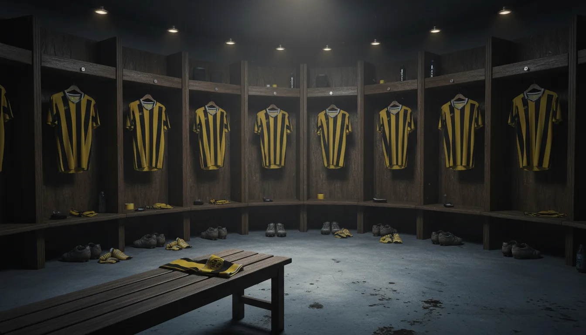

솔직히 저도 **알이티하드 선수 명단**을 처음 검색했을 때 한참 헤맸어요. 어떤 사이트는 벤제마가 9번 주장으로 버젓이 있고, 어떤 사이트는 아예 없고, 캉테도 있다가 없다가 하더라고요. 결론부터 말하면요, **벤제마와 캉테는 이제 알이티하드 선수가 아닙니다.** 2026년 겨울 이적시장에서 둘 다 떠났고, 감독 자리도 지금은 비어 있어요. 오래된 명단을 그대로 둔 사이트가 많아서 혼란스러운 것뿐입니다. 그래서 제가 구단 발표와 최신 이적 뉴스까지 교차 확인해서, 2026년 7월 기준으로 정리해 봤습니다. 이거 한 편 읽으면 다시는 안 헷갈릴 거예요.

📌 3줄 요약
알이티하드는 사우디 프로리그 소속 제다 연고 명문으로, 리그 우승 10회·AFC 챔피언스리그 우승 2회에 빛나는 팀입니다.

2026년 2월 <b>벤제마</b>(알힐랄행)와 <b>캉테</b>(페네르바흐체행)가 떠났고, 그 자리를 <b>엔네시리·디아비·베르흐베인</b> 같은 새 외국인 공격진이 채우고 있습니다.

2025-26 시즌을 5위로 마쳤고, 콘세이상 감독이 6월에 물러나 <b>2026년 7월 현재 감독은 공석</b>입니다.

## 알이티하드, 어떤 팀인지 30초 정리

알이티하드(Al-Ittihad)는 사우디아라비아 서부 항구도시 제다를 연고로 하는 프로축구단입니다. 1927년에 창단해 사우디에서 가장 역사가 오래된 클럽으로 꼽히고, 상징색은 호랑이를 연상시키는 노랑·검정입니다. 홈구장은 킹 압둘라 스포츠 시티인데, 수용 인원은 자료에 따라 62,345석과 66,345석으로 다르게 적혀 있어서 "6만 석급 초대형 구장" 정도로 이해하시면 정확합니다.

성적으로도 명문 소리를 듣는 팀이에요. 사우디 프로리그 우승 10회(1982·1997·1999·2000·2001·2003·2007·2009·2023·2025), AFC 챔피언스리그 우승 2회(2004·2005)를 기록했습니다. 아시아 클럽대항전을 2연패한 몇 안 되는 팀 중 하나죠. 리그·컵·대륙 대회가 어떻게 다른지 헷갈린다면 [축구 트로피 종류 총정리](/soccer-trophy-types/)를 먼저 보면 그림이 잡힙니다.

2023년 여름 사우디 국부펀드(PIF)가 구단 지분을 인수하면서 벤제마·캉테·파비뉴를 한꺼번에 데려온 "빅4 구단" 중 하나가 됐고, 그 멤버로 2024-25 시즌 리그와 킹컵을 동시 석권했습니다. 문제는 그다음 시즌에 팀이 통째로 흔들렸다는 건데, 이건 아래에서 자세히 다룰게요.

## 알이티하드 선수 명단 — 2026년 7월 기준 포지션별 정리

먼저 기준부터 분명히 할게요. 아래 명단은 **2025-26 시즌 종료 직후(2026년 7월) 기준**이고, 등번호·나이는 플래시스코어·사커웨이 등 경기 데이터 사이트의 현재 등록 정보를 따랐습니다. 여름 이적시장이 진행 중이라 개막 전까지 변동이 생길 수 있다는 점은 감안해 주세요. 전체 등록 인원은 30명 안팎(골키퍼 4·수비 8·미드필더 10·공격 10)이라, 여기서는 핵심 선수 위주로 추렸습니다.

| 포지션 | 등번호 | 선수 | 나이 |
|---|---|---|---|
| GK | 1 | 프레드라그 라이코비치 | 30 |
| GK | 50 | 모하메드 알압시 | 23 |
| DF | 4 | 얀카를로 시미치 | 21 |
| DF | 12 | 마리오 미타이 | 22 |
| DF | 13 | 무한나드 알샨키티 | 27 |
| DF | 15 | 하산 카데시 | 33 |
| MF | 2 | 다닐루 페레이라 | 34 |
| MF | 8 | 파비뉴 | 32 |
| MF | 10 | 우셈 아우아르 | 28 |
| MF | 17 | 마하마두 둠비아 | 22 |
| FW | 11 | 살레 알셰흐리 | — |
| FW | 19 | 무사 디아비 | 26 |
| FW | 21 | 유세프 엔네시리 | 29 |
| FW | 34 | 스티븐 베르흐베인 | 28 |

전체 30명 안팎의 풀 명단은 [알이티하드 공식 홈페이지](https://www.ittihadclub.sa/)의 팀 페이지에서 확인할 수 있습니다. 골문은 세르비아 국가대표 출신 **라이코비치**가 지키고, 수비는 알샨키티·카데시 같은 사우디 국내파에 미타이·시미치 같은 젊은 유럽파가 섞인 구성입니다. 중원은 리버풀 출신 **파비뉴**와 포르투갈 대표 출신 **다닐루 페레이라**가 무게를 잡고, **아우아르**가 창의성을 더하는 구조예요. 최전방은 아래에서 따로 보겠습니다.

## 등번호로 보는 핵심 공격진 — 엔네시리·디아비·베르흐베인

지금 알이티하드 공격의 중심은 21번 **엔네시리**(Youssef En-Nesyri)입니다. 모로코 대표 스트라이커로, 2026년 2월 페네르바흐체에서 합류했어요. 캉테가 페네르바흐체로 가는 딜과 맞물린 이적으로 보도됐는데, 벤제마가 빠진 9번 자리의 공백을 사실상 이 선수가 메우고 있습니다. 참고로 모로코는 2026 북중미 월드컵에서도 다크호스로 꼽히는 팀이라, 월드컵 시즌에 주가가 더 오를 선수예요. 월드컵 이야기가 궁금하면 [2026 월드컵 상금과 역대 우승국 정리](/worldcup-2026-prize-money-champions/)도 같이 보세요.

19번 **디아비**(Moussa Diaby)는 2024년 여름 아스턴 빌라에서 온 프랑스 출신 윙어로, 빠른 발과 드리블이 무기입니다. 34번 **베르흐베인**(Steven Bergwijn)은 네덜란드 대표 출신으로 아약스에서 건너왔고요. 여기에 10번 **아우아르**(Houssem Aouar)까지, 유럽 빅리그에서 검증된 2선 자원이 세 명이나 됩니다. 저도 명단을 표로 묶어 보니 확실히 보이더라고요. 벤제마 시대의 "슈퍼스타 원톱" 구조에서, 지금은 20대 중후반 공격진 여러 명이 분담하는 체제로 바뀌었다는 게요.

## 벤제마·캉테는 이제 없다 — 2026년 겨울 대격변

여기서 많이들 헷갈리는데, 사실 저도 올해 초까지 벤제마가 그대로 뛰는 줄 알았거든요. 그런데 2026년 겨울에 팀의 두 축이 한꺼번에 떠났습니다.

**벤제마**(Karim Benzema)는 2026년 2월 초 같은 리그 라이벌 알힐랄로 이적했습니다. 계약 만료를 반년 앞두고 구단이 제시한 재계약 조건이 사실상 "이미지 수익만 받고 무급으로 뛰라"는 수준이었다는 보도가 나왔고, 벤제마 측이 이를 모욕적으로 받아들이면서 결별했어요. 알이티하드에서 남긴 기록은 외신 집계 기준 83경기 54골 17도움. 발롱도르 수상자다운 숫자를 남기고 떠난 셈입니다.

**캉테**(N'Golo Kanté)는 2026년 2월 4일 튀르키예 페네르바흐체로 이적했습니다. 서류 제출 문제로 딜이 한 번 엎어질 뻔한 우여곡절 끝에 성사됐고, 이 과정에서 엔네시리가 반대 방향으로 합류했어요. 캉테는 2024-25 리그·킹컵 더블의 주역이었던 만큼, 팬 입장에선 아쉬운 이별이었죠.

⚠️ 오래된 명단 주의
지금도 검색 상위에 벤제마 9번·캉테 7번이 적힌 명단이 그대로 노출됩니다. <b>2026년 2월 이전 자료라면 최신이 아닙니다.</b> 명단을 볼 땐 시즌 표기(2025-26인지)와 갱신 날짜부터 확인하세요.

## 감독은 지금 공석 — 콘세이상 사임과 5위 추락

2025-26 시즌의 알이티하드는 한마디로 격랑이었습니다. 시즌 도중 로랑 블랑 감독이 물러나고 세르지우 콘세이상 감독이 부임했지만, 리그 우승 경쟁에서 호날두의 알나스르에 승점 30점 이상(외신 집계 기준) 뒤진 **최종 5위**(18팀 중)로 시즌을 마쳤어요. 디펜딩 챔피언이 챔피언스리그 출전권 경쟁에서도 밀린 거라 충격이 컸습니다.

결국 2026년 6월 초, 구단과 콘세이상 감독은 상호 합의로 계약을 끝냈습니다. 원래 계약은 2028년 6월까지였는데 2년이나 앞당겨 헤어진 거예요. 그래서 **2026년 7월 현재 감독석은 공석**이고, 새 시즌 개막 전까지 신임 감독 선임이 구단의 최대 과제입니다. 벤제마·캉테 이탈에 감독 공백까지 겹친 만큼, 다음 시즌 알이티하드는 사실상 "리빌딩 시즌 1년차"라고 보는 게 맞습니다.

## 왜 사이트마다 명단이 다를까 — 확인 요령

앞에서 잠깐 말했지만, 알이티하드처럼 이적이 잦은 팀은 사이트마다 명단이 제각각입니다. 이유는 단순해요. 통계 사이트는 시즌 단위로 페이지를 만들기 때문에 2023-24 명단이 아직 검색에 걸리고, 겨울 이적시장 변동을 늦게 반영하는 곳도 많거든요.

💡 최신 명단 확인 3단계
① 페이지의 <b>시즌 표기</b>가 2025-26 이후인지 확인 → ② <b>벤제마·캉테가 없는지</b> 확인(있으면 옛 자료) → ③ 최종 확인은 <a href="https://www.ittihadclub.sa/" target="_blank" rel="noopener">알이티하드 공식 홈페이지</a>의 팀 명단으로 하면 확실합니다.

특히 여름 이적시장이 열려 있는 지금 같은 시기엔 오늘 맞던 명단이 다음 주에 달라질 수 있습니다. 이 글도 2026년 7월 초 기준이라는 점을 다시 한번 밝혀 둘게요.

## 한눈에 정리 — 알이티하드 팀 프로필

표로 묶어보면 이렇습니다.

| 항목 | 내용 |
|---|---|
| 정식 명칭 | 알이티하드 클럽 (Al-Ittihad Club) |
| 연고지 | 사우디아라비아 제다 |
| 창단 | 1927년 |
| 소속 리그 | 사우디 프로리그 |
| 홈구장 | 킹 압둘라 스포츠 시티 (6만 석급) |
| 리그 우승 | 10회 (최근 2024-25) |
| AFC 챔피언스리그 | 2회 (2004·2005) |
| 2025-26 성적 | 리그 5위 |
| 감독 | 공석 (2026년 7월 기준) |
| 주요 선수 | 엔네시리·디아비·베르흐베인·파비뉴·아우아르 |

## 2026-27 시즌 관전 포인트

새 시즌 알이티하드를 지켜볼 포인트는 세 가지입니다. 첫째, **신임 감독이 누구냐**입니다. 리빌딩의 방향 자체가 감독 선임에 달려 있어요. 둘째, **엔네시리-디아비-베르흐베인 조합의 파괴력**입니다. 개인 능력은 검증됐지만 함께 뛴 시간이 짧아서, 손발이 맞기 시작하면 리그 판도를 흔들 수 있습니다. 셋째, **알나스르·알힐랄과의 격차 줄이기**죠. 특히 벤제마가 알힐랄 유니폼을 입고 친정을 상대하는 경기는 다음 시즌 사우디 리그 최고의 흥행 카드가 될 겁니다.

리그 재개 후 첫 상대로는 경기 데이터 사이트 기준 8월 중순 알 나즈마전이 잡혀 있습니다(일정은 변동될 수 있어요). 중계로 사우디 리그를 챙겨보신 분들이라면, 다음 시즌 알이티하드는 "몰락한 명문의 반등 스토리"라는 관점으로 보면 훨씬 재미있을 거예요.

## 자주 묻는 질문 (FAQ)

**Q. 벤제마는 아직 알이티하드 소속인가요?** 아닙니다. 2026년 2월 알힐랄로 이적했고, 계약은 2027년 여름까지로 알려져 있습니다. 알이티하드 통산 기록은 83경기 54골 17도움입니다.

**Q. 캉테는 어디로 갔나요?** 2026년 2월 4일 튀르키예 페네르바흐체로 이적했습니다. 이 딜과 맞물려 엔네시리가 알이티하드로 합류했습니다.

**Q. 알이티하드 감독은 지금 누구인가요?** 2026년 7월 기준 공석입니다. 세르지우 콘세이상 감독이 6월 초 상호 합의로 물러났고, 신임 감독 선임을 기다리는 상황입니다.

**Q. 알이티하드 홈구장은 어디인가요?** 제다의 킹 압둘라 스포츠 시티입니다. 수용 인원은 자료에 따라 약 6만 2천~6만 6천 석으로 표기됩니다.

---

마지막으로 이거 하나만 기억하면 돼요. **지금의 알이티하드 명단에 벤제마와 캉테는 없고, 엔네시리·디아비·베르흐베인이 새 얼굴이며, 감독은 공석이다.** 이 세 가지만 알고 있으면 어떤 사이트의 명단을 보든 최신인지 아닌지 바로 가려낼 수 있습니다. 사우디 리그의 다른 이야기가 궁금하다면 [축구 트로피 종류 총정리](/soccer-trophy-types/)도 이어서 읽어 보세요.

**관련 키워드** — #알이티하드 #알이티하드선수명단 #알이티하드스쿼드 #알이티하드등번호 #알이티하드감독 #사우디프로리그 #엔네시리 #무사디아비 #베르흐베인 #파비뉴 #사우디축구
