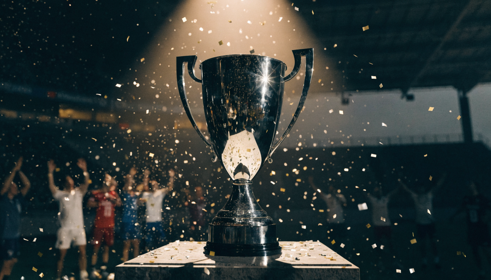

결론부터 말하면요, 챔피언스리그는 **유럽 각국 리그의 상위 팀 36개가 모여 유럽 최강 클럽을 가리는 UEFA 주관 대회**입니다. 매년 9월에 시작해 이듬해 5월 말 결승 한 판으로 끝나요. 저도 예전의 "조별리그 32팀" 상식으로 최근 대회를 보다가 순위표가 낯설어서 한참 헤맸는데, 2024-25시즌부터 방식이 완전히 바뀌었더라고요. 그래서 새 방식 기준으로 대회 구조·일정·역대 우승팀을 처음 보는 분 눈높이로 정리했습니다.

📌 3줄 요약
챔피언스리그는 36팀이 단일 순위표에서 8경기를 치르는 리그 페이즈로 시작해, 토너먼트를 거쳐 5월 말 단판 결승으로 우승팀을 가립니다.

리그 페이즈 1~8위는 16강 직행, 9~24위는 플레이오프, 25위 아래는 그대로 탈락입니다.

역대 최다 우승은 레알 마드리드 15회, 최신 우승팀은 2연패에 성공한 PSG입니다.

## 챔피언스리그란 어떤 대회인가요?

챔피언스리그(UCL)는 유럽축구연맹 UEFA가 주관하는 유럽 클럽 대항전의 최고봉입니다. 1955년 유러피언컵이라는 이름으로 시작해 1992년 지금의 챔피언스리그로 개편됐고, EPL·라리가 같은 각국 리그를 평정한 팀들이 "그래서 유럽에서 누가 제일 세냐"를 가리는 무대죠. 우승팀에게는 손잡이가 큰 은색 트로피, 이른바 **빅 이어**가 주어집니다.

축구 팬들이 챔피언스리그를 꿈의 무대라고 부르는 이유는 단순해요. 리그에서는 만날 수 없는 조합이 여기서만 성사되기 때문입니다. 잉글랜드 챔피언과 스페인 챔피언이 맞붙는 경기는 리그 일정엔 존재하지 않으니까요. 여기에 걸린 돈도 유럽 최대 규모입니다. 2024-25시즌 기준 총상금이 약 24억 유로로 발표됐을 정도라, 각국 리그 우승 상금과는 단위가 다릅니다. 리그 상금 구조가 궁금하면 [프리미어리그 우승 상금 총정리](/epl-prize-money/)와 비교해 보는 것도 재미있어요.

## 어떤 팀이 챔피언스리그에 출전하나요?

출전권은 기본적으로 **직전 시즌 자국 리그 성적**으로 정해집니다. UEFA 리그 랭킹이 높은 잉글랜드·스페인·독일·이탈리아 같은 리그는 상위 4팀 안팎이 나가고, 랭킹이 낮은 리그는 우승팀만 예선부터 밟아 올라옵니다. 2024-25시즌부터 본선이 32팀에서 36팀으로 늘었고, 늘어난 자리는 직전 시즌 유럽 대항전 성적이 좋았던 리그 등에 추가로 배분돼요.

그래서 "우리 리그 몇 위까지 챔스 티켓인가"가 매 시즌 유럽 축구 최대 관심사 중 하나가 됩니다. 디펜딩 챔피언은 자동 출전권을 받고요. 손흥민이 뛰던 시절의 토트넘처럼 리그 4위 싸움이 시즌 마지막 날까지 이어지는 것도 결국 이 티켓 때문입니다.

## 대회 방식 — 리그 페이즈는 어떻게 진행되나요?

2024-25시즌부터 조별리그가 사라지고 **리그 페이즈**가 도입됐습니다. 여기서 많이들 헷갈리는데, 제가 표로 묶어보면 이렇습니다.

| 구분 | 옛 방식 (조별리그) | 새 방식 (리그 페이즈) |
| --- | --- | --- |
| 참가팀 | 32팀 — 4팀씩 8개 조 | 36팀이 단일 순위표 |
| 경기 수 | 팀당 6경기 (같은 조 3팀과 홈·원정) | 팀당 8경기 (서로 다른 8팀과 1번씩) |
| 상대 결정 | 조 추첨 | 4개 포트에서 2팀씩 추첨 |
| 다음 단계 | 조 1·2위 16강 | 1~8위 직행, 9~24위 플레이오프 |

핵심만 기억하면 돼요. 36팀이 한 순위표에 있고, 각 팀은 추첨으로 정해진 서로 다른 8팀과 홈 4경기·원정 4경기를 치릅니다. 조 편성이 없으니 강팀끼리도 리그 페이즈에서 얼마든지 만나고, 매 라운드가 사실상 빅매치가 될 수 있는 구조입니다.

## 16강부터 결승까지 — 토너먼트는 어떻게 올라가나요?

**1~8위는 16강 직행, 9~24위는 2월에 홈·원정 플레이오프, 25위 아래는 탈락**입니다. 플레이오프에서는 나머지 16강 티켓 8장을 나눠 갖습니다.

저도 챔스에서 떨어지면 유로파리그로 내려가서 계속 뛰는 줄 알았거든요. 예전엔 실제로 그랬는데, 2025-26시즌부터 이 이동 제도가 폐지됐습니다. 이제 챔피언스리그에서 탈락하면 그 시즌 유럽 무대는 그걸로 끝이에요. 16강부터는 우리가 아는 토너먼트입니다. 16강·8강·4강은 홈·원정 두 경기 합산으로 승자를 가리고, 결승만 중립 경기장에서 단판으로 치러집니다.

## 시즌 일정은 어떻게 되나요?

챔피언스리그 시즌은 9월에 시작해 이듬해 5월 말 결승으로 끝납니다. 2025-26시즌 실제 일정 기준으로 단계별 시기는 이렇습니다.

| 단계 | 시기 |
| --- | --- |
| 리그 페이즈 8라운드 | 9월 중순 ~ 1월 말 |
| 녹아웃 플레이오프 | 2월 중하순 |
| 16강 | 3월 |
| 8강 | 4월 |
| 4강 | 4월 말 ~ 5월 초 |
| 결승 (중립 구장 단판) | 5월 말 |

경기는 주로 화·수요일 저녁(유럽 기준)에 열립니다. 한국에서는 새벽 3~5시대 킥오프가 많아서, 저는 빅매치만 골라 새벽 알람을 맞추고 나머지는 하이라이트로 따라가는 편이에요. 2025-26 결승은 5월 30일 부다페스트 푸슈카시 아레나에서 열렸고, 매 시즌 결승 개최지는 UEFA가 미리 지정합니다. 시즌별 세부 일정은 [UEFA 챔피언스리그 공식](https://www.uefa.com/uefachampionsleague/) 페이지에서 확인할 수 있어요.

## 역대 우승팀 — 최다 우승은 어느 팀인가요?

최다 우승은 **레알 마드리드**로, 통산 15회 우승입니다. 2위권과 격차가 커서 당분간 바뀌기 어려운 기록이에요.

| 순위 | 팀 | 우승 횟수 |
| --- | --- | --- |
| 1 | 레알 마드리드 | 15회 |
| 2 | AC 밀란 | 7회 |
| 3 | 바이에른 뮌헨 | 6회 |
| 3 | 리버풀 | 6회 |
| 5 | 바르셀로나 | 5회 |

최근 흐름도 표로 보면 판세가 읽힙니다.

| 시즌 | 우승팀 | 결승 상대 · 결과 |
| --- | --- | --- |
| 2021-22 | 레알 마드리드 | 리버풀 1-0 |
| 2022-23 | 맨체스터 시티 | 인터 밀란 1-0 |
| 2023-24 | 레알 마드리드 | 도르트문트 2-0 |
| 2024-25 | PSG | 인터 밀란 5-0 |
| 2025-26 | PSG | 아스날 1-1, 승부차기 4-3 |

## 2025-26 시즌이 특별했던 이유는 뭔가요?

PSG가 아스날과의 부다페스트 결승에서 1-1 접전 끝에 승부차기로 이기며 **2연패**를 달성했습니다. 챔피언스리그 체제에서 2연속 우승은 레알 마드리드에 이어 두 번째일 만큼 드문 기록이에요. 더 극적인 건 여정입니다. PSG는 리그 페이즈를 11위로 마쳐 16강 직행에 실패했고, 2월 플레이오프부터 험로를 뚫고 올라와 우승까지 갔습니다. 반대로 리그 페이즈 1위였던 아스날은 결승에서 승부차기 실축으로 준우승에 그쳤죠. "리그 페이즈 순위가 곧 우승 순위는 아니다"를 제대로 보여준 시즌이었습니다.

한국 팬에게도 의미가 큰 시즌이었어요. PSG 소속 이강인이 한국 선수 최초로 챔피언스리그 2회 우승 기록을 세웠거든요. 두 결승 모두 출전 기회가 없었던 건 본인에게 아쉬움으로 남겠지만, 국내외 보도 기준 아시아 선수의 챔스 2연패 자체가 최초로 꼽히는 기록입니다.

## 챔피언스리그 중계는 어디서 보나요?

2026년 기준 국내에서는 **SPOTV**가 챔피언스리그를 중계합니다. 스포티비 나우 구독으로 온라인 시청이 가능하고, EPL·라리가를 트는 쿠팡플레이와는 플랫폼이 달라요. 한국시간으로 새벽 경기가 대부분이라 본방이 부담되면 아침 재방송·하이라이트 편성을 활용하는 것도 방법입니다. 리그별 중계 플랫폼 전체 구도는 [해외축구 중계 보는 법](/how-to-watch-overseas-football/)에 묶어뒀으니 같이 보면 편해요.

💡 입문 시청 팁
36팀 경기를 다 챙길 필요는 없습니다. 리그 페이즈에서는 상위권 맞대결과 응원팀 경기만, 토너먼트부터 본격적으로 보면 흐름을 놓치지 않아요.

## 자주 묻는 질문

**Q. 챔피언스리그와 유로파리그는 뭐가 다른가요?** 둘 다 UEFA 주관 유럽 대항전인데 급이 다릅니다. 챔피언스리그가 각국 리그 상위권 팀들의 1군 대회, 유로파리그가 그다음 순위 팀들이 나가는 2군 격 대회예요. 2025-26시즌부터는 챔스에서 탈락해도 유로파리그로 이동할 수 없습니다.

**Q. 챔피언스리그 리그 페이즈에서 몇 위까지 16강에 가나요?** 1~8위는 16강에 직행하고, 9~24위는 홈·원정 플레이오프를 거쳐 8팀이 추가로 올라갑니다. 25위 이하는 탈락입니다.

**Q. 챔피언스리그 역대 최다 우승팀은 어디인가요?** 레알 마드리드가 통산 15회로 압도적 1위입니다. AC 밀란이 7회, 바이에른 뮌헨과 리버풀이 6회로 뒤를 잇습니다.

**Q. 챔피언스리그 경기는 한국시간으로 몇 시에 하나요?** 리그 페이즈와 토너먼트 대부분이 한국시간 새벽 3~5시대에 킥오프합니다. 화·수요일 새벽에 열린다고 기억하면 편합니다.

**Q. 이강인은 챔피언스리그에서 우승한 적이 있나요?** 네, PSG 소속으로 2024-25와 2025-26 두 시즌 연속 우승했습니다. 한국 선수가 이 대회에서 2회 우승한 것은 이강인이 처음입니다.

## 마무리 — 이거 하나만 기억하면 돼요

챔피언스리그는 **36팀 리그 페이즈 8경기 → 상위 24팀 토너먼트 → 5월 말 단판 결승**, 이 세 마디로 정리됩니다. 여기에 레알 마드리드 15회라는 최다 우승 기록과 PSG의 2연패라는 최신 흐름까지 알았다면 입문 준비는 끝이에요. 새벽 중계 챙기는 법이 고민이라면 [해외축구 중계 보는 법](/how-to-watch-overseas-football/)에서 플랫폼별 요금까지 확인해 보세요.

---

**관련 키워드** — #챔피언스리그란 #챔피언스리그방식 #리그페이즈 #챔피언스리그일정 #챔피언스리그우승팀 #챔스최다우승 #빅이어 #챔스중계 #챔피언스리그출전권 #UCL #챔스결승
