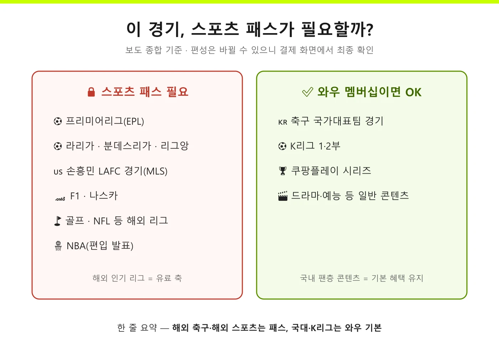

솔직히 저도 **쿠팡플레이 스포츠 패스** 요금을 검색할 때마다 헷갈렸어요. 어떤 글은 월 1만 원, 어떤 글은 9,900원, 뉴스는 또 12,400원이라고 하니까요. 결론부터 말하면요, **셋 다 맞는 숫자입니다. 시점이 다를 뿐이에요.** 스포츠 패스는 2025년 6월에 나와서 딱 1년 만에 가격이 한 번 올랐고, 그래서 언제 쓴 글이냐에 따라 숫자가 다 다른 겁니다. 제가 출시부터 인상까지 보도를 시간순으로 다 맞춰서, 2026년 7월 현재 기준으로 요금·가입법·패스 없이 볼 수 있는 경기까지 한 편에 정리했습니다.

📌 3줄 요약
2026년 6월 1일부터 신규 가입 기준 <b>와우 회원 월 12,400원, 일반 회원 월 19,300원</b>입니다. 인상 전에 가입한 <b>기존 구독자는 이전 요금 그대로 동결</b>됩니다.

패스가 필요한 건 <b>EPL·라리가·분데스리가·손흥민 LAFC 경기·F1 같은 해외 리그</b>이고, <b>축구 국가대표 경기와 K리그는 와우 멤버십만으로</b> 볼 수 있습니다.

월 단위로 언제든 해지할 수 있어서, 보는 리그의 시즌에 맞춰 끊어 쓰는 게 가장 경제적입니다.

## 스포츠 패스가 뭐길래 — 1분 정리

쿠팡플레이 스포츠 패스는 쿠팡플레이 안의 **스포츠 전용 추가 구독권**입니다. 쿠팡플레이가 프리미어리그 독점(보도 기준 연간 중계권료 약 700억 원)을 비롯해 51개 리그·대회를 쓸어 담으면서, 해외 인기 스포츠를 별도 유료 패스로 묶었어요. 티빙(18개)·스포티비(31개)보다 많은 대회 수라 국내 OTT 중 스포츠 커버리지는 가장 넓다는 평가를 받습니다(2026년 5월 보도 기준).

구조를 이해하는 핵심은 이겁니다. **쿠팡은 스포츠를 와우 멤버십의 "미끼 혜택"에서 "독자 수익원"으로 바꾸는 중**이라는 것. 그래서 국내 팬층 콘텐츠(국대·K리그)는 기본 혜택에 남기고, 해외 리그는 패스 뒤로 옮긴 겁니다. 이 방향을 알면 앞으로 어떤 경기가 유료로 갈지도 대충 보입니다.

## 2026년 7월 현재 요금 — 얼마 내야 하나

여기서 많이들 헷갈리는데, 표로 묶어보면 이렇습니다.

| 구분 | 월 요금 (신규 기준) | 비고 |
|---|---|---|
| 와우 회원 | 12,400원 | 와우 멤버십(월 7,890원) 별도 |
| 일반 회원 | 19,300원 | 와우 없이 단독 가입 |
| 기존 가입자 | 인상 전 요금 동결 | 와우 9,900원·일반 16,600원 유지 |

와우 회원이 패스까지 쓰면 실부담은 합쳐서 월 2만 원 안팎(7,890+12,400원)입니다. 주의할 점은 **동결 혜택은 구독을 유지해야 이어진다**는 것 — 해지했다가 다시 가입하면 인상된 요금이 적용될 수 있으니, 인상 전 요금으로 쓰고 계신 분은 해지 전에 한 번 더 생각하세요.

## 요금이 검색마다 다른 이유 — 1년 연대기

제가 보도를 시간순으로 맞춰 보니 혼란의 정체가 이렇더라고요.

| 시점 | 사건 | 요금 |
|---|---|---|
| 2025년 3월 | EPL 독점 계약 발표 | "와우 회원이면 시청" 발표 |
| 2025년 6월 15일 | 스포츠 패스 도입 | 와우 회원 월 1만 원 안팎(초기 보도) |
| 2025년 8월 | 일반 회원 요금제 출시 (보도 기준) | 일반 16,600원 · 와우 9,900원 |
| 2026년 6월 1일 | 첫 인상 (신규만) | 일반 19,300원 · 와우 12,400원 |

즉 "와우면 공짜"였던 발표가 석 달 만에 유료 패스로 바뀌었고, 1년 뒤 최대 25% 인상까지 이어진 겁니다. 옛 글의 9,900원·1만 원은 틀린 게 아니라 **그 시점의 가격**이에요. 인상 배경으로는 치솟는 중계권료 부담이 꼽히고([뉴시스 보도](https://www.newsis.com/view/NISX20260512_0003626314) 기준 최대 25% 인상), "이번 달까지 결제하면 기존가"라는 기사들이 5월에 쏟아졌던 이유도 이 인상 때문이었습니다.

## 패스가 필요한 경기 vs 와우로 충분한 경기

보도 종합 기준으로 나누면 위 그림과 같습니다. **해외 리그는 패스, 국내·국대는 와우 기본**이 큰 원칙이에요. 손흥민 선수의 LAFC 경기(MLS)도 스포츠 패스 대상으로 중계된 사례가 확인됩니다. 반대로 축구 국가대표팀 경기, K리그 1·2부, 쿠팡플레이 시리즈는 패스 없이 와우 멤버십만으로 볼 수 있고요.

다만 편성은 계약에 따라 계속 바뀝니다. 대회별 상태도 층위가 달라요. EPL·라리가·분데스리가는 이미 패스 안에서 중계 중이고, NBA는 2025년 보도에서 "편입 예정"으로 발표된 단계이며, F1·나스카·골프·NFL은 일반 요금제 출시 때부터 패키지에 포함된 것으로 안내됐습니다. 그래서 **내가 보려는 특정 경기가 쿠팡플레이 스포츠 패스 대상인지는 결제 전에 앱의 경기 페이지에서 최종 확인**하는 게 정확합니다. 리그별 국내 중계 지도가 궁금하다면 [해외축구 중계 보는 법 총정리](/how-to-watch-overseas-football/)와 같이 보면 전체 그림이 잡힙니다.

## 쿠팡플레이 스포츠 패스 가입 방법 — 3분이면 끝

가입은 간단합니다. ① 쿠팡플레이 앱(또는 웹) 로그인 → ② 스포츠 탭에서 패스 대상 경기를 누르면 가입 안내가 뜸 → ③ 요금 확인 후 결제. 와우 회원은 할인가가 자동 적용되고, 일반 회원은 단독 요금으로 가입됩니다. 해지는 계정 설정의 구독 관리에서 언제든 가능하고 월 단위 정산이라, EPL 시즌(8월~5월)만 쓰고 여름 휴식기엔 쉬는 식의 운용도 됩니다.

한 가지 짚어 둘 시나리오가 있어요. **인상 전 요금으로 쓰던 사람이 해지 후 다시 가입하면 어떻게 되느냐**인데, 보도에는 "신규 가입자에게 인상가 적용"이라고만 돼 있어서 재가입이 신규로 취급될 가능성이 있습니다. 동결 요금을 지키고 싶다면 해지 전에 고객센터에서 재가입 시 요금을 확인해 보는 걸 추천합니다.

💡 구독료 아끼는 3가지 요령
① <b>시즌 오프엔 해지</b> — 6~7월 유럽 축구 휴식기엔 볼 게 줄어듭니다(단, 인상 전 요금 동결자는 해지 시 혜택 소멸 가능성 주의). ② <b>일반 회원이라면 와우 가입 먼저 계산</b> — 와우(7,890원)+패스(12,400원)=20,290원으로 일반 단독(19,300원)과 큰 차이가 없는데 로켓배송 혜택이 따라옵니다. ③ <b>하이라이트로 충분한 경기는 무료 요약</b> — 공식 유튜브 하이라이트는 계속 무료입니다.

## 아쉬운 점도 있다 — 가입 전 알아둘 것

균형을 위해 짚어 둘게요. 첫째, 1년 만의 25% 인상이라 **추가 인상 가능성을 배제하기 어렵습니다**(기존 가입자 동결이 그래서 더 의미 있어요). 둘째, 패스를 사도 **모든 스포츠가 다 있는 건 아닙니다.** 세리에A와 UEFA 챔피언스리그는 2026년 상반기 중계권 기준 SPOTV 쪽이라, 챔스까지 챙기려면 구독이 이원화됩니다. 셋째, 스포츠 패스는 쿠팡플레이 일반 콘텐츠(드라마·영화)와 별개 축이라, 스포츠를 안 보는 달엔 순수하게 노는 돈이 됩니다. 이런 구조라 "내가 실제로 보는 경기가 뭔지"부터 따져보고 가입하는 게 정답이에요.

## 한눈에 정리

| 항목 | 내용 (2026년 7월 기준) |
|---|---|
| 요금(신규) | 와우 12,400원 · 일반 19,300원 |
| 기존 가입자 | 인상 전 요금 동결 (유지 시) |
| 패스 필요 | EPL·라리가·분데스·MLS(손흥민)·F1·골프 등 해외 리그 |
| 와우 기본 | 국가대표 경기·K리그·쿠팡플레이 시리즈 |
| 미포함 | 세리에A·챔피언스리그(SPOTV) |
| 해지 | 월 단위, 언제든 가능 |

## 자주 묻는 질문 (FAQ)

**Q. 쿠팡플레이 스포츠 패스 가격은 얼마인가요?** 2026년 6월 1일 이후 신규 가입 기준 와우 회원 월 12,400원, 일반 회원 월 19,300원입니다. 인상 전 가입자는 이전 요금(9,900원·16,600원)이 동결 적용됩니다.

**Q. 와우 회원인데 EPL 보려면 돈을 더 내야 하나요?** 네. EPL을 비롯한 해외 리그는 스포츠 패스 가입이 필요합니다. 와우 멤버십만으로는 국가대표 경기·K리그·쿠팡플레이 시리즈까지 볼 수 있습니다.

**Q. 손흥민 경기는 스포츠 패스로 보나요?** 네. 손흥민 선수가 뛰는 LAFC의 MLS 경기가 스포츠 패스 대상으로 중계된 사례가 보도로 확인됩니다. 특정 경기의 편성 여부는 앱에서 최종 확인하세요.

**Q. 스포츠 패스만 가입하고 와우는 안 해도 되나요?** 됩니다. 일반 회원 단독 요금(월 19,300원)이 있습니다. 다만 와우+패스 조합(약 20,290원)과 차이가 크지 않아, 로켓배송을 쓴다면 와우 결합이 대체로 유리합니다.

---

마지막으로 이거 하나만 기억하면 돼요. **해외 축구는 패스, 국대·K리그는 와우 — 그리고 지금 요금은 와우 12,400원·일반 19,300원(기존 가입자 동결)이다.** 검색에서 다른 숫자를 보면 그 글이 언제 쓰였는지부터 확인하면 됩니다. 어떤 리그를 어디서 보는지 전체 지도는 [해외축구 중계 보는 법 총정리](/how-to-watch-overseas-football/)에서 이어집니다.

**관련 키워드** — #쿠팡플레이스포츠패스 #스포츠패스가격 #쿠팡플레이요금 #EPL중계 #쿠팡플레이EPL #손흥민경기중계 #스포츠패스가입 #스포츠패스해지 #와우멤버십 #해외축구중계 #쿠팡플레이인상
