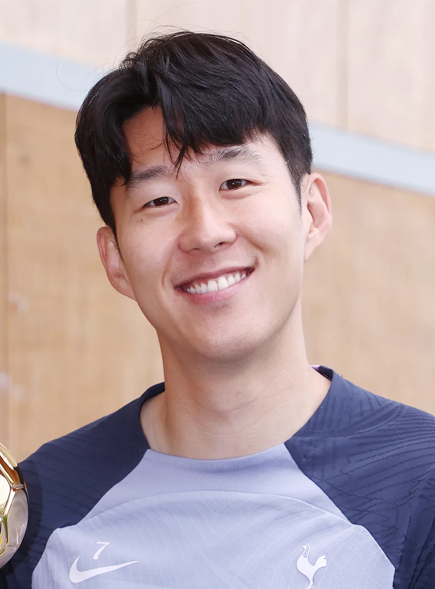

솔직히 저도 얼마 전에 한참 헤맸어요. **해외축구 중계 보는 법**을 찾다가 예전처럼 스포티비를 틀었는데 프리미어리그가 없더라고요. 알고 보니 최근 몇 년 사이 중계권이 통째로 이동했던 겁니다. 결론부터 말하면요, **2026년 현재 EPL·라리가·분데스리가는 쿠팡플레이, 세리에A와 챔피언스리그는 SPOTV**에서 봅니다. 여기에 손흥민 선수가 뛰는 MLS까지 합치면 경우의 수가 꽤 복잡해져서, 제가 리그별로 어디서 어떻게 보는지 표로 싹 정리해 봤습니다. 이거 한 편 읽으면 "이 경기 어디서 하지?" 검색은 오늘로 끝입니다.

📌 3줄 요약
<b>EPL·라리가·분데스리가·리그앙</b>은 쿠팡플레이가 국내 중계를 맡고 있습니다. EPL은 2025-26 시즌부터 6년 독점입니다.

<b>세리에A와 UEFA 챔피언스리그</b>는 SPOTV(스포티비 나우·스포티비 프라임)에서 봅니다.

<b>손흥민의 MLS(LAFC) 경기</b>는 쿠팡플레이·SPOTV 프라임·애플TV MLS 시즌 패스에서 볼 수 있고, "무료 중계 사이트"는 도박 광고와 보안 위험 때문에 피하는 게 안전합니다.

## 결론부터 — 2026년 리그별 중계 채널 한눈에

여기서 많이들 헷갈리는데, 리그마다 중계사가 다르고 최근에 대이동까지 있었습니다. 2026년 7월 기준으로 표로 묶어보면 이렇습니다.

| 대회 | 보는 곳 | 비고 |
|---|---|---|
| 프리미어리그(EPL) | 쿠팡플레이 | 2025-26 시즌부터 독점 |
| 라리가 | 쿠팡플레이 | 2023년부터 |
| 분데스리가 | 쿠팡플레이 | 2024년부터 |
| 세리에A | SPOTV(스포티비 나우) | OTT+TV 채널 병행 |
| UEFA 챔피언스리그 | SPOTV | 플레이오프 포함 |
| MLS(손흥민 LAFC) | 쿠팡플레이·SPOTV 프라임·애플TV | 아래 상세 |
| K리그1 | 쿠팡플레이(OTT)·지상파·스포츠채널 | 병행 중계 |

이 구도는 시즌마다 계약에 따라 바뀔 수 있어서, 큰 경기 전에 각 플랫폼 편성표를 한 번 확인하는 습관이 안전합니다. 그래도 큰 틀은 "잉글랜드·스페인·독일은 쿠팡, 이탈리아·챔스는 스포티비"로 기억하면 됩니다.

## 쿠팡플레이 — EPL 독점 시대가 열렸다

가장 큰 변화가 이겁니다. 쿠팡플레이가 2025-26 시즌부터 **프리미어리그 전 경기를 6년간 국내 독점 중계**합니다. 보도된 중계권료가 총 4,200억 원(연 700억 원) 규모라, 국내 스포츠 중계권 역사에서도 손꼽히는 계약이에요. 저도 이 숫자를 처음 보고 "이제 EPL은 한동안 쿠팡에 뿌리내리겠구나" 싶었습니다. 계약 발표 당시 기준으로는 잉글랜드 축구 패키지(EFL 챔피언십·FA컵·리그컵·커뮤니티 실드)와 라리가·분데스리가·리그앙까지 쿠팡플레이가 함께 중계하는 것으로 알려졌습니다.

요금은 주의할 부분이 있어요. **계약 발표 시점(2025년 3월) 보도로는 로켓와우 멤버십(당시 월 7,890원)이면 추가 비용 없이 시청 가능**하다고 했는데, 2026년 들어 일부 종목·경기에 별도 "스포츠 패스" 가입이 필요하다는 보도가 나오고 있습니다. 즉 "와우만 있으면 다 본다"가 지금도 유효한지는 경기·종목에 따라 다를 수 있으니, 결제 전에 쿠팡플레이 앱의 안내를 꼭 확인하세요. 경기 일정 자체는 [프리미어리그 공식 홈페이지](https://www.premierleague.com/)에서 보는 게 가장 정확합니다.

💡 왜 스포티비에서 EPL이 사라졌나
EPL은 원래 SPOTV 계열에서 중계했지만, <b>2025-26 시즌부터 중계권이 쿠팡플레이로 넘어갔습니다.</b> 옛 글이나 커뮤니티 답변엔 "스포티비에서 보라"는 정보가 아직 많이 남아 있는데, 지금 기준으론 틀린 정보입니다. 중계권은 이렇게 몇 년 주기로 이동하니 글의 작성 시점을 꼭 확인하세요.

## SPOTV — 세리에A와 챔피언스리그는 여기

이탈리아 세리에A와 UEFA 챔피언스리그는 SPOTV가 중계합니다. 보는 방법이 두 갈래인데, 모바일·PC로 보려면 OTT인 **스포티비 나우**(SPOTV NOW)를 구독하면 되고, TV로 보고 싶으면 IPTV(KT·SK브로드밴드·LG유플러스)나 케이블에 들어 있는 **스포티비 프라임** 채널을 이용하면 됩니다. 스포티비 나우는 요금제가 여러 단계로 나뉘어 있고 2026년 7월 기준 월 1만~2만 원대에서 형성돼 있으니(정확한 금액은 공식 앱 기준 확인), 챔스 경기가 몰리는 시기에만 끊어서 구독하는 것도 방법이에요.

챔피언스리그는 플레이오프부터 결승까지 SPOTV가 커버하는 것으로 안내되고 있습니다. 유럽 대항전 트로피 체계가 헷갈린다면 [축구 트로피 종류 총정리](/soccer-trophy-types/)에서 리그·컵·대륙 대회 구조를 한 번 잡고 보면 중계 편성도 훨씬 눈에 잘 들어옵니다.

## 손흥민 경기는 어디서 보나 — MLS 시청법

2025년 여름 손흥민 선수가 LAFC로 이적하면서 "손흥민 경기 어디서 보냐"가 해외축구 검색의 새 단골이 됐습니다. 제가 직접 확인해 보니 선택지가 세 갈래더라고요.

*▲ 손흥민 — 사진 ⓒ Ujishadow, CC BY-SA 4.0 (Wikimedia Commons)*

첫째, **쿠팡플레이**입니다. 2026년 4월 손흥민의 LAFC 경기가 쿠팡플레이에서 한국어 해설로 중계된 사례가 보도됐고, 스포츠 패스 가입이 필요한 것으로 안내됐습니다. 둘째, **SPOTV 프라임**도 LAFC 경기를 중계해 온 것으로 알려져 있습니다. 셋째, 글로벌 정식 경로인 [애플TV MLS 시즌 패스](https://tv.apple.com/kr/channel/mls-season-pass/tvs.sbd.7000)예요. MLS 전 경기를 다 볼 수 있는 리그 공식 OTT로, 해외 기준 월 14.99달러부터입니다. 정리하면 "손흥민 경기만 골라 보고 싶다"면 국내 플랫폼 편성표를 먼저 확인하고, "MLS 전 경기를 다 보고 싶다"면 애플TV 시즌 패스가 정공법입니다.

## 합법적으로 무료로 볼 수 있는 것들

무료 시청이 아예 없는 건 아닙니다. 다만 범위가 정해져 있어요. 우선 각 플랫폼과 리그·구단의 **공식 유튜브 하이라이트**는 무료입니다. 골 장면과 요약본은 경기 종료 후 빠르게 올라오죠. 국가대표 A매치 같은 국민 관심 경기는 **지상파**가 중계하는 경우가 많고요. 그리고 OTT들이 수시로 여는 **무료 체험 프로모션**(신규 가입 무료 기간 등)을 활용하면 빅매치 주간만 합법적으로 공짜 시청이 가능합니다. 프로모션 조건은 수시로 바뀌니 가입 화면에서 확인하는 게 정확합니다.

## "무료 중계 사이트"의 함정 — 이래서 피하라고 합니다

솔직하게 짚고 갈게요. "해외축구 중계"를 검색하면 상위에 정체불명의 무료 중계 사이트가 잔뜩 뜹니다. 검색 결과에 뜨는 곳들의 소개 화면만 봐도 스포츠 중계 옆에 카지노·슬롯·홀덤 같은 도박성 메뉴가 함께 붙어 있는 경우가 많아요. 스스로 "합법 운영"이라고 주장하는 곳도 있지만, 정식 중계권 보유 여부를 이용자가 검증할 방법이 없습니다.

⚠️ 무료 중계 사이트의 3가지 위험
① <b>도박 광고 노출</b> — 상당수가 베팅·카지노 사이트로 연결되는 구조입니다. ② <b>보안 위험</b> — 팝업·다운로드 유도를 통한 악성코드 감염 사례가 꾸준히 보고됩니다. ③ <b>저작권 문제</b> — 무허가 스트리밍은 저작권 침해로 사이트가 수시로 차단·폐쇄돼 화질도 시청 안정성도 보장되지 않습니다.

한 달 커피 두 잔 값이면 정식 플랫폼에서 풀HD로 안정적으로 볼 수 있는 시대라, 굳이 위험을 감수할 이유가 없다는 게 제 결론입니다.

## 새벽 경기, 조금 편하게 보는 팁

유럽 축구는 시차 때문에 한국 시간으로 주말 밤부터 새벽 사이에 몰립니다. EPL 기준 이른 경기가 밤 9~11시대, 빅매치는 자정 넘어 새벽 1~2시대에 시작하는 패턴이 많아요. 저는 이렇게 봅니다. 생중계를 고집할 경기(응원팀·빅매치)만 골라 알람을 맞추고, 나머지는 다음 날 아침 **다시보기·하이라이트**로 소화하는 거죠. 쿠팡플레이·스포티비 나우 모두 다시보기를 지원하니까, 스포일러만 피하면 새벽잠을 지키면서도 시즌 전체를 따라갈 수 있습니다. 참고로 사우디 리그처럼 시차가 적은 리그는 저녁 시간대에 볼 수 있는 것도 매력인데, 사우디 리그가 궁금하다면 [알이티하드 선수 명단 총정리](/al-ittihad-squad/)부터 읽어 보세요.

## 뭘 구독해야 하나 — 상황별 선택 가이드

표로 묶어보면 이렇습니다.

| 이런 분이라면 | 추천 조합 |
|---|---|
| EPL(손흥민 옛 소속 리그) 중심 | 쿠팡플레이 하나로 충분 |
| 챔스·세리에A까지 챙김 | 쿠팡플레이 + 스포티비 나우 |
| 손흥민 LAFC 경기 위주 | 국내 편성(쿠팡·SPOTV) 확인, 전 경기는 애플TV 시즌 패스 |
| 하이라이트만 봐도 만족 | 공식 유튜브 무료 |

두 개를 다 구독하면 월 3만 원 안팎이 들 수 있으니, 자기가 실제로 보는 리그가 뭔지 한 시즌 지출을 먼저 따져 보고 고르는 걸 추천합니다.

## 자주 묻는 질문 (FAQ)

**Q. EPL을 무료로 볼 수 있는 방법이 있나요?** 정식 무료 생중계는 없습니다. 공식 유튜브 하이라이트, OTT 무료 체험 기간 활용이 합법적인 무료 시청의 전부이며, 무허가 중계 사이트는 도박 광고·보안 위험 때문에 피하는 게 안전합니다.

**Q. 스포티비에서 EPL이 왜 안 나오나요?** 중계권이 2025-26 시즌부터 쿠팡플레이로 이동했기 때문입니다. 세리에A와 챔피언스리그는 여전히 SPOTV에서 중계합니다.

**Q. 손흥민 경기는 어디서 보나요?** 쿠팡플레이와 SPOTV 프라임의 편성에서 LAFC 경기를 확인할 수 있고, MLS 전 경기를 보려면 애플TV의 MLS 시즌 패스를 구독하면 됩니다.

**Q. 챔피언스리그는 어디서 보나요?** SPOTV(스포티비 나우·스포티비 프라임)에서 봅니다. 플레이오프부터 본선까지 커버하는 것으로 안내되고 있습니다.

## 이미지 출처

- 대표 이미지 — 경기장 TV 중계 카메라, 사진 ⓒ Sam Szapucki, CC BY 2.0 (Wikimedia Commons)
- 본문 이미지 — 손흥민, 사진 ⓒ Ujishadow, CC BY-SA 4.0 (Wikimedia Commons)

---

마지막으로 이거 하나만 기억하면 돼요. **잉글랜드·스페인·독일 축구는 쿠팡플레이, 이탈리아와 챔피언스리그는 SPOTV, 손흥민의 MLS는 편성 확인 후 시청.** 이 세 줄이 2026년 해외축구 중계 보는 법의 전부입니다. 중계권은 몇 년마다 이동하니, 시즌이 바뀔 때 이 구도가 유지되는지만 다시 확인하면 됩니다.

**관련 키워드** — #해외축구중계 #해외축구중계보는법 #EPL중계 #쿠팡플레이EPL #라리가중계 #분데스리가중계 #세리에A중계 #챔피언스리그중계 #손흥민중계 #MLS중계 #스포티비나우
