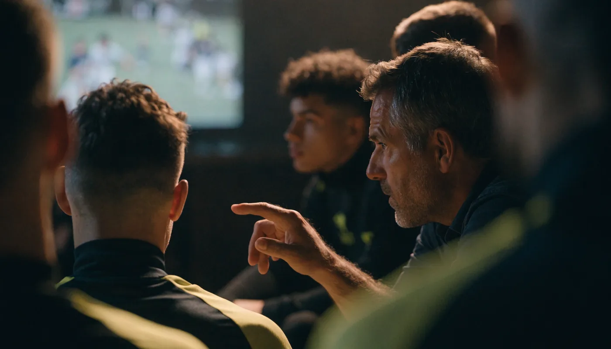

**김기동 감독 전술**을 검색하면 "유연하다", "임기응변의 달인" 같은 평가만 돌아다니고, 그 유연함이 구체적으로 뭘 어떻게 한다는 건지 설명해주는 글은 찾기 어렵죠. 저도 처음 찾아볼 때 "갓기동"이라는 별명과 칭찬만 잔뜩 보고 정작 원리는 못 건졌거든요. 결론부터 말하면요, 김기동 축구는 **단단한 플랜A를 깔아두고, 상대와 경기 흐름에 맞춰 대형과 역할을 경기 중에 다시 쓰는** 축구입니다. 그 플랜A가 4-2-3-1과 전방 압박이고요. 그래서 "유연한 재해석"이라는 말이 붙어요. 선수 시절 철인 기록부터 포항의 언더독 신화, 2025년 커리어 최악이라던 6위에서 2026년 선두 질주까지, 이 감독의 축구를 한 편으로 묶었습니다.

📌 3줄 요약
김기동 전술의 뼈대는 <b>4-2-3-1 기반 전방 압박과 높은 라인</b>입니다. 여기까지는 고정이고, 그 위의 대형·역할은 상대에 맞춰 계속 바뀝니다.

강점은 <b>경기 중 수정 능력</b>입니다. 교체 카드와 대형 변화로 흐름을 바꾸는 능력은 국내 감독 중 최고 수준이라는 평가를 받아요.

FC서울 3년 차인 2026시즌, 지난해 6위 부진을 씻고 <b>리그 선두</b>를 달리는 중입니다(7월 초 기준). 최신 순위는 구단 공식 사이트 확인이 정확합니다.

## 김기동 감독은 어떤 감독인가요?

**K리그 역사에 남은 철인 선수가 그대로 벤치로 옮겨온 케이스입니다.** 선수 김기동은 1993년 유공에서 데뷔해 부천과 포항을 거치며 마흔 살까지 뛰었고, 2011년 10월 K리그 필드 플레이어 최초로 통산 500경기 출장을 달성했습니다. 최종 기록은 통산 501경기, 그리고 39세 5개월의 최고령 득점 기록. "철인"이라는 별명이 괜히 붙은 게 아니에요.

지도자로는 2016년 포항 수석코치로 합류해 2019년 4월 감독으로 승격했고, 2023년 12월 14일 FC서울 감독으로 선임됐습니다. 화려한 스타 플레이어 출신이라기보다는 성실함으로 커리어를 쌓은 선수였고, 감독으로서도 자원이 부족한 팀에서 성과를 짜내는 데 강한 유형입니다.

여기서 많이들 헷갈리는데, 김기동의 "유연함"은 철학이 없다는 뜻이 아닙니다. 전방 압박과 높은 라인이라는 기본 틀은 어느 팀에서든 유지해요. 바뀌는 건 그 틀을 실행하는 대형과 선수 역할입니다. 이게 이 글의 핵심 문장이에요.

## 포항에서 뭘 이뤘나요?

**돈 없는 팀으로 아시아 결승까지 간 게 포항 시절의 요약입니다.** 김기동의 포항은 매 시즌 주력을 팔면서도 상위권을 유지했고, 특히 2021년 AFC 챔피언스리그에서는 얇은 스쿼드로 상대 약점을 물고 늘어지는 맞춤 전술을 앞세워 결승까지 올라갔습니다. 준우승이었지만 언더독 운영의 교과서 같은 여정이었어요.

| 시즌 | 성과 |
| --- | --- |
| 2019.4 | 포항 감독 취임(수석코치에서 승격) |
| 2020 | K리그1 감독상 수상 |
| 2021 | AFC 챔피언스리그 준우승(언더독 결승행) |
| 2023 | 코리아컵(FA컵) 우승 + 리그 상위권 |
| 2023.12 | FC서울 15대 감독 선임 |

이 시기에 굳어진 평가가 "전술의 폭이 넓고 유동적이며, 교체 선수를 활용한 경기 중 전술 변화는 국내 감독 중 최고 수준"이라는 것입니다. 자원이 부족하니 상대를 분석해 매 경기 답을 다시 쓰는 수밖에 없었고, 그 생존술이 그대로 무기가 된 셈이에요.

## 김기동 전술의 핵심 — 유연한 재해석이란 뭔가요?

**플랜A는 하나, 답안지는 매 경기 새로 쓴다는 뜻입니다.** 기본 틀은 4-2-3-1 포메이션을 중심으로 전방에서부터 강하게 압박하고 라인을 높게 유지하는 축구예요. 그래서 김기동의 팀은 상대가 누구든 무기력하게 내려앉아 수비만 하는 경기가 잘 안 나옵니다.

유연함은 그 위에서 작동합니다. 상대 스타팅 라인업, 선수단 컨디션, 심지어 날씨까지 고려해 경기마다 대형과 역할을 조정하고, 경기 중에도 흐름이 나쁘면 교체와 함께 대형을 통째로 바꿉니다. 하나의 포메이션을 고집하지 않고 위기 상황에서 망설임 없이 과감하게 손대는 게 이 감독의 진가라는 평가가 많아요.

제가 자료를 훑으며 흥미로웠던 건, 이게 이론가의 축구가 아니라 **501경기를 뛴 선수의 축구**라는 점입니다. 경기장 안에서 흐름이 어떻게 넘어가는지를 몸으로 아는 사람이라, 수정 타이밍이 빠르고 구체적입니다. "축구는 보는 관점에 따라 달라진다, 무엇이 옳다고 말할 수 없다"는 본인 말이 이 스타일을 그대로 요약해요.

## 전술 미팅부터 다르다는 게 무슨 얘기인가요?

**영상은 12분을 넘기지 않고, 전체 회의 대신 파트별 소그룹으로 쪼개는 방식입니다.** 포항 시절 인터뷰 기사에 따르면 김기동 감독은 선수들의 집중력이 유지되는 한계를 고려해 분석 영상을 12분 이상 틀지 않았고, 수비·미드필더·공격 세 파트로 나눠 8명 안팎의 소수 인원으로 감독실 미팅을 진행했다고 해요.

포인트는 형식이 아니라 방향입니다. 일방적인 지시 대신 선수들과의 토론을 중심에 두고, "오늘은 이렇게 훈련해보자"는 식으로 선수 의견을 훈련에 반영합니다. 전체 회의에선 입을 안 열던 선수도 소그룹에선 말을 하게 되니, 전술 이해도가 벤치가 아니라 그라운드 위에서 만들어지는 거죠.

이 대목이 "유연한 재해석"의 숨은 조건이라고 봅니다. 경기 중에 대형을 바꾸려면 선수들이 왜 바꾸는지 이해하고 있어야 하는데, 그 이해가 이런 미팅 문화에서 쌓이는 거예요.

## FC서울에서의 3년 — 최악에서 선두까지

**2024년 4위, 2025년 6위, 그리고 2026년 선두. 롤러코스터 같은 3년입니다.** 제가 3년 치 성적을 표로 묶어보니 반등의 낙차가 더 선명하게 보이더라고요. 부임 첫해에는 팀을 상위권으로 끌어올렸지만, 2년 차인 2025시즌엔 12승 13무 13패 승점 49로 6위에 그치며 아시아 무대 진출에 실패했어요. 폭풍 영입에 걸맞지 않은 성적이라 "커리어 최악"이라는 평가까지 나왔고, 감독 스스로 "2026년엔 다 갈아 넣는다"는 각오를 밝혔습니다.

| 시즌 | 성적 | 비고 |
| --- | --- | --- |
| 2024 | K리그1 4위 (16승 10무 12패, 승점 58) | 부임 첫해 상위권 복귀 |
| 2025 | K리그1 6위 (12승 13무 13패, 승점 49) | 커리어 최악 평가, 아시아권 진출 실패 |
| 2026 | **선두 질주** — 16경기 11승 2무 3패, 승점 35 (7월 초 기준) | 4월 한때 최다 득점·최소 실점 동시 1위 |

그리고 2026년, 반등이 왔습니다. 4월 중순 시점에 6승 1무로 선두를 독주하며 득점 1위(16골)와 최소 실점 1위(4실점)를 동시에 찍었고, 7월 초에도 3연승과 함께 선두를 지키고 있어요. 순위는 시즌 내내 바뀌니 최신 상황은 [FC서울 공식 사이트](https://www.fcseoul.com/)에서 확인하는 게 정확합니다.

## 2026 서울은 왜 강한가요?

**공수 밸런스, 그리고 안 풀리는 날에도 승점을 챙기는 힘이 달라졌습니다.** 4월의 울산전 4-1 대승처럼 터지는 날의 화력도 있지만, 더 눈에 띄는 건 경기력이 안 나오는 날의 결과예요. 7월 인천전 1-0 승리 뒤 김기동 감독은 "준비한 대로 경기가 되지 않았다"면서 "이런 안 풀리는 경기에서 승점을 가져오는 게 중요하다"고 했습니다. 우승권 팀의 화법이죠.

시즌 첫 패배 직후 반응도 흥미로웠습니다. 무너지는 대신 다음 홈경기에서 3-0 완승으로 응수했고, 감독은 "선수들이 팬들에게 감동을 주는 축구를 했다"며 선수단을 앞세웠어요. 2025년의 부진을 겪은 팀이라고 믿기 어려운 회복 탄력입니다.

여담으로, 최근엔 국가대표팀 감독 후보로도 이름이 오르내립니다. 본인은 "하고 싶다고 되는 게 아니다"라면서도 "서울에서 성과를 내면 기회가 오지 않을까, 기회가 오면 도전해보고 싶다"고 여지를 열어뒀어요. 결정된 건 없지만 서울 팬 입장에선 신경 쓰이는 변수입니다.

## 이정효·차두리와 뭐가 다른가요?

**세 감독은 각각 설계형·강도형·재해석형으로 갈립니다.** 감독 시리즈로 다뤄온 세 명을 나란히 놓으면 K리그 전술 지형이 보여요.

| 감독 | 정체성 | 축구의 출발점 |
| --- | --- | --- |
| [이정효](/lee-junghyo-tactics/) | 설계형 포지션 플레이 | 공을 잡았을 때의 대형·구조 |
| [차두리](/cha-duri-tactics/) | 강도형 압박 축구 | 공이 없을 때의 에너지·활동량 |
| 김기동 | 재해석형 맞춤 전술 | 상대 분석과 경기 중 수정 |

이정효가 자기 구조를 상대에게 강요하고 차두리가 강도로 상대를 무너뜨린다면, 김기동은 상대를 읽고 답을 바꿉니다. 어느 쪽이 우월하다기보다 지향이 다른 건데, 셋 다 자기 색깔을 한 문장으로 말할 수 있는 감독이라는 공통점이 있어요. 이런 감독이 늘어날수록 K리그 보는 재미가 커집니다.

## 약점과 과제는 없나요?

**기복과 거취, 두 가지가 변수입니다.** 유연함은 양날의 검이라, 맞춤 수가 통하는 시즌엔 강하지만 2025년처럼 승부처 디테일이 어긋나면 무승부가 쌓이며 순위가 처집니다(2025년 무승부가 13개였어요). 상대 분석형 축구는 상대도 나를 분석한다는 숙명을 안고 가고요.

거취 변수도 있습니다. 국가대표 감독 후보설이 계속 나오는 상황이라, 시즌 중 거취 이슈가 팀 분위기에 영향을 줄 수 있어요. 여기에 여름 혹서기 체력 관리, 그리고 아시아 챔피언스리그 엘리트(2025-26) 병행 부담까지 — 지난 2월 16강 길목에서 히로시마와 2-2로 비기며 진땀을 뺐던 것처럼, 두 마리 토끼를 쫓는 일정은 선두 수성의 변수로 남아 있습니다.

## 한눈에 정리 — 김기동 감독 전술 핵심표

**이 표 하나면 김기동 축구의 뼈대는 다 잡힌 겁니다.**

| 항목 | 내용 |
| --- | --- |
| 소속 | FC서울 (2023년 12월 14일 15대 감독 선임) |
| 선수 시절 | K리그 통산 501경기 — 필드 플레이어 최초 500경기, 별명 "철인" |
| 전술 뼈대 | 4-2-3-1 기반 전방 압박 + 높은 라인 |
| 시그니처 | 상대 맞춤 대형 조정 + 경기 중 교체·대형 수정("유연한 재해석") |
| 운영 방식 | 12분 넘지 않는 분석 영상, 파트별 소그룹 토론 미팅 |
| 포항 성과 | 2020 감독상, 2021 ACL 준우승, 2023 코리아컵 우승 |
| 서울 3년 | 2024 4위 → 2025 6위(부진) → 2026 선두 질주(7월 초 기준) |
| 과제 | 유연함의 기복, 국대설 거취 변수, 혹서기 순위 방어 |

이거 하나만 기억하면 돼요. **김기동 축구는 플랜A가 없는 게 아니라, 플랜A를 상대에 맞춰 매 경기 다시 쓰는 축구입니다.** 감독 시리즈 1편 [이정효 감독 전술](/lee-junghyo-tactics/), 2편 [차두리 감독 전술](/cha-duri-tactics/)과 나란히 읽으면 K리그 벤치 싸움이 훨씬 재밌어질 거예요.

## 자주 묻는 질문 (FAQ)

**Q. 김기동은 지금 어느 팀 감독인가요?** FC서울 감독입니다. 2023년 12월 14일 구단 15대 감독으로 선임됐고, 2026시즌 현재 3년 차를 보내며 리그 선두를 달리고 있습니다(7월 초 기준).

**Q. 김기동 감독의 전술 스타일은 어떤가요?** 4-2-3-1을 기본으로 전방 압박과 높은 라인을 유지하되, 상대 라인업·컨디션·경기 흐름에 맞춰 대형과 역할을 계속 조정하는 맞춤형 축구입니다. 특히 교체 카드와 함께 경기 중 대형을 바꾸는 능력이 국내 최고 수준이라는 평가를 받아요.

**Q. 김기동 감독의 선수 시절 기록은 어떻게 되나요?** K리그 통산 501경기 출장으로, 2011년 10월 필드 플레이어 최초의 500경기 고지를 밟았습니다. 39세 5개월의 최고령 득점 기록도 세웠고, 그래서 별명이 "철인"입니다.

**Q. 왜 김기동 전술을 "유연한 재해석"이라고 부르나요?** 전방 압박이라는 원칙은 유지하면서, 그걸 실행하는 포메이션과 선수 역할을 상대마다 다시 설계하기 때문입니다. 하나의 정답을 고집하는 대신 "축구는 보는 관점에 따라 달라진다"는 본인 지론대로 매 경기 답안을 새로 쓰는 스타일이에요.

**Q. 김기동 감독이 국가대표팀 감독이 되나요?** 결정된 것은 없습니다. 후보로 이름이 오르내리는 건 사실이고, 본인도 "기회가 오면 도전해보고 싶다"고 밝혔지만 어디까지나 가능성 단계입니다. 공식 발표 전까지는 지켜볼 일이에요.

---

**관련 키워드** — #김기동감독전술 #김기동 #FC서울 #FC서울전술 #유연한재해석 #4231포메이션 #전방압박 #포항스틸러스 #K리그1순위 #갓기동 #김기동국가대표 #K리그감독
