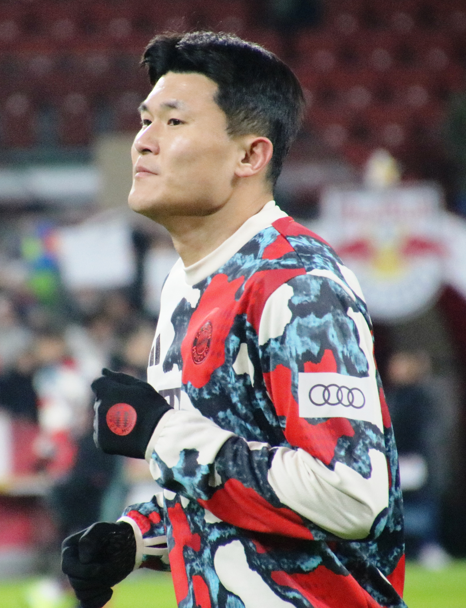

결론부터 말하면요, **김민재 소속팀**은 2026년 현재 독일 분데스리가의 **바이에른 뮌헨**이고, 포지션은 중앙 수비수(센터백)입니다. 저도 처음 김민재 기록을 찾아볼 때 전북·나폴리·바이에른이 뒤섞이고 등번호도 클럽과 국가대표가 달라서 한참 헷갈렸어요. 그래서 위키·기록 사이트·최신 기사까지 교차 확인해서, 소속팀 변천과 포지션, 등번호, 통산 기록을 2026년 7월 기준으로 한 번에 정리했습니다.

📌 3줄 요약
김민재는 2023년 7월 나폴리에서 약 5,000만 유로에 바이에른 뮌헨으로 이적했고, 이는 당시 아시아 선수 역대 최고 이적료로 보도됐습니다.

포지션은 센터백, 등번호는 클럽에서 3번, 국가대표팀에서는 4번을 씁니다.

전북 K리그1 2회, 나폴리 세리에A, 바이에른 분데스리가 우승을 거쳤고 별명은 괴물 수비수입니다.

## 김민재 프로필 한눈에

기본 정보부터 표로 묶어보면 이렇습니다. 잘 바뀌는 계약·기록은 집계 시점 기준이라는 점을 감안하고 보세요.

| 항목 | 내용 |
|---|---|
| 생년월일 | 1996년 11월 15일 |
| 신체 | 190cm |
| 포지션 | 중앙 수비수(센터백) |
| 현 소속 | 바이에른 뮌헨 (독일 분데스리가) |
| 등번호 | 클럽 3번 · 국가대표 4번 |
| 별명 | 괴물, 괴물 수비수 |
| 국가대표 | A매치 82경기 4골 (집계 시점 기준) |

키 190cm의 큰 체격에 빠른 스피드와 대인 방어 능력을 겸비한 것이 김민재의 최대 강점입니다. 여기서 많이들 헷갈리는데, 등번호가 클럽에서는 3번인데 국가대표팀에서는 4번이에요. 이건 뒤에서 따로 짚어드리겠습니다.

## 김민재 소속팀은 어디인가요?

**2026년 현재 김민재의 소속팀은 바이에른 뮌헨입니다.** 2023년 여름에 합류해 지금까지 뛰고 있고, 기록 사이트 기준 계약은 2028년 여름까지로 표기돼 있습니다.

바이에른은 독일 분데스리가의 명문이자 유럽 최상위권 클럽입니다. 김민재는 이 팀에서 분데스리가 우승을 함께 들어 올렸어요. 다만 우파메카노 등 세계적인 센터백들과 주전 경쟁을 벌이는 위치라, 시즌·시기에 따라 선발과 후보를 오가는 흐름이 있습니다.

제가 최신 기사들을 살펴보니, 2026-27시즌을 앞두고 현지에서는 김민재를 여전히 주전 경쟁 그룹으로 분류하면서도 확실한 붙박이로는 보지 않는 시각이 있었습니다. 잔류 의사를 밝힌 상태이고 뚜렷한 이적설은 없으니, 경쟁에서 얼마나 치고 올라가느냐가 관전 포인트입니다.

## 김민재 포지션과 플레이 스타일

**김민재의 포지션은 중앙 수비수, 흔히 센터백이라 부르는 자리입니다.** 수비 라인 한가운데에서 상대 공격수를 막고 뒷공간을 관리하는 역할이에요.

플레이 스타일의 핵심은 세 가지입니다. 첫째, 190cm의 큰 키에서 나오는 제공권으로 세트피스 수비에 강합니다. 둘째, 큰 체격에 비해 스피드가 빨라 뒷공간으로 침투하는 공격수를 따라잡는 커버 능력이 좋습니다. 셋째, 전진 패스로 빌드업에 관여하는 현대형 센터백의 면모도 갖췄습니다.

이런 종합적인 수비력 덕에 나폴리 시절 '괴물'이라는 별명을 얻었어요. 처음 유럽 무대를 볼 때 저도 아시아 수비수가 세리에A 최고 수비수로 꼽힐 줄은 몰랐거든요. 그만큼 김민재의 수비는 리그를 가리지 않고 통했습니다.

*▲ 김민재 — 사진 ⓒ Werner100359, CC BY-SA 4.0 (Wikimedia Commons)*

## 김민재 소속팀 변천 — 전북에서 바이에른까지

김민재의 커리어는 K리그에서 시작해 중국·튀르키예·이탈리아를 거쳐 독일에 이른 단계적 성장 스토리입니다. 이적 경로를 표로 정리하면 이렇습니다.

| 시기 | 소속팀 | 리그 | 비고 |
|---|---|---|---|
| 2016 | 경주 한국수력원자력 | K3 | 프로 데뷔 |
| 2017~2018 | 전북 현대 모터스 | K리그1 | K리그1 우승 2회 |
| 2019~2021 | 베이징 궈안 | 중국 슈퍼리그 | 해외 진출 첫 무대 |
| 2021~2022 | 페네르바흐체 | 튀르키예 쉬페르리그 | 유럽 진출 |
| 2022~2023 | 나폴리 | 세리에A | 세리에A 우승 |
| 2023~ | 바이에른 뮌헨 | 분데스리가 | 아시아 최고 이적료 |

여기서 결정적인 두 번의 도약이 있었어요. 하나는 2022년 페네르바흐체에서 나폴리로 옮긴 것이고, 다른 하나는 2023년 7월 나폴리에서 바이에른으로 약 5,000만 유로에 이적한 겁니다. 이 이적료는 당시 아시아 선수 역대 최고액으로 보도됐습니다. 정확한 금액은 출처마다 조금씩 차이가 있으니 "약 5,000만 유로 규모"로 보는 게 안전합니다.

## 김민재 등번호 — 클럽 3번, 국가대표 4번

**김민재는 클럽에서 3번, 국가대표팀에서 4번을 씁니다.** 같은 선수인데 번호가 다르니 헷갈릴 수밖에 없어요.

클럽에서는 전북 시절부터 3번을 주로 달았고, 페네르바흐체·나폴리·바이에른까지 3번을 이어 왔습니다. 예외는 베이징 궈안 시절로, 이때만 2번을 달았어요. 저도 처음엔 김민재가 늘 3번인 줄 알았는데, 중국 시절 사진을 보고 다른 번호였다는 걸 알았습니다.

국가대표팀에서는 4번이 상징입니다. 이미 4번 유니폼을 구입한 팬들을 위해 번호를 유지한다는 취지를 밝힌 적도 있어요. 그래서 소속팀 유니폼을 살 땐 3번, 국가대표 유니폼을 살 땐 4번으로 기억하면 됩니다.

## 김민재 우승 기록과 수상

**김민재는 K리그·세리에A·분데스리가에서 모두 우승을 경험한 몇 안 되는 한국 선수입니다.** 리그를 옮길 때마다 정상급 무대에서 우승을 보탰다는 게 커리어의 무게를 보여줍니다.

주요 우승·수상을 정리하면 다음과 같습니다.

- **K리그1 우승 2회** — 전북 현대 시절(2017, 2018)
- **세리에A 우승** — 나폴리 시절(2022-23), 나폴리의 오랜만의 리그 정상
- **분데스리가 우승** — 바이에른 뮌헨 시절
- **세리에A 최우수 수비수** — 나폴리 시절 리그를 대표하는 수비수로 선정

나폴리 시절 세리에A 우승은 특히 의미가 큽니다. 나폴리가 수십 년 만에 리그 정상에 오르는 과정에서 김민재가 수비의 핵심이었거든요. 세리에A 최고 수비수로 꼽힌 것도 이 시즌입니다.

## 김민재 국가대표 기록

**김민재는 대한민국 대표팀의 주전 센터백이자 수비 리더입니다.** A매치 데뷔는 2017년으로, 이후 대표팀 중앙 수비의 중심으로 자리 잡았습니다.

집계 시점 기준 A매치 82경기에 4골을 기록하고 있습니다. 수비수라 골 수는 많지 않지만, 세트피스 상황에서 헤더로 득점하는 장면이 종종 나옵니다. 2022년과 2026년 두 번의 FIFA 월드컵, 그리고 여러 차례 AFC 아시안컵에 참가하며 대표팀 주요 대회를 지켰습니다.

대표팀에서 김민재의 진짜 가치는 숫자보다 안정감에 있습니다. 상대 에이스를 지우는 대인 방어와 뒷공간 커버가 대표팀 수비의 기준선을 끌어올렸어요. 손흥민이 공격의 상징이라면 김민재는 수비의 상징이라 볼 수 있습니다. 손흥민 쪽 기록이 궁금하다면 [손흥민 기록 총정리](/son-heung-min-profile/)에 따로 정리해 두었습니다.

## 한눈에 정리 — 김민재 핵심 요약

마지막으로 이 글 전체를 표 하나로 압축하면 이렇습니다. 대표팀 소식이나 이적 뉴스는 [대한축구협회(KFA)](https://www.kfa.or.kr/) 같은 공식 채널에서 최신 정보를 확인하는 게 가장 정확합니다.

| 항목 | 핵심 |
|---|---|
| 현 소속팀 | 바이에른 뮌헨(분데스리가) |
| 포지션 | 센터백 |
| 등번호 | 클럽 3번 · 국대 4번 |
| 대표 이적 | 나폴리 → 바이에른(2023, 약 5,000만 유로) |
| 우승 | K리그1·세리에A·분데스리가 |
| 국가대표 | A매치 82경기 4골(집계 시점 기준) |

이거 하나만 기억하면 돼요. 김민재는 **바이에른 뮌헨의 센터백, 클럽 3번·국대 4번, K리그부터 분데스리가까지 우승한 괴물 수비수**라는 것. 이 뼈대만 잡아두면 어떤 김민재 기사를 봐도 흐름이 한눈에 들어옵니다.

## 자주 묻는 질문 (FAQ)

**Q. 김민재 소속팀은 2026년 현재 어디인가요?** 독일 분데스리가의 바이에른 뮌헨입니다. 2023년 7월 나폴리에서 이적해 지금까지 뛰고 있고, 기록 사이트 기준 계약은 2028년 여름까지로 표기돼 있습니다.

**Q. 김민재 포지션은 무엇인가요?** 중앙 수비수, 즉 센터백입니다. 190cm의 큰 키에서 나오는 제공권과 빠른 스피드를 겸비해 대인 방어와 뒷공간 커버에 강한 것이 특징입니다.

**Q. 김민재 등번호는 몇 번인가요?** 클럽에서는 3번, 국가대표팀에서는 4번을 씁니다. 전북 시절부터 클럽에서 3번을 주로 달았고, 베이징 궈안 시절에만 2번을 착용했습니다. 국가대표 유니폼을 살 땐 4번으로 기억하면 됩니다.

**Q. 김민재 이적료는 얼마였나요?** 2023년 나폴리에서 바이에른 뮌헨으로 이적할 때 약 5,000만 유로 규모로 보도됐고, 당시 아시아 선수 역대 최고 이적료로 평가됐습니다. 정확한 액수는 출처마다 조금씩 다르니 대략적 규모로 보는 게 안전합니다.

---

## 이미지 출처

- 김민재 사진 — ⓒ Werner100359, [CC BY-SA 4.0](https://creativecommons.org/licenses/by-sa/4.0/deed.ko), via Wikimedia Commons.

---

**관련 키워드** — #김민재 #김민재소속팀 #김민재포지션 #김민재등번호 #김민재기록 #바이에른뮌헨 #센터백 #김민재이적료 #김민재나폴리 #김민재국가대표 #분데스리가 #괴물수비수
