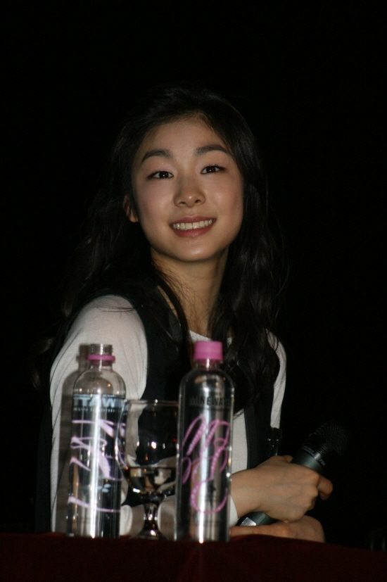
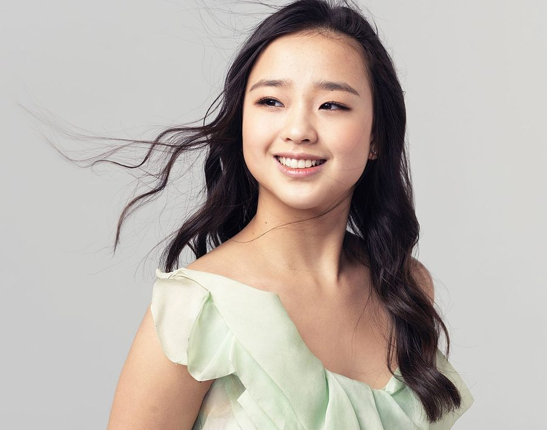
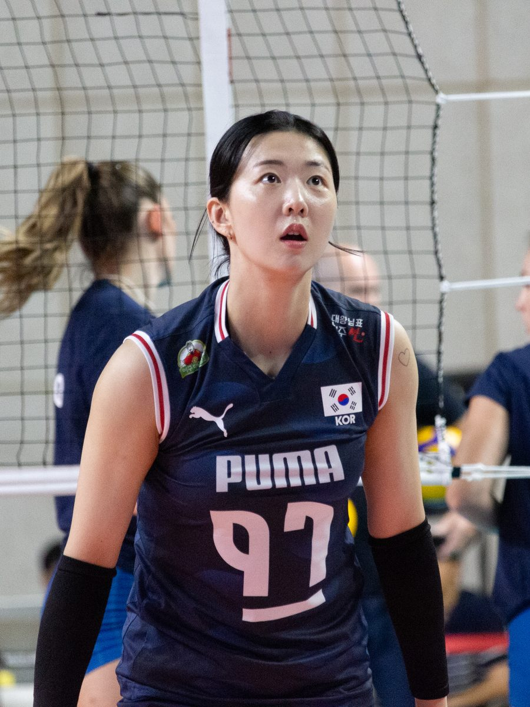
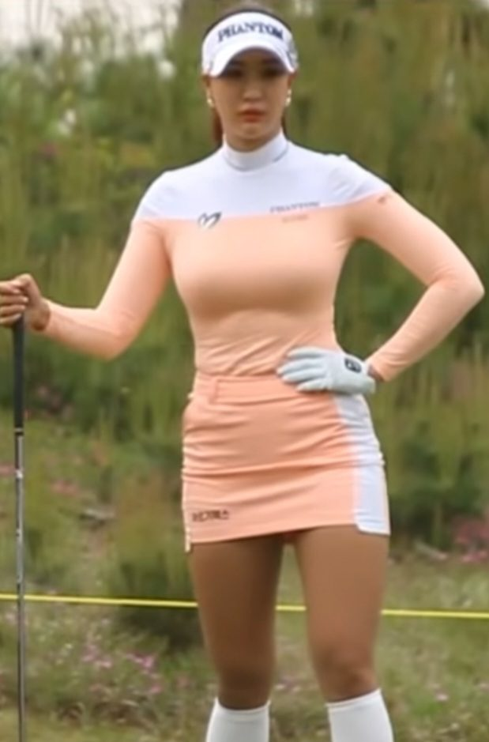

솔직히 고백하면, 저도 **한국 미녀 운동선수**를 검색해 본 적이 있습니다. 그런데 막상 찾아보면 이상하게 정리된 글이 없어요. 어떤 글은 해외 선수만 잔뜩 나오고, 어떤 글은 육상 선수 세 명만 소개하고 끝나고, 커뮤니티 글은 사진만 있고 이 선수가 뭘 이룬 선수인지는 안 알려주더라고요. 결론부터 말하면요, 이 선수들은 외모로 화제가 됐을지 몰라도 **본체는 전부 실력**입니다. 그래서 제가 종목별로 커리어와 근황까지 직접 찾아 한 편에 묶어봤습니다.

📌 3줄 요약
이 글은 피겨·리듬체조·배구·축구·골프·육상·씨름 <b>7개 종목 9인</b>을 종목별로 정리했습니다. 전원 국가대표 또는 프로 무대에서 실력이 검증된 선수들입니다.

김연아·손연재·신수지는 은퇴 후에도 해설·방송·프로 전향으로 활동 중이고, 강소휘(배구)·이민아(축구)·박민지(씨름)·김민지(육상)는 현역입니다.

글 마지막에 각 선수 경기를 <b>어디서 볼 수 있는지</b>까지 정리했으니, 얼굴만 보고 끝내지 말고 경기까지 챙겨보세요. 그게 진짜 팬 되는 길입니다.

## 한국 미녀 운동선수, 왜 검색하면 정리된 글이 없을까

이 키워드로 상위에 뜨는 글들을 제가 하나하나 열어봤는데요, 공통적인 문제가 있었습니다. 절반은 해외 선수 목록이었고, 국내 선수를 다룬 글은 특정 종목 두세 명에서 끝났습니다. 그리고 대부분 "예쁘다"는 얘기만 하고 정작 그 선수가 어떤 기록을 가진 선수인지는 빠져 있었어요.

여기서 많이들 헷갈리는데, 이 선수들이 오래 사랑받는 이유는 외모가 아니라 **커리어**입니다. 외모로 잠깐 화제가 된 선수는 금방 잊히지만, 올림픽 메달리스트나 리그 우승 주역은 계속 회자되거든요. 그래서 이 글은 선수마다 얼굴 얘기보다 기록 얘기를 먼저 하려고 합니다.

선정 기준은 단순합니다. 국가대표 경력 또는 프로 리그에서 검증된 실력, 그리고 대중적 인지도. 이 두 가지를 모두 갖춘 9명을 종목별로 골랐습니다. 은퇴 선수와 현역을 구분해서 근황까지 붙였으니 스크롤만 내리면 됩니다.

## 피겨와 리듬체조 — 김연아·손연재·신수지

### 김연아 — 설명이 필요 없는 피겨 여왕

**김연아**는 사실 이런 목록에 넣는 게 실례일 정도의 레전드입니다. 2010 밴쿠버 올림픽에서 당시 세계신기록인 228.56점으로 금메달, 2014 소치 올림픽 은메달, 세계선수권 우승 2회(2009·2013). 무엇보다 시니어 데뷔 후 출전한 모든 국제대회에서 3위 안에 든 "올 포디움" 기록의 주인공입니다.

*▲ 김연아 — 사진 ⓒ Paparazzi Studio(Flickr), CC BY 2.0, Wikimedia Commons*

소치를 끝으로 은퇴한 지 10년이 넘었는데도 광고 시장에서 여전히 최상위권이라는 것 자체가, 실력으로 쌓은 이미지가 얼마나 오래가는지 보여주는 사례라고 생각해요.

### 손연재 — 리듬체조의 판을 바꾼 선수

**손연재**는 한국 리듬체조 역사를 앞뒤로 나누는 선수입니다. 2012 런던 올림픽에서 한국 선수 최초로 개인종합 결선에 올라 5위, 2014 인천 아시안게임 개인종합 금메달, 2016 리우 올림픽 4위. 리우의 4위는 당시 아시아 선수 역대 최고 성적이었습니다.

*▲ 손연재 — 사진 ⓒ LG전자, CC BY 2.0, Wikimedia Commons*

2017년 2월에 은퇴했고, 이후 방송 해설과 체조계 활동, 리듬체조 교육 사업 등으로 여전히 이 종목의 얼굴 역할을 하고 있습니다.

### 신수지 — 리듬체조에서 프로볼링으로, 두 번 성공한 케이스

**신수지**는 커리어가 두 개인 특이한 선수입니다. 리듬체조 시절이던 2008년, 베이징 올림픽에 자력으로 출전권을 따냈습니다. 발목 부상으로 2012년에 체조를 그만뒀는데, 여기서 끝나지 않고 2014년 11월 프로볼링 선발전에 합격해 2015년 3월 프로 볼러로 데뷔했어요. 방송인으로만 아는 분도 많을 텐데, 이력을 보면 이야기가 달라집니다. 시구 한 번으로 화제가 된 유연성도 결국 리듬체조 국가대표 출신이라는 기본기에서 나온 거였죠.

## 코트의 현역 스타 — 강소휘와 이민아

### 강소휘 — 여자배구 간판 아웃사이드 히터

**강소휘**는 2015-16 신인 드래프트 전체 1순위로 GS칼텍스에 입단한 뒤로 줄곧 V리그 간판으로 뛰고 있는 현역입니다. 2020-21 시즌 V리그 우승, KOVO컵 3회 우승, 2018 자카르타-팔렘방 아시안게임 동메달까지. 2024년에는 FA 자격으로 김천 한국도로공사로 이적해 새 팀에서 뛰고 있습니다.

*▲ 강소휘(2025 코리아 인비테이셔널) — 사진 ⓒ Nt, CC BY 4.0, Wikimedia Commons*

저는 배구 중계를 챙겨보는 편인데, 강소휘 경기를 보면 왜 "미녀 선수"라는 수식어가 아깝다는 말이 나오는지 알게 됩니다. 공격 성공률과 서브가 본체인 선수예요.

### 이민아 — 여자축구의 스타 미드필더

**이민아**는 여자축구를 잘 모르는 분도 이름은 들어봤을 미드필더입니다. 인천현대제철 시절 WK리그 우승을 다섯 차례 경험했고, 일본 INAC 고베에서도 뛰었으며, A매치 80경기 이상을 소화한 국가대표 출신입니다. 2017년에는 대한축구협회 올해의 여자선수로 선정됐고, 2018 아시안게임 동메달 멤버이기도 합니다. 현재는 해외 리그(캐나다)로 무대를 옮겨 도전을 이어가고 있어요.

## 필드의 인플루언서 — 골프 유현주

**유현주**는 이 목록에서 가장 "SNS 시대형" 선수입니다. 2011년 프로에 데뷔한 KLPGA 골퍼인데, 투어 우승 없이도 골프 대중화에 기여한 영향력만큼은 웬만한 우승자 이상이라는 평가를 받아요. 유튜브·인스타그램에서 골프 콘텐츠로 수십만 팔로워를 모았고, 2022년에는 SBS 연예대상에서 소셜스타상을 받기도 했습니다.

*▲ 유현주 — 사진 ⓒ 뉴스영studio, CC BY 3.0, Wikimedia Commons*

"우승도 없는데 왜 유명하냐"는 댓글이 종종 보이는데, 저는 반대로 봅니다. 골프처럼 진입장벽 높은 종목은 코스 밖에서 사람을 끌어오는 선수도 필요하거든요. 유현주를 보고 골프를 시작했다는 입문 후기도 심심찮게 보입니다.

## 트랙의 여신들 — 육상 김민지와 김지은

몇 년 전부터 커뮤니티에서 "아이돌인 줄 알았는데 육상 국가대표급"이라며 화제가 된 두 명이 있습니다. 400m와 400m 허들을 뛰는 **김민지**, 그리고 400m의 **김지은**입니다.

김민지는 1996년생, 진천군청 소속으로 173cm의 피지컬에서 나오는 주법 때문에 "한국의 알리샤 슈미트"라는 별명이 붙었습니다. 2022년 전국 실업육상대회에서 계주 금메달을 포함해 여러 메달을 땄고, 바디프로필과 SNS로 육상 팬 밖에서도 유명해졌어요.

김지은은 2021~2022년 국내 400m를 사실상 지배한 선수입니다. 2022년에만 400m에서 다섯 차례 우승했고, 15세에 국가대표에 발탁된 이력이 있으며 부모님이 모두 육상 국가대표 출신인 육상 집안이에요. 아킬레스건 부상을 이겨내고 정상에 복귀한 스토리까지, 외모 얘기가 아까운 커리어입니다.

💡 알고 보면 더 재밌는 포인트
육상 실업대회는 대부분 무료 관람이거나 유튜브로 중계됩니다. "미녀 육상선수" 검색으로 유입된 분들이 실제 대회 영상을 보고 육상 팬이 되는 경우가 많습니다. 종목 저변이 이렇게 넓어집니다.

## 모래판의 여신 — 씨름 박민지

넷플릭스 피지컬100을 보신 분이라면 **박민지**를 기억할 겁니다. 자신보다 훨씬 큰 럭비 선수를 상대로 정면 승부를 펼치며 "모래판의 여신"이라는 별명을 전 세계에 알렸죠. 원래 투포환 선수였다가 허리 부상 이후 2013년 씨름으로 전향했고, 2019년 대통령기 전국씨름대회 우승을 비롯해 전국 무대에서 장사 타이틀을 따낸 실력자입니다.

경남 거제 출신으로 경남체고와 한국체대를 거쳤고, 화성시청을 지나 지금은 영동군청 씨름단 소속이에요. 여자 씨름 자체가 낯선 분이 많을 텐데, 박민지 덕분에 여자 씨름 중계 시청자가 눈에 띄게 늘었다는 얘기가 나올 정도로 종목 간판이 됐습니다.

## 9인 한눈에 비교 — 종목·대표 기록·현재

제가 직접 표로 묶어보면 이렇습니다.

| 선수 | 종목 | 대표 기록 | 현재 |
| --- | --- | --- | --- |
| 김연아 | 피겨스케이팅 | 2010 밴쿠버 금, 2014 소치 은 | 은퇴(2014), 방송·광고 |
| 손연재 | 리듬체조 | 2014 인천 AG 금, 리우 4위 | 은퇴(2017), 해설·교육 |
| 신수지 | 리듬체조→볼링 | 베이징 올림픽 출전, 프로볼러 데뷔 | 프로볼링·방송 |
| 강소휘 | 배구 | V리그 우승, AG 동메달 | 현역(한국도로공사) |
| 이민아 | 축구 | WK리그 5회 우승, A매치 80+ | 현역(해외 리그) |
| 유현주 | 골프 | KLPGA 프로, 소셜스타상 | 현역·인플루언서 |
| 김민지 | 육상 400m·400mH | 실업대회 다관왕(2022) | 현역(진천군청) |
| 김지은 | 육상 400m | 2022년 400m 5회 우승 | 현역(전북개발공사) |
| 박민지 | 씨름 | 대통령기 우승, 피지컬100 | 현역(영동군청) |

표로 묶고 보니 분명해지는 게 하나 있습니다. 9명 중 6명이 현역입니다. 지금 경기장에 가면 직접 볼 수 있는 선수가 더 많다는 뜻이에요.

## 이 선수들 경기, 어디서 볼 수 있나

여기까지 읽고 "그래서 경기는 어디서 보는데?"가 궁금해졌다면 이 글의 목적은 달성입니다. 종목별로 정리해 드릴게요.

- **배구(강소휘)** — V리그는 10월~3월 시즌 중 스포츠 전문 채널에서 거의 매일 중계됩니다. 김천 홈경기 직관도 티켓값이 부담 없는 편이에요.
- **축구(이민아)** — 국내 WK리그 경기는 유튜브 중계가 활발하고, 여자 국가대표 A매치는 지상파에서 볼 수 있습니다. 여자축구를 처음 보신다면 [축구 오프사이드 규칙 정리](/soccer-offside-rule/)를 먼저 읽고 보면 훨씬 재밌습니다.
- **골프(유현주)** — KLPGA 투어 중계 외에도 본인 유튜브 채널에서 라운드 콘텐츠를 꾸준히 올립니다.
- **육상(김민지·김지은)** — 전국 실업육상대회는 대한육상연맹 유튜브 등에서 중계·하이라이트를 제공합니다.
- **씨름(박민지)** — 민속씨름 대회는 명절 연휴 지상파 중계가 많고, 여자부 경기도 함께 편성되는 추세입니다.

종목별 대회 일정은 [대한체육회](https://www.sports.or.kr/) 홈페이지에서 한 번에 확인할 수 있어요. 이거 하나만 기억하면 돼요. 얼굴로 알게 됐어도, 팬으로 남게 만드는 건 결국 경기력입니다.

## 자주 묻는 질문

**Q. 한국 미녀 운동선수 중 현역은 누구인가요?** 이 글의 9인 기준으로 강소휘(배구)·이민아(축구)·유현주(골프)·김민지·김지은(육상)·박민지(씨름) 6명이 현역이고, 김연아·손연재·신수지는 은퇴 후 방송·해설·프로볼링 등으로 활동 중입니다.

**Q. 피지컬100에 나온 여자 씨름 선수는 누구인가요?** 영동군청 씨름단의 박민지 선수입니다. 투포환에서 씨름으로 전향한 케이스로, 2019년 대통령기 전국씨름대회 우승 경력이 있는 현역 장사입니다.

**Q. 신수지는 지금 무슨 선수인가요?** 프로볼링 선수입니다. 리듬체조 국가대표로 2008 베이징 올림픽에 출전했고, 은퇴 후 2014년 프로볼링 선발전에 합격해 2015년부터 프로 볼러로 활동하고 있습니다.

**Q. 강소휘 선수 소속팀은 어디인가요?** 2024년 FA 이적으로 현재 김천 한국도로공사 하이패스 소속입니다. 그 전까지는 데뷔팀인 GS칼텍스 서울 KIXX에서 뛰었습니다.

## 이미지 출처

이 글의 인물 사진은 모두 위키미디어 공용(Wikimedia Commons)의 자유 라이선스 사진이며, 각 사진 하단에 저작자와 라이선스를 표기했습니다. 히어로 이미지는 특정 인물이 아닌 AI 생성 일러스트입니다.

---

**관련 키워드** — #한국미녀운동선수 #예쁜여자운동선수 #미녀스포츠스타 #여자운동선수 #김연아 #손연재 #신수지볼링 #강소휘 #유현주골프 #미녀육상선수 #여자축구이민아 #피지컬100박민지
