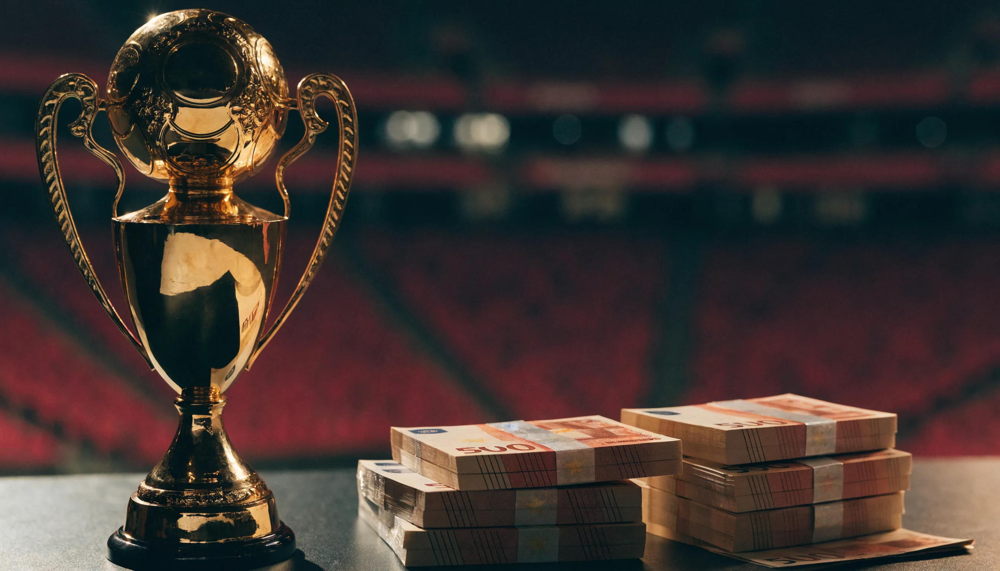

**라리가 우승 상금**을 검색하면 어떤 글은 550억이라 하고, 어떤 글은 3,000억이 넘는다고 하죠. 저도 바르셀로나 우승 기사와 레알 마드리드 중계권 기사를 나란히 놓고 보다가, 같은 '라리가 돈' 이야기인데 숫자가 세 배 넘게 차이 나서 멈칫했어요. 알고 보니 이유는 프리미어리그와 똑같았습니다. 라리가에도 **우승 상금이라는 단일 항목이 아예 없고**, 리그가 중계권료를 나눠주는 배분금 안에 순위에 따라 달라지는 몫이 섞여 있어서 어디까지 합치느냐로 숫자가 갈리는 거였어요. 결론부터 말하면요, 순위에 따른 성적 배분금만 보면 우승팀 몫은 약 5,491만 유로이고, 균등·상업 배분까지 합친 전체 배분금은 1억 5,600만 유로대입니다. 이 글 한 편이면 그 구조가 다시는 안 헷갈릴 겁니다.

📌 3줄 요약
라리가 상금은 <b>균등배분 50% + 성적 배분 25% + 상업 배분 25%</b> 구조라, "우승 상금"이라는 한 덩어리 숫자가 따로 없습니다.

2024-25 우승팀 바르셀로나의 <b>성적 배분금은 약 5,491만 유로</b>(약 961억 원 안팎), 균등·상업까지 합친 총 배분금은 약 1억 5,645만 유로였습니다.

그런데 총 중계권 배분금 1위는 우승팀 바르셀로나가 아니라 <b>레알 마드리드(약 1억 5,752만 유로)</b>였어요. 우승과 배분금 1위가 갈린 반전입니다.

## 라리가 우승 상금, 왜 검색마다 숫자가 다를까

여기서 많이들 헷갈리는데, 저도 처음엔 컵대회처럼 우승하면 상금 한 덩어리를 딱 받는 방식인 줄 알았거든요. 라리가는 다릅니다. 리그가 협상한 중계권료를 시즌이 끝나면 1부 20개 구단에 **배분**하는 구조이고, 그 배분금 안에 순위에 따라 달라지는 성적 몫이 섞여 있을 뿐이에요.

그래서 "라리가 우승 상금 얼마"라는 질문에는 두 가지 답이 존재합니다. 순위 1위에게 주어지는 **성적 배분금**만 말하면 5,491만 유로(약 961억 원), 우승팀이 그 시즌 리그에서 받아 가는 **전체 배분금**을 말하면 1억 5,600만 유로대(약 2,700억 원 안팎)가 되는 거죠. 기사마다 숫자가 다른 건 대부분 이 기준 차이 때문입니다.

한 가지 더. 라리가는 배분금을 **한 번에 주지 않고 5시즌에 걸쳐 나눠 지급**합니다. 우승팀도 당장 손에 쥐는 건 20억 원대 초기분이고 나머지는 이후 시즌으로 분할돼요. 그래서 "우승하면 통장에 950억 꽂힌다"는 식의 감각과는 조금 다릅니다.

## 상금 구조 3계층 — 균등·성적·상업 50·25·25

제가 여러 출처의 수치를 표로 맞춰보니, 구조는 아래 세 줄이면 끝납니다(라리가 공식 배분 공식 기준).

| 구분 | 비중 | 성격 |
| --- | --- | --- |
| 균등배분 | 50% | 1부 20개 구단에 똑같이 나눔. 구단당 최소 약 5,000만 유로 보장 |
| 성적 배분(merit, 메리트) | 25% | 최근 5시즌 성적 기준. 여기서 우승팀이 17%로 최대 몫 |
| 상업 배분 | 25% | 티켓 판매·시청자 규모·사회적 영향력 등 구단 파워 기준 |

포인트는 **균등배분이 절반**이라는 겁니다. 꼴찌를 해도 5,000만 유로 안팎은 기본으로 깔고 시작해요. 우승 경쟁은 그 위에 얹히는 성적 배분(1위 몫 약 5,491만 유로)과, 팬덤·시청자가 큰 빅클럽일수록 유리한 상업 배분에서 갈립니다.

💡 숫자가 헷갈릴 때
어떤 글이 "라리가 우승 상금 약 960억"이라 하면 성적 배분금(17%)만, "약 2,700억"이라 하면 균등·상업까지 합친 총 배분금을 말하는 겁니다. 기준만 확인하면 두 숫자 모두 맞는 말이에요.

## 우승팀이 실제로 받는 돈 — 바르셀로나와 레알의 경우

가장 최근 확정치는 2024-25 시즌입니다. 이 시즌 우승팀은 승점 88점으로 28번째 리그 우승을 차지한 **바르셀로나**였어요. 바르셀로나가 우승으로 받은 **성적 배분금은 전체 성적 몫의 17%인 약 5,491만 유로**, 원화로는 약 961억 원입니다. 여기에 균등·상업 배분을 더한 총 중계권 배분금은 약 **1억 5,645만 유로**였어요.

그런데 여기서 제가 자료를 맞춰보다 진짜 멈칫한 대목이 있어요. **총 중계권 배분금 1위는 우승팀 바르셀로나가 아니었습니다.** 라리가가 공식 발표한 2024/25 중계권 배분에서 1위는 리그 2위 **레알 마드리드로 약 1억 5,752만 유로**, 우승팀 바르셀로나는 약 1억 5,645만 유로로 근소하게 2위였어요. 3위 아틀레티코 마드리드는 약 1억 817만 유로였고요.

우승팀이 배분금 1위가 아닌 이유는 구조에 있습니다. 성적 배분(25%)은 **당해 순위가 아니라 최근 5시즌 성적**을 보고, 상업 배분(25%)은 팬덤·시청자 규모를 봅니다. 레알은 이 두 항목에서 워낙 강해서, 당해 우승을 놓치고도 총액에선 앞선 거예요. 우승 트로피와 돈 1등이 항상 같지는 않다는 게 라리가 배분의 묘미입니다.

## 순위별로 얼마 받나 — 17%에서 0.25%까지

성적 배분은 순위에 따른 비중이 정해져 있습니다. **1위 17% → 2위 15% → 3위 13% → 4위 11%**로 내려가다 20위는 0.25%까지 떨어져요. 2024-25 성적 배분을 금액으로 잡아보면 감이 옵니다(출처 추정치, 반올림).

| 순위 | 성적 배분 비중 | 금액(약) |
| --- | --- | --- |
| 1위 | 17% | 5,491만 유로 |
| 2위 | 15% | 5,150만 유로 |
| 3위 | 13% | 4,460만 유로 |
| 4위 | 11% | 3,780만 유로 |
| 5위 | 9% | 3,090만 유로 |
| 10위 | 2.75% | 940만 유로 |
| 20위 | 0.25% | 90만 유로 |

성적 배분만 보면 1위와 4위 차이가 약 1,700만 유로예요. 그런데 실제 통장에 찍히는 총 배분금은 균등 50%가 워낙 크게 깔려서 순위별 격차가 이 표보다 훨씬 완만해집니다. 그래서 라리가는 프리미어리그처럼 "한 계단당 얼마"가 극적으로 벌어지는 리그는 아니에요.

## 꼴찌도 5,000만 유로 — 그런데 EPL과 비교하면

라리가는 균등배분 덕에 하위권도 굶지 않습니다. 최소 보장이 구단당 약 5,000만 유로 안팎이라, 강등권 팀도 그 정도는 확보해요. 여기까지만 보면 프리미어리그와 비슷해 보이는데, 리그를 나란히 놓으면 격차가 확 드러납니다.

제가 이 대목에서 좀 놀랐는데요, 2024-25 시즌 **프리미어리그에서 강등된 번리가 받은 돈이 라리가 우승팀 바르셀로나의 리그 배분금보다 많다**는 국내 보도가 있었어요. 번리는 EPL 중계권 배분금 약 9,690만 파운드에 강등 보상금(파라슈트 페이먼트) 5,000만~5,500만 파운드까지 더해 총 1억 6,000만 유로(약 2,798억 원)를 확보한 것으로 집계됐습니다. 바르셀로나의 라리가 배분금은 약 1억 5,500만 유로였고요. 리그 중계권 규모 자체가 EPL이 라리가의 약 두 배라, 이런 역전이 생깁니다.

물론 바르셀로나·레알은 라리가 배분금 외에 챔피언스리그 수익과 막대한 상업·경기 수익이 따로 있어서 구단 전체 매출은 번리와 비교가 안 됩니다(바르셀로나 총수입은 딜로이트 집계로 약 9억 7,480만 유로). 하지만 "리그가 우승 대가로 주는 돈"만 떼어 보면 EPL 강등팀에 밀린다는 게 라리가의 현실이에요.

## 챔피언스리그·다른 리그와 비교하면

감을 잡으려면 옆 무대와 놓고 보는 게 빠릅니다. 대회 단위로 보면 **챔피언스리그가 최상위권**이에요. 레알 마드리드가 2016-17 우승 당시 받은 챔스 상금만 약 9,780만 유로였고, 최근엔 우승 시 UEFA 배분이 1억 유로를 훌쩍 넘습니다. 그래서 라리가 빅클럽에게 진짜 돈방석은 리그 우승보다 **챔피언스리그 출전권과 성적**인 경우가 많아요.

리그끼리 비교하면 프리미어리그가 압도적이고, 독일 분데스리가는 라리가와 비슷하거나 조금 아래입니다. 분데스리가 우승팀 수령액과 DFL 배분 방식은 [분데스리가 우승 상금](/bundesliga-prize-money/)에, 프리미어리그 쪽은 [프리미어리그 우승 상금](/epl-prize-money/)에 따로 정리해뒀어요. 국가대항전은 또 달라서 월드컵 우승국 상금은 수천만 달러 단위인데, 이쪽이 궁금하면 [2026 월드컵 상금·역대 우승국](/worldcup-2026-prize-money-champions/) 글과 이어서 보세요.

## 한눈에 정리 — 2024-25 배분 기준

| 항목 | 우승팀(바르셀로나) | 배분금 1위(레알 마드리드) |
| --- | --- | --- |
| 당해 리그 순위 | 1위(우승) | 2위 |
| 성적 배분금(17% 기준) | 약 5,491만 유로 | 15% 몫(약 5,150만 유로) |
| 총 중계권 배분금 | 약 1억 5,645만 유로 | 약 1억 5,752만 유로 |
| 결과 | 우승했지만 배분금 2위 | 준우승인데 배분금 1위 |

시즌별 정확한 배분 내역과 규정은 [라리가 공식 사이트](https://www.laliga.com/)에서 확인할 수 있습니다. 환율·중계권 계약에 따라 매 시즌 바뀌니, 이 표는 구조를 이해하는 기준점으로 쓰시면 됩니다.

## 자주 묻는 질문 (FAQ)

**Q. 라리가 우승 상금은 정확히 얼마인가요?** 단일 우승 상금 항목은 없고, 2024-25 기준 순위 1위의 성적 배분금이 약 5,491만 유로(약 961억 원), 균등·상업 배분까지 합친 우승팀 총 배분금은 약 1억 5,645만 유로였습니다. 어떤 숫자를 말하는지에 따라 답이 달라집니다.

**Q. 2024-25 라리가 우승팀은 어디이고 얼마 받았나요?** 승점 88점으로 우승한 바르셀로나입니다. 성적 배분금 약 5,491만 유로에 균등·상업을 더해 총 약 1억 5,645만 유로를 받았습니다. 다만 배분은 5시즌에 걸쳐 분할 지급됩니다.

**Q. 우승팀 바르셀로나가 왜 배분금 1위가 아닌가요?** 성적 배분이 당해가 아닌 최근 5시즌 성적을, 상업 배분이 팬덤·시청자 규모를 반영하기 때문입니다. 이 두 항목이 강한 레알 마드리드가 준우승에도 총 배분금 1위(약 1억 5,752만 유로)를 차지했습니다.

**Q. 라리가 우승 상금과 프리미어리그 상금 중 뭐가 더 큰가요?** 프리미어리그가 훨씬 큽니다. 중계권 규모가 약 두 배라, 2024-25엔 EPL 강등팀 번리의 수입이 라리가 우승팀 바르셀로나의 리그 배분금보다 많았을 정도입니다.

**Q. 라리가 꼴찌팀도 상금을 받나요?** 받습니다. 균등배분이 전체의 50%라 1부 구단은 최소 약 5,000만 유로를 보장받습니다. 다만 강등되면 다음 시즌 이 배분금이 통째로 사라집니다.

이거 하나만 기억하면 돼요 — **라리가 우승 상금은 한 덩어리가 아니라 균등 50% 위에 성적·상업 배분이 얹히는 3층 구조**이고, 우승 트로피와 배분금 1위가 꼭 같지는 않다는 것. 이제 어떤 기사에서 어떤 숫자를 보든 기준이 뭔지 바로 읽힐 겁니다. 리그별 돈 이야기가 더 궁금하면 [프리미어리그 우승 상금](/epl-prize-money/)도 이어서 읽어보세요.

---

**관련 키워드** — #라리가우승상금 #라리가상금 #라리가중계권배분 #바르셀로나우승상금 #레알마드리드중계권 #라리가상금분배 #라리가배분금 #스페인축구상금 #EPL라리가상금비교 #분데스리가상금 #챔피언스리그상금 #라리가순위별상금
