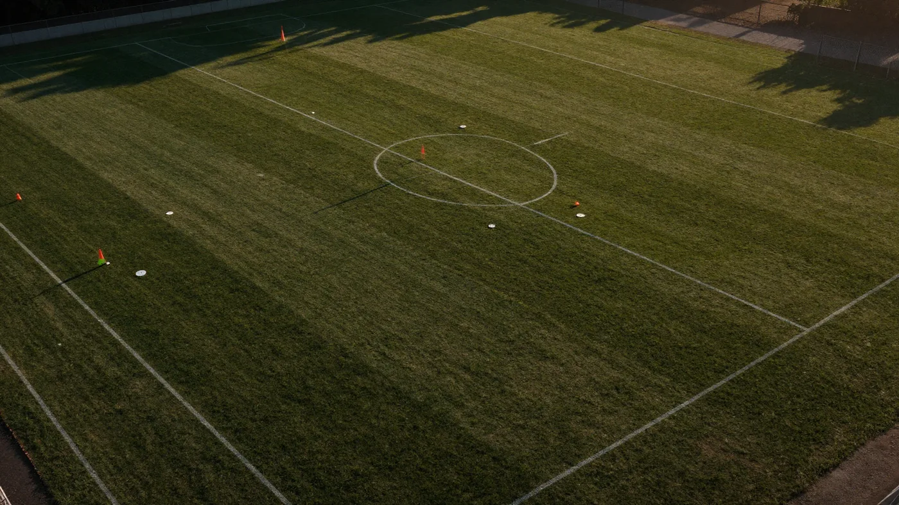

**이정효 감독 전술**을 검색해보면 "포지션 플레이", "데 제르비 스타일" 같은 말만 나오고 정작 무슨 뜻인지는 안 알려주는 글이 대부분이죠. 저도 처음 찾아봤을 때 용어만 잔뜩 주워담고 경기는 여전히 안 보이더라고요. 결론부터 말하면요, 이정효 축구는 **기본 4-4-2로 서서 공을 잡는 순간 2-3 구조로 바뀌고, 측면에 사람을 몰아넣은 뒤 반대편으로 넘기는** 축구입니다. 이 문장 하나만 이해하면 광주 경기도, 지금 수원 삼성 경기도 완전히 다르게 보입니다. 기록부터 전술 원리, 약점까지 제가 자료를 뒤져 한 편으로 묶었습니다.

📌 3줄 요약
기본 포메이션은 <b>4-4-2</b>지만, 공을 잡으면 풀백이 안으로 접히며 <b>2-3 빌드업</b> 대형으로 변합니다. 그래서 4-3-3처럼 보여요.

압박은 무조건 달려드는 게 아니라 <b>공이 측면으로 나가는 순간</b> 스위치가 켜집니다. 중앙에서는 기다립니다.

광주 4년 통산 180경기 85승 40무 55패. K리그2 우승, K리그1 3위, 시·도민구단 최초 ACL 엘리트 8강을 남기고 2026년 수원 삼성으로 옮겼습니다.

## 이정효 감독은 어떤 감독인가요?

한마디로 **포지션 플레이를 가장 정확히 구현하는 국내파 감독**입니다. 유럽 전술을 공부한 국내 감독은 많지만, 그걸 K리그 선수단에 실제로 이식해낸 사례는 드물어요. 이정효 감독이 학구파로 불리는 이유는 공부의 양이 아니라 **옮겨심는 방법론을 갖고 있다는 점** 때문입니다.

선수 시절엔 부산에서만 11시즌을 뛴 원클럽맨 풀백이었습니다. 통산 222경기 13골 9도움. 화려한 스타는 아니었죠. 지도자 커리어도 아주대 코치에서 시작해 전남·광주·성남·제주 코치를 거쳐 올라온 밑바닥 루트입니다. 본인이 "화려한 선수 출신은 실패해도 재기의 코인이 무한정 나오지만 인지도 낮은 사람은 한 번 미끄러지면 끝"이라고 말한 배경이 여기 있어요.

참고로 생년월일은 자료마다 다릅니다. 1975년 5월 15일이라는 기록과 1975년 7월 23일이라는 포털 기록이 함께 돌아다니는데, 음력·양력 차이에서 비롯된 것으로 보입니다. 이런 건 단정하지 않는 게 맞습니다.

## 이정효 감독 통산 기록은 어떻게 되나요?

광주 FC에서 4시즌 동안 **180경기 85승 40무 55패**를 기록했습니다. 승률로는 47.22%인데, 무승부를 0.5승으로 계산하는 연맹 방식으로는 훨씬 높게 잡힙니다.

시즌별로 묶어보면 이렇습니다. 저는 이 표를 만들고 나서야 "2024년이 진짜 위기였구나" 하는 게 눈에 들어왔어요.

| 시즌 | 대회 | 성적 | 세부 |
| --- | --- | --- | --- |
| 2022 | K리그2 | **우승·다이렉트 승격** | 25승 11무 4패, 승점 86 (당시 K리그2 최다) |
| 2023 | K리그1 | 3위 (파이널 A) | 16승 11무 11패, 창단 첫 ACL 진출권 |
| 2024 | K리그1 | 9위 (파이널 B) | 14승 5무 19패, 한때 6연패 |
| 2024-25 | ACL 엘리트 | **8강** | 시·도민구단 최초, 8강서 알 힐랄에 0-7 패 |
| 2025 | K리그1 | 7위 | 15승 9무 14패, 코리아컵 준우승 |

개인 수상으로는 K리그 이달의 감독상을 세 차례(2022년 4월·9월, 2023년 6월) 받았고, 2025시즌을 결산하는 대한축구협회(KFA) 어워즈에서 **올해의 지도자**로 뽑혔습니다. 2부 소속 감독이 1·2부 통합으로 주는 이달의 감독상을 받은 것 자체가 이례적인 일이었어요.

## 기본 포메이션은 4-4-2인가요, 4-3-3인가요?

**기본 배치는 4-4-2가 맞습니다.** 그런데 경기를 보면 4-3-3처럼 보입니다. 여기서 많이들 헷갈리는데, 포메이션 숫자는 공이 없을 때의 정렬일 뿐이고 공을 잡는 순간 대형이 통째로 바뀌기 때문이에요.

부임 초기인 2022년 전반기엔 3-4-3을 쓰다가 8월에 4-2-3-1로 갈아탄 적도 있습니다. 즉 숫자에 집착하는 감독이 아니라, 상대와 선수 구성에 맞춰 대형을 바꾸는 쪽입니다. 실제로 광주 시절 스토퍼 아론이 미드필더 높이까지 올라가면 중앙 미드필더 정호연이 내려와 그 자리를 메웠고, 최전방 자원이 내려와 중원 숫자를 채우기도 했습니다.

그래서 이정효 축구를 볼 땐 숫자보다 **"지금 이 순간 어느 구역에 몇 명이 있는가"** 를 보는 게 맞습니다. 포메이션 자체의 장단점이 궁금하다면 [축구 포메이션 장단점](/soccer-formation-pros-cons/) 글에 정리해 뒀어요.

## 2-3 빌드업이 뭔가요?

공을 잡았을 때 **뒤에 2명, 그 앞에 3명**을 세우는 구조입니다. 센터백 2명이 뒤에 남고, 양쪽 풀백이 바깥이 아니라 안쪽으로 접혀 들어와 중앙 미드필더와 함께 3명 라인을 만듭니다. 이 접혀 들어오는 풀백을 **인버티드 풀백**이라고 불러요.

이 구조를 쓰면 두 가지가 동시에 해결됩니다. 첫째, 중원 숫자가 늘어나 상대 압박을 숫자로 눌러버릴 수 있습니다. 둘째, 공을 뺏겨도 중앙에 사람이 이미 모여 있어 역습 차단이 빠릅니다. 맨체스터 시티가 칸셀루와 리코 루이스를 안으로 넣어 쓰던 방식과 같은 원리입니다.

여기에 하나 더 있습니다. 양쪽 윙어를 터치라인 끝까지 벌려 세우면 그 안쪽에 **하프 스페이스**라는 빈 통로가 생기는데, 중앙 미드필더들이 이 통로로 계속 침투합니다. 저도 처음엔 윙어를 왜 저렇게 구석에 세워두나 했거든요. 알고 보니 윙어는 공을 받으러 간 게 아니라 **상대를 끌고 나가 공간을 여는 역할**이었습니다.

## 압박은 언제 나가고 언제 기다리나요?

**공이 측면으로 나가는 순간에 나갑니다.** 무작정 90분 내내 달려드는 축구가 아니에요. 상대 골키퍼가 공을 잡거나 공이 중앙에 있을 때는 지역을 지키며 기다립니다.

스위치가 켜지는 건 상대 센터백이 옆으로 공을 넘길 때입니다. 이때 윙백을 아주 높은 위치까지 끌어올려 1대1로 강하게 붙고, 필요하면 중앙 미드필더까지 전진시켜 **패스가 나갈 줄기를 미리 잘라버립니다.** 볼을 잃은 직후에도 즉시 전방 압박이 들어갑니다.

선제골을 넣으면 압박 강도를 오히려 더 올리는 것도 특징입니다. 리드를 지키려고 내려앉는 게 아니라, 더 눌러서 두 번째 골을 만들러 갑니다. 본인 표현으로는 "실점하면 왜 먹었지 생각하지 않고 다음 골을 어떻게 넣을지 고민한다"는 쪽이에요.

💡 중계 볼 때 이것만 보세요
상대 센터백이 옆 센터백에게 공을 넘기는 순간, 이정효 팀의 측면 선수가 어디까지 튀어나가는지 보세요. 그 한 장면에 이 팀의 압박 원리가 다 들어 있습니다.

## 측면에 몰아넣고 반대로 넘긴다는 게 무슨 뜻인가요?

**아이솔레이션**입니다. 한쪽 측면에 일부러 사람을 잔뜩 모아 상대까지 끌고 온 다음, 비어버린 반대편으로 공을 한 번에 넘겨 1대1 상황을 만드는 방식이에요. 농구에서 스타 선수에게 공간을 만들어주는 그 개념과 같습니다.

이정효 축구가 "측면에서 시작한다"는 평가를 받는 이유가 여기 있습니다. 측면으로 넓게 벌려 상대를 끌어들이고, 그 구역에서 숫자를 대등하게 유지하며 버티다가, 반대편이 텅 비는 순간을 노립니다.

이게 제대로 터진 경기가 2024년 ACL 엘리트 요코하마 F. 마리노스전이었습니다. 홈에서 **7-3 대승**을 거뒀는데, ACL 무대에서 일본 팀이 7골을 내준 건 이때가 처음이었습니다. 그런데 정작 감독 본인은 3골을 먹혔다며 경기 내내 화를 냈다고 하죠.

## 유럽의 어느 감독과 닮았나요?

**로베르토 데 제르비**가 가장 자주 언급됩니다. 후방에서 일부러 공을 끌어 상대를 불러들인 뒤 한 번에 뚫는 방식이 특히 그렇습니다. 실제로 데 제르비의 사수올로에서 뛰었던 광주 외국인 선수 티모도 두 감독이 비슷하다고 말했습니다.

본인은 인터뷰에서 **브라이튼** 경기를 많이 본다고 밝혔습니다. 큰 틀은 브라이튼에서 가져오고 거기에 자기 색을 입힌 형태로 보입니다. 아스날과 맨시티 경기도 챙겨본다고 하고요. 최근에는 중원 장악과 압박으로 승부하는 키어런 맥케나와 닮았다는 평가도 늘고 있습니다.

다만 계보상으로는 **남기일 사단** 출신입니다. 측면 압박 방식엔 그 흔적이 남아 있지만, 수비에 무게를 두는 남기일 축구와 방향은 정반대예요. 같은 사단에서 나와 정반대 축구를 하는 셈입니다.

## 이정효 전술의 약점은 무엇인가요?

**체력 소모와 잠긴 수비**입니다. 유동적으로 계속 자리를 바꾸고 강하게 압박하는 축구는 필연적으로 많이 뛰어야 합니다. 실제로 광주는 시즌 중반마다 경기력이 주춤하는 구간이 반복됐습니다.

두 번째 약점은 5백을 세우고 내려앉는 팀입니다. 상대가 아예 골문 앞에 버스를 세우면 하프 스페이스도 아이솔레이션도 쓸 공간이 사라집니다. 2023년 강원·제주전, 2024년 대구·인천전처럼 촘촘한 수비에 막혀 결정력 부재로 무너진 경기가 여럿 있었어요.

세 번째는 본인의 감정입니다. 판정 항의로 퇴장당한 사례가 여러 번 있는데, 특히 **2025년 코리아컵 결승** 전북전에서 전반에 경고 누적 퇴장을 당한 게 뼈아팠습니다. 벤치를 비운 광주는 전반에 이동준에게 선제골을 내주고 후반 프리드욘슨의 동점골로 따라붙었지만, 연장 전반 추가시간 이승우에게 결승골을 허용해 1-2로 무릎을 꿇었습니다. 구단 첫 우승 문턱에서 준우승에 그친 셈이에요.

⚠️ 숫자 볼 때 주의
승률 표기는 매체마다 다릅니다. 축구는 무승부를 분모에 넣어 계산하지만, 프로축구연맹은 무승부를 0.5승으로 환산해 발표합니다. 같은 성적인데 47%와 61%가 함께 돌아다니는 이유예요.

## 수원 삼성에서는 무엇이 달라졌나요?

**스위퍼 키퍼와 수비 중심 후방 빌드업이 추가됐습니다.** 광주에서의 뼈대(포지션 플레이·인버티드 풀백·아이솔레이션·4-4-2)는 그대로인데, 골키퍼를 빌드업 인원으로 적극 끌어들이고 후방 구조를 더 단단히 짜는 방향으로 조정됐습니다.

이정효 감독은 2025년 12월 24일 수원 삼성 제11대 감독으로 선임돼 2026년 1월 2일 취임했습니다. 계약은 4+1년 구조로 알려졌고, 광주 시절 코칭스태프 전원이 함께 옮겨왔습니다. 사단 전체 이적을 조건으로 내건 건 유럽에서도 흔치 않은 일이에요.

성적은 어떨까요. 2026시즌 K리그2에서 **개막 5연승**을 달렸는데 이건 구단 창단 첫 기록입니다. 7월 4일 성남전(1-0 승)까지 치른 15경기에서 10승 2무 3패 승점 32점으로, 선두 부산 아이파크와 승점이 같지만 다득점에서 밀려 2위에 있습니다. 제가 경기 내용을 훑어보니 재미있는 대목이 있더군요. **수비는 리그에서 손꼽히게 단단한데, 공격 생산성은 중하위권**입니다. 감독 본인도 무득점 경기가 이어지자 "전형적인 약팀의 패턴"이라며 선수단을 강하게 비판했습니다.

💡 왜 전술을 안 알려줄까
이 감독은 수원에서 구체적 전술을 "비밀 레시피"라며 공개하지 않습니다. 미디어에 노출될수록 상대가 대응하기 쉬워진다는 이유예요. 대신 선수들이 훈련을 통해 본인도 모르는 사이 전술이 몸에 배도록 만든다고 밝혔습니다.

## 자주 묻는 질문

**Q. 이정효 감독은 지금 어느 팀 감독인가요?** 수원 삼성 블루윙즈 감독입니다. 2025년 12월 24일 제11대 감독으로 선임돼 2026년 1월 2일 취임했고, 4년에 1년 연장 옵션이 붙은 계약으로 알려졌습니다. 그 전까지 4시즌 동안 광주 FC를 이끌었어요.

**Q. 이정효 감독이 쓰는 포메이션은 뭔가요?** 기본은 4-4-2입니다. 다만 공을 잡으면 양 풀백이 안쪽으로 접혀 들어와 2-3 빌드업 대형으로 바뀌고, 윙어가 넓게 벌리면서 4-3-3에 가까운 모양이 됩니다. 2022년 전반기엔 3-4-3, 후반기엔 4-2-3-1을 쓰기도 했습니다.

**Q. 이정효 감독 전술이 데 제르비와 비슷하다는 게 무슨 뜻인가요?** 후방에서 일부러 공을 오래 끌어 상대를 앞으로 끌어낸 뒤, 열린 공간을 한 번에 공략하는 빌드업 방식이 닮았다는 뜻입니다. 본인은 브라이튼 경기를 많이 본다고 밝혔고, 데 제르비 밑에서 뛰었던 선수도 두 감독이 비슷하다고 말했습니다.

**Q. 광주에서 이정효 감독 성적은 어땠나요?** 4시즌 통산 180경기 85승 40무 55패입니다. 2022년 K리그2를 승점 86으로 우승해 승격했고, 2023년 K리그1 3위, 2024-25 ACL 엘리트 8강, 2025년 코리아컵 준우승을 기록했습니다. ACL 엘리트 8강은 K리그 시·도민구단 최초예요.

**Q. 이정효 감독 전술의 약점은 뭔가요?** 체력 소모가 크고, 5백으로 내려앉아 잠그는 팀을 상대로 결정력 부족에 시달립니다. 감정 조절도 과제인데, 2025년 코리아컵 결승에서 판정 항의로 전반에 퇴장당하고 팀은 연장 끝에 1-2로 져 준우승에 그친 사례가 대표적입니다.

**Q. 수원 삼성은 승격할 수 있을까요?** 2026년 7월 초 기준 승점 32점으로 부산 아이파크와 동률 2위라 가능성은 충분합니다. 다만 수비는 단단한 반면 공격 생산성이 중하위권이라 득점력 개선이 관건입니다. 순위는 라운드마다 바뀌니 [K리그 공식 사이트](https://www.kleague.com/)에서 최신 기록을 확인하세요.

## 정리하면

이거 하나만 기억하면 돼요. 이정효 축구는 **4-4-2로 서서, 풀백을 안으로 접어 2-3을 만들고, 측면에 몰아넣었다가 반대로 넘기는 축구**입니다. 압박은 공이 옆으로 흐르는 순간에만 스위치가 켜지고요.

숫자만 보면 광주 4년은 승률 47%짜리 커리어입니다. 하지만 예산이 리그 최하위권인 시민구단으로 K리그2 우승, 1부 3위, 아시아 8강을 찍었다는 게 이 기록의 진짜 의미예요. 이제 그 축구가 자원이 훨씬 두터운 수원에서 어떻게 확장될지가 올여름 K리그2의 가장 큰 볼거리입니다. 다음 경기 중계를 켜면, 상대 센터백이 옆으로 공을 넘기는 순간부터 한번 지켜봐 주세요.

---

**관련 키워드** — #이정효감독 #이정효전술 #이정효포메이션 #수원삼성 #광주FC #442포메이션 #포지션플레이 #인버티드풀백 #후방빌드업 #K리그2 #데제르비 #축구전술분석
