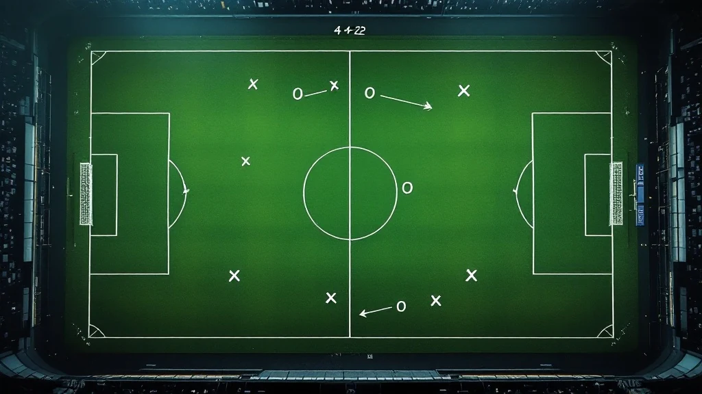

📌 3줄 요약
이강인의 아틀레티코 마드리드 이적은 2026년 7월 초 "구두 합의·오피셜 임박"으로 보도됐습니다. 아직 공식 발표 전이라 이적료 같은 세부는 매체마다 갈립니다.

이적의 최대 관전 포인트는 시메오네의 수비적 4-4-2와 창의적 왼발 플레이메이커의 궁합입니다. 서사와 실리는 분명하지만 전술 적응은 양날의 검입니다.

10세에 스페인으로 건너가 발렌시아에서 프로가 된 선수의 라리가 회귀라는 점에서, 단순 이적 이상의 서사적 무게가 있습니다.

이강인 아틀레티코 이적설이 뜨는 걸 보면서, 저는 이적료보다 먼저 "시메오네 밑에서 이강인이 어떻게 쓰일까"가 궁금했습니다. 결론부터 말하면요, 이번 이적은 서사와 실리로 보면 앞뒤가 딱 맞지만, 전술 궁합만 놓고 보면 물음표가 남는 이적입니다. 그래서 이 글은 "좋다/나쁘다"로 뭉뚱그리지 않고, 이적의 장점·시메오네 전술과의 궁합·발렌시아에서 시작한 배경을 하나씩 팩트로 뜯어보겠습니다.

## 이강인 아틀레티코 이적, 지금 어디까지 왔나요?

2026년 7월 초 기준, 이강인의 아틀레티코 마드리드행은 구두 합의가 끝나 공식 발표만 남았다는 단계로 보도되고 있습니다. 이적 전문 기자 파브리시오 로마노가 "Here we go"로 전했고, 스페인 매체들도 모든 당사자의 구두 합의를 보도했습니다. 다만 여기서 많이들 헷갈리는데, 이건 아직 구단 공식 발표가 아니라 합의·임박 단계입니다. 등번호나 데뷔전 같은 세부는 공식 발표 때 확정되는데, 그리즈만이 달던 7번의 향방도 그때 정해질 전망입니다.

이적료는 매체마다 갈립니다. 3,000만 유로에 보너스가 붙는다는 보도가 있고, 4,000만 유로(약 700억 원) 규모라는 보도도 있습니다. 잘 바뀌는 정보라 정확한 액수는 공식 발표 기준으로 확인하는 게 안전합니다. 협상은 발렌시아 시절부터 이강인을 알던 아틀레티코의 마테우 알레마니 스포츠 디렉터가 주도한 것으로 전해집니다.

⚠️ 이 글의 전제
이적 관련 수치(이적료·등번호·데뷔전)는 공식 발표 전이라 유동적입니다. 이 글은 확정 정보가 아니라 보도를 근거로 한 분석이며, 세부 숫자는 단정하지 않고 "보도 기준"으로 표기했습니다.

## 왜 이적하려 할까? — PSG 벤치와 출전 시간

이적의 가장 현실적인 이유는 출전 시간입니다. 이강인은 PSG에서 리그와 챔피언스리그 우승을 경험했고, 보도 기준 두 시즌간 공식전 124경기에서 16골 16도움을 기록했습니다. 아시아 선수로는 드문 유럽 트레블 경험까지 쌓았죠.

문제는 시즌 후반이었습니다. 중요한 경기에서 벤치에 머무는 일이 늘면서, 주전으로 꾸준히 뛸 무대를 찾는 게 이적 동기가 됐다는 게 스페인 매체들의 공통된 분석입니다. 저도 PSG 경기를 챙겨보면서 느낀 건, 이강인의 재능이 로테이션 자원으로 쓰이기엔 아깝다는 점이었습니다.

2026년 북중미 월드컵을 앞둔 시점이라는 것도 큽니다. 대표팀 핵심 자원이 소속팀에서 꾸준한 리듬을 확보하는 건 개인은 물론 대표팀 관점에서도 중요합니다. "우승 트로피는 있지만 출전은 부족한" 상황을 "주전으로 뛰는" 상황으로 바꾸려는 선택으로 읽힙니다.

## 라리가 복귀가 왜 이강인에게 잘 맞나요?

라리가는 이강인의 플레이 스타일에 가장 잘 맞는 리그입니다. 이건 감이 아니라 기록으로 드러납니다. 이강인은 좁은 공간에서의 탈압박과 드리블에 강하고, 발렌시아 시절 라리가에서 드리블 성공률 상위권을 기록한 유형입니다. 몸싸움과 속도로 밀어붙이는 리그보다, 좁은 공간의 기술과 창의성이 통하는 라리가가 그의 무기를 살리기 좋습니다.

여기에 언어와 문화 적응이라는 변수도 사실상 제로입니다. 뒤에서 자세히 다루지만, 이강인은 10대를 스페인에서 보낸 선수라 현지 적응 비용이 거의 들지 않습니다. 새 리그·새 언어에 적응하느라 첫 시즌을 허비하는 다른 이적생들과 출발선이 다릅니다.

전술 이해도와 다재다능함도 라리가에서 강점입니다. 이강인은 좌우 윙어, 중앙 미드필더, 심지어 가짜 9번까지 소화해 왔습니다. 감독 입장에서 여러 카드로 쓸 수 있는 선수라는 뜻인데, 이 다재다능함이 뒤에 볼 시메오네 시스템에서 어떻게 작동할지가 이번 이적의 진짜 관전 포인트입니다.

## 시메오네 전술과 이강인, 정말 맞을까?

여기가 이 이적의 핵심 쟁점입니다. 결론부터 말하면, 창의성은 매력이지만 수비 부담이 관건입니다. 디에고 시메오네의 아틀레티코는 4-4-2를 현대적으로 재해석한 팀입니다. 두 줄 수비 블록을 단단히 세우고, 강한 압박과 빠른 역습으로 경기를 지배하죠. 이 시스템의 특징은 측면 자원에게도 강한 수비 가담을 요구한다는 점입니다. 윙어가 수비 라인까지 내려와 틈을 메우는 게 시메오네 축구의 기본입니다.

바로 여기서 물음표가 생깁니다. 이강인은 공격형 미드필더이자 왼발 플레이메이커로, 파이널 서드에서 창의성을 뿜는 게 본업입니다. 90분 내내 수비 복귀와 활동량을 요구하는 시메오네 시스템에서, 공격 재능을 얼마나 유지하며 수비 몫까지 해낼 수 있느냐가 성패를 가릅니다. 발렌시아 시절 지적됐던 기복·일관성 논란도 이 지점과 무관하지 않습니다.

그럼에도 궁합이 맞을 여지는 충분합니다. 세 가지 이유가 있습니다.

**첫째, 아틀레티코가 예전보다 공격적으로 바뀌었습니다.** 훌리안 알바레스 같은 공격 자원이 가세하면서, 시메오네도 파이널 서드의 창의성을 필요로 합니다. 순수 수비 팀이 아니라는 뜻입니다.

**둘째, 역습 축구와 이강인의 킥은 궁합이 좋습니다.** 시메오네의 빠른 전환 상황에서, 이강인의 정확한 킬패스와 세트피스는 소수의 기회를 득점으로 바꾸는 결정적 무기가 될 수 있습니다.

**셋째, 다재다능함이 곧 전술 유연성입니다.** 스페인 매체들은 시메오네 감독도 이강인을 원하는 카드로 평가한다고 전합니다. 여러 포지션을 소화하는 선수는 시메오네가 경기 중 변형을 줄 때 활용도가 높습니다.

💡 시메오네의 4-4-2가 궁금하다면
왜 측면 자원의 수비 가담이 중요한지, 4-4-2가 어떤 상황에 강하고 약한지는 포메이션 원리를 알면 이해가 빠릅니다. 전술 궁합을 더 깊이 보고 싶다면 <a href="/soccer-formation-pros-cons/">축구 포메이션 장단점</a> 글과 함께 보시길 권합니다.

## 경쟁 상대는 누구? — 아틀레티코 스쿼드 속 이강인

이적이 곧 주전을 보장하진 않습니다. [아틀레티코 마드리드 공식 사이트](https://www.atleticodemadrid.com/)의 스쿼드를 보면, 측면과 2선에는 이미 경쟁자가 있습니다. 감독의 아들이자 우측 윙어로 뛰는 줄리아노 시메오네, 중원과 측면을 오가는 코너 갤러거 같은 자원과 자리를 다퉈야 합니다.

시메오네 밑에서 출전을 보장받는 방법은 분명합니다. 공격 생산성뿐 아니라 수비 기여로 감독의 신뢰를 얻는 것입니다. 시메오네는 재능만으로 선수를 쓰지 않고, 팀 전술에 헌신하는 선수에게 시간을 주는 감독으로 유명합니다. 이강인이 창의성에 더해 궂은일까지 해낸다면, 오히려 다른 어떤 팀보다 확실한 입지를 잡을 수 있습니다.

반대로 수비 부담을 못 견디면 로테이션 자원에 머물 위험도 있습니다. 그래서 이번 이적은 "재능이 부족해서"가 아니라 "시스템에 얼마나 녹아드느냐"로 평가가 갈릴 겁니다. 제가 이 이적을 흥미롭게 보는 이유가 바로 이 지점입니다.

## 스페인에서 시작한 축구 — 발렌시아 회귀의 서사

이강인에게 스페인은 단순한 이적지가 아니라 축구를 완성한 곳입니다. 이 배경을 알면 이번 이적의 무게가 다르게 보입니다. 이강인은 KBS '날아라 슛돌이' 출신 축구 신동으로, 2011년 만 10세 나이에 가족과 함께 스페인으로 건너가 발렌시아 유소년팀에 입단했습니다. 온 가족이 한국의 삶을 접고 이주한 결단이었습니다.

발렌시아 유소년에서 각종 대회 MVP와 득점왕을 휩쓴 그는 2018년 10월, 17세의 나이에 1군에 데뷔했습니다. 당시 스페인 현지 매체가 그의 실력뿐 아니라 인성을 극찬했을 만큼 화제였죠. 이듬해 코파 델 레이 우승을 맛봤고, 2019 U-20 월드컵에서는 준우승과 함께 대회 최고 선수에게 주는 골든볼을 받았습니다. 저도 그 U-20 월드컵을 중계로 챙겨봤는데, 그때 이미 "이 선수는 라리가에서 클 선수"라는 인상이 강했습니다.

물론 순탄하지만은 않았습니다. 1군에서 기복과 일관성 문제로 출전 기회가 줄었고, 2021년 레반테전에서 좋은 활약에도 교체돼 벤치에서 눈물을 흘린 장면은 팬들 사이에서 두고두고 회자됩니다. 결국 발렌시아와 결별한 뒤 마요르카에서 재기했고, PSG에서 유럽 정상까지 밟았습니다. 그런 그가 라리가 빅클럽으로 돌아온다는 건, 발렌시아에서의 아쉬운 이별을 스스로 되갚는 서사이기도 합니다.

## 이적의 명암 — 한눈에 정리

지금까지 내용을 장점과 리스크로 압축하면 이렇습니다.

| 구분 | 내용 |
| --- | --- |
| 출전 시간 | PSG 벤치 → 주전 도전, 월드컵 앞두고 리듬 확보 (장점) |
| 리그 적합성 | 좁은 공간 기술·드리블이 통하는 라리가, 언어·문화 적응 제로 (장점) |
| 서사·심리 | 10세부터 성장한 스페인 복귀, 발렌시아 이별의 설욕 (장점) |
| 전술 궁합 | 시메오네의 강한 수비 가담 요구 vs 창의형 플레이메이커 (리스크) |
| 경쟁 | 줄리아노 시메오네·갤러거 등과 측면·2선 경쟁 (리스크) |

정리하면, 이적의 방향 자체는 이강인에게 잘 맞습니다. 남은 변수는 순수하게 전술 적응 하나입니다.

## 자주 묻는 질문 (FAQ)

**Q. 이강인 아틀레티코 이적은 확정된 건가요?** 2026년 7월 초 기준으로는 "구두 합의 완료, 공식 발표 임박" 단계로 보도됐습니다. 파브리시오 로마노와 스페인 매체들이 합의를 전했지만 구단 공식 발표는 아직이라, 최종 확정은 오피셜을 기다려야 합니다.

**Q. 이강인은 시메오네 전술에 맞을까요?** 양면적입니다. 이강인의 창의성·킥·다재다능함은 최근 공격적으로 바뀐 아틀레티코에 무기가 되지만, 시메오네가 측면·2선 자원에게 요구하는 강한 수비 가담과 활동량에 얼마나 적응하느냐가 관건입니다. 재능보다 시스템 적응이 성패를 가릅니다.

**Q. 이강인은 원래 스페인에서 축구를 시작했나요?** 네. 2011년 만 10세에 가족과 함께 스페인으로 이주해 발렌시아 유소년팀에서 성장했고, 2018년 발렌시아 1군에서 프로 데뷔했습니다. 사실상 스페인에서 축구를 완성한 선수라, 라리가 복귀는 제2의 고향으로 돌아오는 셈입니다.

**Q. 이적료는 얼마인가요?** 보도마다 다릅니다. 기본 3,000만 유로에 보너스가 붙는다는 보도와, 4,000만 유로(약 700억 원) 규모라는 보도가 함께 나옵니다. 공식 발표 전이라 정확한 액수는 확정되지 않았습니다.

## 마무리

자, 이거 하나만 기억하면 돼요. 이강인 아틀레티코 이적은 서사와 실리로 보면 나무랄 데 없는 방향이고, 남은 물음표는 오직 하나, 시메오네 전술과의 궁합입니다. 출전 시간, 라리가 적합성, 스페인에서 자란 배경까지 이적의 이유는 충분합니다. 이제 지켜볼 건 창의적인 왼발이 두 줄 수비 시스템 안에서 어떻게 살아남느냐입니다. 개인적으로는, 발렌시아에서 눈물로 떠났던 선수가 라리가 빅클럽에서 어떤 답을 내놓을지가 2026년 라리가에서 가장 흥미로운 관전 포인트라고 봅니다. 라리가 경기를 챙겨보고 싶다면 [해외축구 중계 보는 법](/how-to-watch-overseas-football/)도 함께 참고하세요.

---

**관련 키워드** — #이강인 #이강인아틀레티코 #이강인이적 #이강인시메오네 #이강인라리가 #이강인발렌시아 #이강인PSG #아틀레티코마드리드 #이강인이적료 #마드리드더비 #라리가복귀 #이강인등번호
