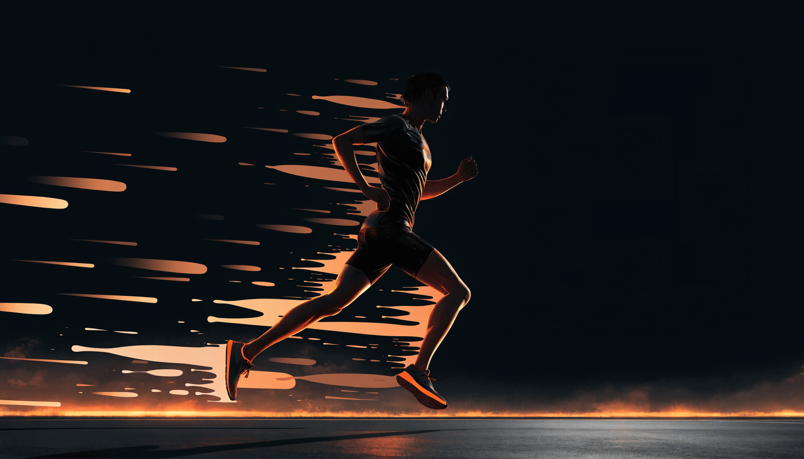

📌 3줄 요약
마라톤 입문은 42.195km가 아니라 5km·10km 대회부터 시작하는 게 정답이다.

장비는 러닝화 하나만 제대로 사면 충분하고, 나머지는 차차 늘려도 된다.

완주의 핵심은 속도가 아니라 끝까지 일정한 페이스를 지키는 것이다.

저도 처음 마라톤에 관심 가졌을 때 "그래서 뭐부터 해야 하지?" 하고 한참 검색만 했던 기억이 나요. 결론부터 말하면요, 가장 먼저 알아야 할 건 "풀코스부터 뛰지 않는다"예요. 마라톤 입문은 5km, 10km 같은 짧은 거리부터 시작해 몸을 만들고, 점차 거리를 늘려가는 과정이에요. 이 글에서는 거리 단계부터 훈련 로드맵, 꼭 필요한 준비물, 대회 당일 체크리스트까지 처음 도전할 때 알아야 할 것을 제가 직접 찾아 순서대로 정리해 드릴게요.

핵심은 "무리하지 않고 꾸준히"예요. 처음부터 빨리, 멀리 뛰려다 부상이나 번아웃으로 그만두는 경우가 가장 많아요. 아래 순서대로 차근차근 가면 누구나 완주할 수 있어요.

## 마라톤, 어디서부터 시작할까

마라톤이라고 하면 42.195km 풀코스를 떠올리지만, 입문자는 그 전에 거쳐야 할 단계가 있어요. 대부분의 대회가 거리별로 종목을 나눠 열리니, 본인 수준에 맞는 거리부터 신청하면 돼요.

- **5km** — 입문 첫 목표. 꾸준히 걷고 조깅하면 몇 주 안에 완주 가능.
- **10km** — 러닝이 익숙해졌다면 다음 단계. 본격적인 "러너"의 시작.
- **하프(21.1km)** — 중급 목표. 체계적인 훈련이 필요한 거리.
- **풀코스(42.195km)** — 최종 목표. 보통 몇 달~1년 이상 준비 후 도전.

한국에서는 봄·가을마다 전국에서 다양한 규모의 대회가 열려서, 5km·10km 대회는 어렵지 않게 찾을 수 있어요. 첫 목표를 풀코스로 잡지 말고, **3개월 안에 5km 완주** 같은 현실적인 목표부터 세우는 게 끝까지 가는 비결이에요.

## 입문 훈련 로드맵 — 걷기에서 달리기로

여기서 많이들 조급해하는데, 처음부터 30분을 쉬지 않고 뛰려고 하면 대부분 일주일 안에 포기해요. 입문 훈련의 핵심은 **걷기와 조깅을 섞어가며 점진적으로 늘리는 것**이에요. 초보자용 플랜은 보통 8~16주에 걸쳐 달리는 시간을 조금씩 늘려가요.

| 시기 | 목표 | 방식 |
| --- | --- | --- |
| 1~2주차 | 걷기에 적응 | 30분 빠르게 걷기, 주 3회 |
| 3~5주차 | 걷기+조깅 | 1분 조깅·2분 걷기 반복 |
| 6~8주차 | 조깅 비중↑ | 5분 조깅·1분 걷기 반복 |
| 9주차~ | 쉬지 않고 달리기 | 20~30분 연속 조깅 → 거리 늘리기 |

원칙은 **주 3회, 무리하지 않는 강도**예요. 한 주에 거리를 10% 이상 갑자기 늘리지 않는 게 부상 예방의 기본이에요. 통증이 있으면 쉬고, 다음 단계로 못 넘어가면 그 주를 한 번 더 반복하면 돼요. 조급해할 필요 없어요.

## 꼭 필요한 준비물 — 우선순위대로

장비를 한 번에 다 살 필요는 없어요. 입문자에게 정말 필요한 건 몇 가지뿐이에요. 우선순위대로 정리하면 이래요.

- **러닝화 (1순위)** — 가장 중요하고, 처음부터 제대로 사야 할 유일한 장비. (아래 따로 설명)
- **기능성 의류** — 땀 배출되는 소재. 면 티셔츠는 무거워지고 쓸림이 생겨 피해야 해요.
- **러닝벨트·암밴드** — 휴대폰·에너지젤·열쇠를 넣는 용도. 거리가 길어지면 필요해요.
- **에너지젤·수분** — 하프 이상부터 필수. 목마르기 전에 조금씩 보충하는 게 요령이에요.
- **러닝워치(선택)** — 페이스·거리 기록용. 없으면 폰 앱으로도 충분해요.

신발 외 장비의 구체적인 가이드는 [나이키 러닝 가이드](https://www.nike.com/kr/running) 같은 공식 자료를 참고하면 도움이 돼요. 정리하면, **입문 초기엔 러닝화 + 기능성 옷 한 벌**이면 시작하기 충분하고, 거리가 늘면서 벨트·젤을 더하면 돼요.

## 러닝화 고르기 — 입문 장비의 전부

마라톤 입문에서 돈을 쓸 곳은 사실상 러닝화 하나예요. 발에 안 맞는 신발은 물집·통증·부상으로 직결돼서, 운동화를 대충 신고 뛰는 게 가장 흔한 초보 실수예요.

고를 때는 **쿠셔닝과 사이즈**가 핵심이에요. 입문자는 충격을 잘 흡수하는 쿠션감 좋은 모델이 무난해요. 사이즈는 평소보다 **반 치수~한 치수 크게** 신는 게 좋은데, 오래 뛰면 발이 붓기 때문이에요. 가능하면 매장에서 직접 신어보고, 오후(발이 부은 상태)에 맞춰보는 걸 추천해요.

너무 비싼 카본화(대회용 고반발 신발)는 입문자에게 필요 없어요. 그건 기록을 다투는 단계에서 고민할 문제예요. 입문자는 **편하고 쿠션 좋은 데일리 트레이닝화**면 충분해요.

## 페이스 조절 — 완주를 가르는 진짜 변수

이거 하나만 기억하면 돼요. 초보가 대회에서 가장 많이 하는 실수는 출발 직후 신나서 너무 빨리 뛰는 거예요. 그러면 중반에 체력이 바닥나서 걷게 돼요. 완주의 핵심은 속도가 아니라 **끝까지 일정한 페이스를 유지하는 것**이에요.

기준은 간단해요. "옆 사람과 대화가 가능한 속도"가 입문자의 적정 페이스예요. 숨이 차서 말을 못 할 정도면 너무 빠른 거예요. 처음엔 답답할 만큼 천천히 시작해서, 후반에 여유가 있으면 조금씩 올리는 전략이 완주 확률을 가장 높여요.

훈련할 때부터 이 페이스에 익숙해지면 대회에서도 자연스럽게 지켜져요. 기록은 완주를 몇 번 해본 뒤에 신경 써도 늦지 않아요.

## 대회 당일 체크리스트

대회 날 당황하지 않으려면 미리 준비해두면 좋아요. 입문자가 챙길 것들이에요.

- **복장·신발은 새것 금지** — 훈련 때 신어본 익숙한 것으로. 새 신발·새 옷은 쓸림·물집의 주범.
- **배번호·기록칩** — 전날 미리 옷에 달아두기.
- **수분·에너지젤** — 거리에 맞게. 목마르기 전 조금씩.
- **워밍업** — 출발 전 가벼운 조깅·스트레칭으로 몸 풀기.
- **여유 있게 도착** — 화장실 줄이 길어요. 1시간 전 도착 권장.

날씨도 변수예요. 쌀쌀한 출발 시간엔 버려도 되는 겉옷을 걸쳤다가 출발 직전 벗는 러너가 많아요. 비 예보가 있으면 모자·방수 대비도 챙기세요.

## 언제, 어떤 대회로 시작할까

러닝하기 가장 좋은 시기는 **봄**(3-5월)과 **가을**(10-11월)이에요. 기온 10~15°C 내외에 습도가 낮아 몸에 부담이 적어요. 한여름·한겨울 대회는 입문자에겐 난이도가 높으니 피하는 게 좋아요.

첫 대회는 **5km 또는 10km**로 고르세요. 규모가 너무 큰 대회보다 동네 마라톤·소규모 대회가 부담이 적고 분위기도 좋아요. 완주 메달을 받아보면 동기부여가 확 올라가서, 자연스럽게 다음 거리에 도전하게 돼요.

## 초보가 자주 하는 실수

- **풀코스부터 도전** — 5km·10km로 몸을 만든 뒤 단계적으로.
- **새 신발·새 옷을 대회 당일 착용** — 반드시 훈련 때 길들인 것으로.
- **출발 오버페이스** — 천천히 시작, 대화 가능한 속도 유지.
- **거리·강도 급증** — 주당 10% 이내로 천천히 늘리기.
- **통증 참고 강행** — 아프면 쉬는 게 가장 빠른 길.

자료를 직접 정리해보니 입문자가 그만두는 이유가 결국 이 다섯 가지로 모이더라고요. 이것만 피해도 부상 없이 꾸준히 갈 수 있어요. 운동을 단계적으로 시작하는 원칙은 다른 종목도 같아서, [골프 입문 가이드](/golf-first-round-beginner-guide/)에서도 비슷한 접근을 다뤘어요.

## 자주 묻는 질문

**Q. 마라톤 입문, 몇 km부터 시작해야 하나요?**
A. 5km부터예요. 걷기와 조깅을 섞어 몇 주 훈련하면 완주할 수 있는 거리라 첫 목표로 적당해요. 익숙해지면 10km, 하프, 풀코스 순으로 늘리면 됩니다.

**Q. 풀코스 완주까지 얼마나 걸리나요?**
A. 운동 경험과 훈련량에 따라 다르지만, 완전 초보가 풀코스를 안전하게 완주하려면 보통 수개월에서 1년 정도 단계적으로 준비해요. 조급해하지 말고 거리를 차근차근 늘리는 게 중요해요.

**Q. 러닝화 말고 꼭 사야 할 장비가 있나요?**
A. 초기엔 러닝화와 땀 배출되는 기능성 옷이면 충분해요. 거리가 길어지면 러닝벨트와 에너지젤을 더하고, 기록을 챙기고 싶으면 러닝워치나 앱을 쓰면 됩니다.

**Q. 대회 당일 가장 조심할 점은?**
A. 새 신발·새 옷을 처음 신지 말고, 출발할 때 너무 빨리 뛰지 마세요. 이 두 가지가 초보 완주 실패의 가장 큰 원인이에요. 수분은 목마르기 전에 조금씩 보충하세요.

**Q. 비 오거나 더운 날 대회는 어떻게 하나요?**
A. 입문자는 무리하지 않는 게 우선이에요. 폭염·한파 대회는 피하고, 비가 오면 모자와 방수 대비를 하세요. 컨디션이 안 좋으면 기록을 포기하고 완주만 목표로 삼아도 됩니다.

---

**관련 키워드** — #마라톤입문 #마라톤초보 #러닝입문 #마라톤준비물 #러닝화추천 #마라톤훈련 #5km마라톤 #10km완주 #러닝페이스 #달리기입문 #마라톤대회 #초보러너
