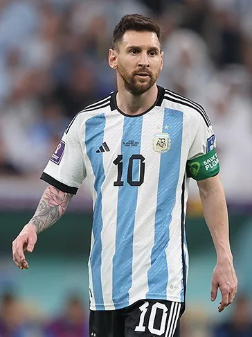
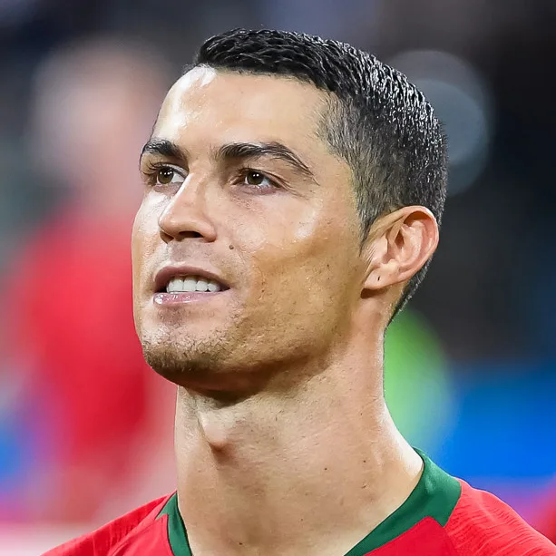

메시 vs 호날두 통산 기록을 딱 한 줄로 답하면, **골은 호날두, 나머지는 대부분 메시**입니다. 저도 처음 두 선수 숫자를 찾아봤을 때 출처마다 값이 달라서 한참 헤맸는데요, 그래서 여러 통계 사이트를 직접 열어 교차확인하고 표로 묶어봤습니다. 이 글 하나면 골·도움·발롱도르·트로피까지 누가 앞서는지 다시는 안 헷갈릴 겁니다.

📌 3줄 요약
통산 골은 호날두(약 976골)가 메시(약 918골)보다 많고, 1,000골에 도전 중입니다.

도움·발롱도르(8대 5)·리그 우승·월드컵은 메시가 앞섭니다. 챔피언스리그만 호날두가 5대 4로 근소 우위.

즉 '득점 기계'는 호날두, '우승과 창조력'은 메시. 2026년 기준이고 두 선수 다 현역이라 숫자는 계속 바뀝니다.

## 결론부터 — 메시와 호날두, 누가 앞설까?

결론부터 말하면요, 단일 지표로 줄 세울 수 없는 라이벌입니다. **득점 총량은 호날두, 효율·창조력·우승 트로피는 메시**로 갈립니다. 20년 가까이 이어진 이 '메호대전'이 아직도 재밌는 이유가 바로 이거예요. 기준을 뭘로 잡느냐에 따라 승자가 바뀌거든요.

큰 그림만 먼저 잡아두면 나머지는 쉽습니다. 호날두는 "얼마나 많이 넣었나"에서 앞서고, 메시는 "얼마나 효율적으로, 얼마나 많이 우승했나"에서 앞섭니다. 특히 발롱도르 8대 5, 월드컵 1대 0은 메시 쪽으로 무게추를 확실히 기울인 기록입니다.

그럼 항목별로 하나씩 뜯어보겠습니다. 숫자는 2026년 기준이고, 두 선수 모두 현역이라 매 경기 조금씩 갱신된다는 점만 기억해 주세요.

## 통산 골 수 비교 — 이건 호날두가 앞선다

통산 골은 **호날두가 약 976골로 메시(약 918골)보다 앞섭니다.** 호날두는 축구 역사상 누구도 밟지 못한 통산 1,000골 고지에 도전하고 있어요. 순수 득점 총량만 놓고 보면 이건 호날두의 영역이 맞습니다.

다만 여기서 많이들 헷갈리는데, 총량과 효율은 다른 이야기입니다. 경기당 득점을 보면 메시가 0.79골로 호날두(0.73골)보다 높아요. 출전 경기 수 자체가 호날두(약 1,330경기)가 메시(약 1,160경기)보다 훨씬 많기 때문에, 더 오래 더 많이 뛰며 쌓은 총량이라는 점도 같이 봐야 공평합니다.

| 골 관련 지표 | 메시 | 호날두 |
| --- | --- | --- |
| 통산 골(2026 기준) | 약 918골 | 약 976골 |
| 통산 출전 | 약 1,160경기 | 약 1,330경기 |
| 경기당 골 | 0.79골 | 0.73골 |
| 골 하나당 소요 시간 | 약 104분 | 약 111분 |

제가 표로 묶어보니 흥미롭죠. 총량은 호날두, 효율은 메시. 그래서 "누가 더 골을 잘 넣나"라는 질문 자체가 애초에 답이 갈리는 질문이에요.

## 도움(어시스트)은 누가 더 많을까?

도움은 **메시가 압도적으로 많습니다.** 집계 방식에 따라 메시 약 410~450개, 호날두 약 260~310개로, 어떤 기준을 쓰든 메시가 150개 안팎 더 많아요. 이 격차는 두 선수의 플레이 스타일 차이를 그대로 보여줍니다.

호날두가 골문 앞에서 마무리하는 완성형 스트라이커라면, 메시는 직접 넣기도 하면서 동료를 살리는 창조형 플레이메이커에 가깝습니다. 골과 도움을 합친 '공격 포인트'로 보면 격차가 더 벌어져요. 메시는 약 72분마다 골이든 도움이든 하나를 만들고, 호날두는 약 88분마다 하나를 만듭니다.

*▲ 리오넬 메시 (아르헨티나, 2022 월드컵) — 사진 ⓒ Hossein Zohrevand, CC BY 4.0 (Wikimedia Commons)*

## 발롱도르는 몇 개씩 받았나?

발롱도르는 **메시 8회, 호날두 5회**로 메시가 앞섭니다. 발롱도르는 한 해 최고의 선수에게 주는 개인 최고 권위의 상인데, 메시의 8회는 역대 단독 1위 기록이에요. 호날두의 5회도 역대 공동 2위급이지만, 개인상 대결에서는 메시가 확실히 우위입니다.

저도 예전엔 둘이 발롱도르를 비슷하게 나눠 가진 줄 알았거든요. 실제로 2008년부터 2017년까지 약 10년은 두 사람이 번갈아 독식했습니다. 그런데 2018년 이후 메시가 세 번을 더 받으면서 8대 5로 격차가 벌어졌어요. 트로피 종류와 권위가 헷갈린다면 [축구 트로피 종류 정리](/soccer-trophy-types/)를 같이 보면 개인상과 팀 우승의 차이가 정리됩니다.

## 챔피언스리그와 리그 우승은 누가 앞설까?

여기서는 항목마다 주인이 다릅니다. **챔피언스리그(UCL)는 호날두가 5회로 메시(4회)보다 하나 많고, 리그 우승은 메시가 앞섭니다.** 호날두가 유일하게 팀 트로피에서 앞서는 대표 지표가 바로 이 챔피언스리그예요. 레알 마드리드에서의 3연패가 결정적이었습니다.

반면 리그 우승은 메시가 12회 안팎으로 호날두(7회 안팎)보다 많습니다. 메시는 바르셀로나에서 라리가를 여러 번 제패했고, 호날두는 잉글랜드·스페인·이탈리아 세 리그를 모두 우승한 유일한 강점이 있어요. 리그 우승 횟수는 집계 사이트마다 한두 개씩 차이가 나니, 정확한 값은 공식 기록으로 확인하는 걸 권합니다.

💡 챔피언스리그 vs 리그, 뭐가 더 대단할까
둘 다 최고 무대지만 성격이 달라요. 챔피언스리그는 유럽 최강을 가리는 단기 토너먼트, 리그는 한 시즌 꾸준함을 증명하는 장기 레이스입니다. 그래서 "호날두가 UCL을 더 먹었으니 위"라고 단정하긴 어렵고, 반대도 마찬가지예요.

## 국가대표와 월드컵 — 메시만 가진 것

국가대표 트로피에서 결정적 차이가 하나 있습니다. **메시는 2022 월드컵 우승자이고, 호날두는 아직 월드컵 우승이 없습니다.** 축구에서 가장 큰 무대인 월드컵을 들어 올렸다는 건, 오랫동안 메시의 유일한 약점으로 지적되던 '국가대표 무관'을 완전히 지워버린 사건이었어요.

메시는 월드컵(2022)에 코파 아메리카 두 번(2021·2024), 올림픽 금메달(2008)까지 더해 국가대표 커리어가 화려합니다. 호날두도 유로 2016과 네이션스리그 우승으로 포르투갈에 큰 트로피를 안겼지만, 월드컵이라는 정점이 빠져 있어요. 이 차이가 '메호대전'의 마지막 승부처로 꼽히는 이유입니다. 참고로 두 선수 모두 2026 월드컵에 참가 중이라, 이 대회 결과가 마지막 변수로 남아 있습니다. 대회 공식 정보는 [FIFA 공식 사이트](https://www.fifa.com/)에서 확인할 수 있어요.

*▲ 크리스티아누 호날두 (포르투갈) — 사진 ⓒ Анна Нэсси, CC BY-SA 3.0 (Wikimedia Commons)*

## 한눈에 정리 — 메시 vs 호날두 통산 기록 표

말로 풀면 복잡하니, 제가 핵심만 한 표로 묶어봤습니다. 이거 하나만 저장해두면 웬만한 논쟁은 정리됩니다.

| 항목 | 메시 | 호날두 | 우위 |
| --- | --- | --- | --- |
| 통산 골 | 약 918골 | 약 976골 | 호날두 |
| 통산 도움 | 약 410~450 | 약 260~310 | 메시 |
| 경기당 골 | 0.79 | 0.73 | 메시 |
| 발롱도르 | 8회 | 5회 | 메시 |
| 챔피언스리그 | 4회 | 5회 | 호날두 |
| 리그 우승 | 12회 안팎 | 7회 안팎 | 메시 |
| 월드컵 | 1회(2022) | 없음 | 메시 |
| 통산 트로피 | 약 45개 이상 | 약 35개 이상 | 메시 |

표로 보면 명확하죠. 개별 득점 총량과 챔피언스리그는 호날두, 그 외 대부분은 메시입니다. 그래서 저는 "누가 위냐"보다 "어떤 유형의 위대함이냐"로 보는 게 이 둘을 즐기는 가장 좋은 방법이라고 생각해요.

## 왜 출처마다 숫자가 다를까?

숫자가 사이트마다 다른 건 **집계 범위가 다르기 때문**이지, 누가 틀린 게 아닙니다. 이걸 알면 어떤 자료를 봐도 안 헷갈려요. 저도 이걸 몰랐을 때 골 수가 사이트마다 10골씩 달라서 한참 헤맸거든요.

가장 큰 차이는 세 가지에서 납니다. 첫째, 친선경기나 유소년·연령별 대표 경기를 포함하느냐. 둘째, 취소된 대회나 비공식 경기를 넣느냐. 셋째, 도움의 '판정 기준'이 매체마다 달라 어시스트 숫자는 특히 편차가 큽니다. 그래서 이 글에서도 딱 떨어지는 값 대신 '약'과 '안팎'을 붙였어요. 두 선수 다 현역이라 오늘 넣은 골이 내일 숫자를 바꾼다는 점도 있고요.

⚠️ 숫자 볼 때 주의
"통산 ○○골 확정"처럼 단정한 자료는 오히려 의심하세요. 현역 선수의 통산 기록은 매 경기 갱신되는 '움직이는 숫자'입니다. 정확한 최신값이 필요하면 공식 리그·FIFA 기록이나 날짜가 명시된 통계 사이트를 기준으로 삼는 게 안전합니다.

## 자주 묻는 질문 (FAQ)

**Q. 메시랑 호날두 중에 누가 골을 더 많이 넣었나요?** 통산 골 총량은 호날두가 약 976골로 메시(약 918골)보다 많습니다. 다만 경기당 득점 효율은 메시가 0.79골로 더 높아, '총량은 호날두, 효율은 메시'로 갈립니다.

**Q. 발롱도르는 메시와 호날두 각각 몇 번 받았나요?** 메시가 8회, 호날두가 5회입니다. 메시의 8회는 역대 단독 최다 기록이며, 개인상 대결에서는 메시가 앞섭니다.

**Q. 호날두가 메시보다 확실히 앞서는 기록은 뭔가요?** 통산 골 총량과 챔피언스리그 우승 횟수(5대 4)입니다. 특히 챔피언스리그는 호날두가 팀 트로피에서 메시를 앞서는 거의 유일한 지표예요.

**Q. 메시와 호날두, 결국 누가 더 위대한가요?** 기준에 따라 다릅니다. 순수 득점과 챔피언스리그는 호날두, 효율·도움·발롱도르·리그 우승·월드컵은 메시가 앞섭니다. 하나로 줄 세우기보다 유형이 다른 두 위대함으로 보는 게 정확합니다.

## 마무리

이거 하나만 기억하면 돼요. **골 총량은 호날두, 효율과 우승은 메시.** 20년을 끌어온 라이벌인 만큼 어느 한쪽이 모든 걸 이긴 게 아니라, 서로 다른 방식으로 최정상을 증명한 두 선수라는 게 제가 자료를 다 정리하고 내린 결론입니다. 트로피와 개인상의 차이가 더 궁금하다면 [축구 트로피 종류 정리](/soccer-trophy-types/)도 이어서 보시면 좋아요.

---

## 이미지 출처

- 리오넬 메시 (2022 월드컵) — ⓒ Hossein Zohrevand, [CC BY 4.0](https://creativecommons.org/licenses/by/4.0/), via Wikimedia Commons
- 크리스티아누 호날두 (2018) — ⓒ Анна Нэсси, [CC BY-SA 3.0](https://creativecommons.org/licenses/by-sa/3.0/), via Wikimedia Commons
- 대표(히어로) 이미지는 위 두 사진을 좌우로 배치해 제작했습니다.

---

**관련 키워드** — #메시vs호날두 #메호대전 #메시호날두기록비교 #메시통산골 #호날두통산골 #메시호날두발롱도르 #메시호날두트로피 #메시호날두도움 #메시호날두챔피언스리그 #메시월드컵 #호날두월드컵 #메시호날두국가대표
