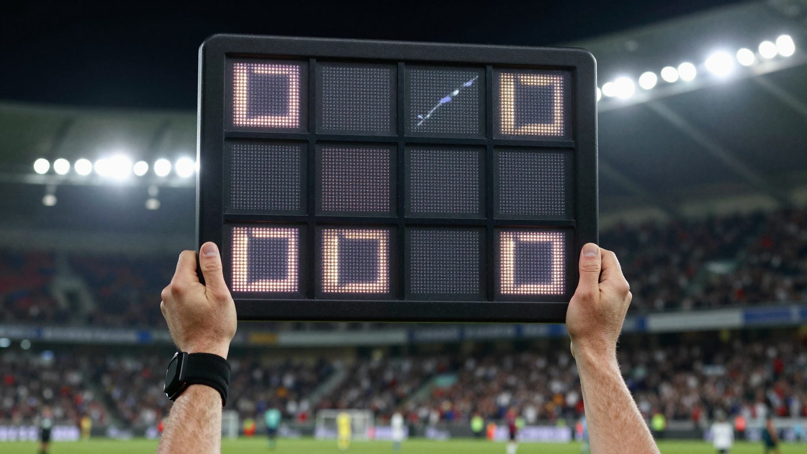

결론부터 말하면요, **축구 경기 시간은 전반 45분 + 후반 45분, 총 90분**이고 여기에 심판이 정하는 추가시간이 붙습니다. 그런데 중계를 보다 보면 90분이 지났는데 왜 안 끝나는지, 추가시간이 5분인데 6분째 골이 들어가도 되는 건지 헷갈리죠. 저도 처음엔 추가시간이 정확히 몇 분인지 딱 정해져 있는 줄 알았거든요. 그래서 축구 경기 시간과 추가시간 규칙을, 인저리타임 용어 정리부터 연장전·승부차기, 그리고 2025년에 바뀐 골키퍼 시간 규칙까지 한 번에 정리했습니다.

📌 3줄 요약
정규 시간은 전후반 각 45분, 하프타임 15분을 빼면 총 90분입니다.

추가시간(인저리타임)은 경기 중 멈춘 시간을 보충하는 것으로, 심판 재량이라 고정값이 없습니다.

토너먼트에서 90분 뒤 동점이면 연장 전후반 15분씩 30분, 그래도 동점이면 승부차기로 갑니다.

## 축구 경기 시간, 기본 구조는 어떻게 되나요?

축구 정규 경기 시간은 전반전 45분과 후반전 45분을 합친 90분입니다. 전후반 사이에는 15분의 하프타임(휴식)이 있어요. 그래서 경기장에 실제로 머무는 시간은 추가시간까지 더하면 대략 두 시간 안팎이 됩니다.

표로 묶어보면 이렇습니다.

| 구간 | 시간 |
|---|---|
| 전반전 | 45분 |
| 하프타임(휴식) | 15분 |
| 후반전 | 45분 |
| 정규 시간 합계 | 90분 |
| 추가시간 | 전·후반 끝에 심판 재량으로 별도 부여 |

참고로 이 90분은 성인 경기 기준입니다. 유소년 경기는 연령에 따라 전후반 시간이 짧아지는데, 예를 들어 어린 연령대는 전후반 40분 이하로 줄여서 진행하는 식이에요. 즉 "90분"은 절대 불변이 아니라 성인 표준값이라고 보면 됩니다.

## 추가시간은 왜 생기고 몇 분인가요?

추가시간은 경기가 진행되는 동안 여러 이유로 멈춘 시간을 보충해주는 시간입니다. 축구 시계는 농구처럼 반칙이나 아웃 때마다 멈추지 않고 계속 흐르기 때문에, 그동안 실제로 공이 멈춰 있던 시간을 후반과 전반 끝에 몰아서 돌려주는 개념이에요.

추가시간에 반영되는 대표적인 요소는 선수 교체, 부상자 치료, 골 세리머니, VAR 판독, 그리고 노골적인 시간 끌기 같은 지연입니다. 그래서 교체가 많거나 VAR 판독이 길었던 경기는 추가시간이 길어집니다.

여기서 많이들 헷갈리는데, **추가시간은 심판 재량이라 고정된 숫자가 없습니다.** 보통 1~5분 사이에서 결정되고 경기에 따라 그 이상으로 늘어나기도 합니다. 게다가 전광판에 "+5"가 떠도 그게 끝이 아니에요. 그 5분 안에서 또 지연이 생기면 심판은 더 흘려보낼 수 있습니다. 표시된 시간은 "최소한 이만큼"에 가깝지, 정확한 종료 시각이 아닙니다.

## 추가시간·인저리타임·스토피지타임, 뭐가 다른가요?

같은 시간을 두고 부르는 이름이 여러 개라 더 헷갈립니다. 정리하면, 가장 정확한 공식 표현은 **추가시간**(additional time)이고, 인저리타임과 스토피지타임은 관용적으로 같이 쓰이는 말이에요.

- **추가시간(additional time)** — 국제 규칙에서 쓰는 공식에 가까운 표현. 멈춘 시간 전체를 보충한다는 의미입니다.
- **인저리타임(injury time)** — 원래는 '부상으로 멈춘 시간'을 가리키던 좁은 말인데, 지금은 추가시간 전체를 부르는 관용어로 굳어졌습니다.
- **스토피지타임(stoppage time)·로스타임(loss time)** — '멈춘 시간'이라는 뜻으로, 역시 추가시간을 가리키는 다른 이름입니다.

저도 예전엔 인저리타임이 부상 시간만 따로 세는 건 줄 알았거든요. 실제로는 방송·현장에서 넷을 거의 같은 뜻으로 섞어 씁니다. 그러니 어느 단어가 나와도 "정규 90분 뒤에 붙는 보충 시간"이라고 이해하면 됩니다.

## 2022 월드컵 뒤로 추가시간이 왜 길어졌나요?

2022 카타르 월드컵을 기점으로 추가시간이 눈에 띄게 길어졌습니다. 예전엔 후반 추가시간이 3~4분이 흔했는데, 이 대회에서는 7분, 10분씩 붙는 경기가 자주 나왔어요. 저도 이 대회를 중계로 챙겨봤는데 후반에 +10이 뜨는 걸 보고 눈을 의심했던 기억이 납니다. 멈춘 시간을 예전보다 엄격하게 계산해 돌려주기 시작했기 때문입니다.

그 배경엔 "실제로 공이 움직인 시간"이 너무 짧다는 문제의식이 있었습니다. 90분 경기라지만 온갖 지연으로 공이 실제 인플레이된 시간은 한 시간에 못 미치는 경우가 많았거든요. 그래서 잃어버린 시간을 최대한 채워주자는 방향으로 운영이 바뀐 겁니다.

다만 이 방식은 경기가 늘어지고 예측이 어렵다는 지적도 받았습니다. 그래서 이후 대회에서는 추가시간을 무작정 길게 주기보다, 지연 자체를 줄이는 쪽으로 방향이 옮겨가고 있어요. 그 연장선이 바로 다음에 설명할 2025-26 규칙 변화입니다.

## 2025-26 시즌부터 바뀐 시간 관련 규칙

축구 규칙을 정하는 국제축구평의회(IFAB)는 2025-26 시즌부터 시간 끌기를 원천 차단하는 규칙들을 도입했습니다. 시간을 나중에 보충하는 대신, 애초에 지연이 생기지 않게 하겠다는 방향이에요.

가장 화제가 된 건 **골키퍼 8초룰**입니다. 골키퍼가 공을 손에 잡고 8초를 넘기면 상대 팀에 코너킥을 주는 규칙으로, 심판은 5초가 남았을 때 손을 들어 카운트다운을 해줍니다. 기존에는 6초를 넘기면 간접 프리킥을 주게 돼 있었지만 거의 적용되지 않았는데, 벌칙을 코너킥으로 바꾸니 실제로 효과가 있었다고 합니다.

이 밖에도 지연을 줄이기 위한 시간 제한이 함께 정비됐습니다. 스로인이나 골킥을 제한 시간 안에 하지 않으면 불이익을 주고, 교체되어 나가는 선수도 빨리 그라운드를 벗어나도록 하는 식이에요. 세부 적용은 대회마다 다를 수 있으니, 정확한 최신 규정은 [대한축구협회(KFA)](https://www.kfa.or.kr/)나 국제 규칙 기관의 공지를 확인하는 게 안전합니다.

## 90분 뒤 동점이면? 연장전과 승부차기

리그 경기는 90분 뒤 동점이면 그냥 무승부로 끝납니다. 하지만 토너먼트처럼 반드시 승부를 가려야 하는 경기는 연장전으로 이어져요.

**연장전은 전반 15분 + 후반 15분, 총 30분입니다.** 정규 시간의 하프타임과 달리 연장전 사이에는 긴 휴식이 없고, 짧게 진영만 바꾸는 정도입니다. 연장전에도 추가시간이 붙을 수 있어요. 참고로 예전엔 연장전에서 먼저 골을 넣으면 바로 끝나는 골든골·실버골 제도가 있었지만 지금은 쓰지 않고, 30분을 다 치릅니다.

연장 30분을 다 치르고도 동점이면 **승부차기**로 갑니다. 양 팀이 번갈아 5명씩 차서 더 많이 넣는 팀이 이기고, 5명씩 찬 뒤에도 같으면 한 명씩 주고받는 서든데스로 승부가 날 때까지 이어집니다. 경기의 규칙 전반이 궁금하다면 [축구 오프사이드 규칙](/soccer-offside-rule/)부터 함께 보면 흐름을 잡기 좋습니다.

## 한눈에 정리 — 축구 경기 시간

마지막으로 이 글 전체를 표로 압축하면 이렇습니다. 그래서 제가 헷갈리던 시간 규칙을 표 하나로 묶어봤어요.

| 항목 | 시간·규칙 |
|---|---|
| 정규 경기 | 전후반 45분씩 90분 |
| 하프타임 | 15분 |
| 추가시간 | 심판 재량, 보통 1~5분(그 이상도 가능) |
| 연장전 | 전후반 15분씩 30분 |
| 승부차기 | 5명씩, 동점이면 서든데스 |
| 골키퍼 8초룰 | 8초 초과 시 상대 코너킥(2025-26~) |

이거 하나만 기억하면 돼요. 축구 경기 시간은 **90분 + 심판이 정하는 추가시간**이고, 그 추가시간은 고정값이 아니라는 것. 전광판의 숫자는 최소 기준일 뿐이니, 끝나는 휘슬이 울릴 때까지가 진짜 경기 시간입니다.

## 자주 묻는 질문 (FAQ)

**Q. 축구 경기 시간은 총 몇 분인가요?** 정규 경기는 전반 45분과 후반 45분을 합쳐 90분입니다. 여기에 하프타임 15분과 심판이 정하는 추가시간이 더해지므로, 실제로는 두 시간 안팎이 걸립니다.

**Q. 추가시간은 최대 몇 분까지 주나요?** 정해진 상한은 없습니다. 보통 1~5분 사이지만 교체·부상·VAR 지연이 많으면 그 이상으로 늘어나기도 합니다. 전광판에 표시된 시간 안에 또 지연이 생기면 심판이 더 흘려보낼 수 있어 고정값이 아닙니다.

**Q. 인저리타임과 추가시간은 다른 건가요?** 사실상 같은 시간을 부르는 다른 이름입니다. 공식에 가까운 표현은 추가시간이고, 인저리타임·스토피지타임·로스타임도 모두 정규 90분 뒤에 붙는 보충 시간을 가리킵니다.

**Q. 연장전은 몇 분이고 언제 하나요?** 토너먼트에서 90분 뒤 동점일 때 진행하며, 전후반 15분씩 총 30분입니다. 연장 30분을 다 치르고도 동점이면 승부차기로 승부를 가립니다.

---

**관련 키워드** — #축구경기시간 #추가시간 #인저리타임 #스토피지타임 #축구연장전 #승부차기 #축구규칙 #하프타임 #골키퍼8초룰 #축구후반전 #축구전반전 #축구경기시간규칙
