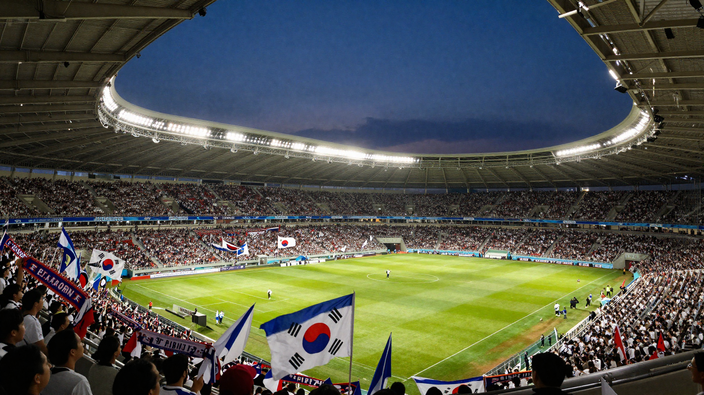

결론부터 말하면요, 축구 직관은 **티켓 예매 → 준비물 챙기기 → 경기 90분 전 도착** 이 세 가지만 지키면 첫 방문이어도 전혀 어렵지 않습니다. 저도 처음 축구 직관을 준비할 때 예매처가 구단마다 다르고, 좌석 이름은 N석·W석처럼 암호 같아서 한참 헤맸어요. 그때 하나하나 찾아보며 정리한 내용을 이 글에 전부 담았습니다. 한 편 읽고 나면 다시 검색할 일이 없게 만드는 게 목표입니다.

📌 3줄 요약
티켓은 구단마다 인터파크 티켓 또는 티켓링크에서 팔고, 보통 경기 며칠 전에 열리니 구단 공식 채널부터 확인합니다.

좌석은 응원 분위기를 원하면 N석, 편하게 경기를 보고 싶으면 W석이나 2층 중앙이 기본 공식입니다.

주류·유리병·캔·600ml 초과 페트병은 K리그 공식 반입금지이니 가방 쌀 때 미리 빼두세요.

## 축구 직관, 뭐부터 하면 되나요?

순서는 딱 세 단계입니다. **① 경기 고르고 티켓 예매 → ② 전날 준비물 챙기기 → ③ 당일 일찍 도착**. 이 흐름만 잡으면 나머지는 디테일이에요.

처음이라면 경기 선택부터가 사실 절반입니다. 라이벌전이나 순위 결정전은 분위기가 최고지만 표 구하기가 어렵고, 평일 저녁 경기는 여유롭게 즐기기 좋습니다. 첫 직관이라면 주말 홈 경기 중에서 너무 치열하지 않은 매치를 고르는 걸 추천해요. 입장부터 응원 문화까지 천천히 둘러볼 여유가 생기거든요.

날짜를 정했다면 그 다음은 예매와 준비물입니다. 아래에서 하나씩 풀어볼게요. 참고로 올 시즌 전체 일정과 구단별 특징이 궁금하다면 [K리그 2026 시즌 가이드](/k-league-2026-guide/)에 따로 정리해 뒀습니다.

## K리그 티켓 예매는 어디서 하나요?

**구단마다 예매처가 다릅니다.** 크게 인터파크 티켓과 티켓링크 두 곳으로 나뉘고, 어느 쪽인지는 응원할 구단의 공식 홈페이지나 SNS 공지에서 확인하는 게 가장 정확해요. 티켓 오픈은 보통 경기 며칠 전(통상 5일 전 안팎)이지만 이것도 구단별로 다릅니다.

제가 직접 찾아보니 예매 흐름 자체는 어느 플랫폼이든 비슷했습니다. **회원가입 → 경기 선택 → 좌석 선택 → 결제 → 모바일 티켓 발급** 순서예요. 여기서 초보가 놓치기 쉬운 포인트 세 가지만 짚을게요.

- **계정은 미리 만들어 두세요.** 인기 경기는 오픈 직후 좋은 자리가 빠지는데, 그 순간에 회원가입을 하고 있으면 늦습니다.
- **구단 멤버십이 있으면 선예매·할인이 붙는 경우가 많습니다.** 한 시즌에 여러 번 갈 계획이라면 가입비를 뽑고도 남아요.
- **취소 수수료를 확인하세요.** 예매 당일 취소는 무료인 경우가 많지만, 다음 날부터는 수수료가 붙습니다. 세부 기준은 예매처·구단마다 다르니 결제 전에 안내 문구를 한 번 읽어두는 게 안전합니다.

💡 매진 경기 팁
서울·전북·울산처럼 인기 구단의 빅매치는 오픈과 동시에 좋은 좌석이 사라집니다. 티켓 오픈 일정에 알람을 걸어두고, 오픈 시각 전에 로그인·결제수단까지 세팅해 두면 성공률이 확 올라갑니다.

## 좌석은 어디가 좋나요? N석·W석·E석·S석 차이

여기서 많이들 헷갈리는데, 축구장 좌석은 방위 이름부터 이해하면 쉽습니다. 골대 뒤가 N석과 S석, 측면이 W석과 E석이에요. 서울월드컵경기장이나 수원 빅버드 같은 대형 구장 기준으로 구역별 특징을 표로 묶어보면 이렇습니다.

| 구역 | 위치 | 특징 | 이런 분께 추천 |
| --- | --- | --- | --- |
| N석 | 골대 뒤 | 홈 서포터즈 응원석. 대부분 서서 응원 | 응원 분위기를 온몸으로 느끼고 싶은 분 |
| W석 | 측면(본부석 쪽) | 벤치 뒤라 선수 가까움. 지붕 있고 해를 등져 쾌적, 중계 카메라와 같은 시점 | 편하게 선수·경기를 보고 싶은 분 |
| E석 | 측면(반대편) | 경기 흐름 보기 좋음. 낮 경기엔 햇빛을 정면으로 받을 수 있음 | 가성비로 넓은 시야를 원하는 분 |
| S석 | 골대 뒤 | 원정석. 원정팀 팬 전용 구역 | 원정팀을 응원하러 가는 분 |

층수도 중요합니다. 아래층 앞자리는 선수 얼굴까지 보이는 대신 전체 흐름이 안 보이고, 위층으로 갈수록 선수는 작아져도 전술 대형이 한눈에 들어와요. 그래서 축구 자체를 보고 싶다면 2층 중앙이 숨은 명당입니다.

단, 이 배치는 어디까지나 일반적인 기준이에요. 일부 구장은 홈 서포터석이 S쪽에 있는 등 예외가 있으니, 예매 화면에서 구단이 제공하는 좌석별 시야 사진을 꼭 확인하고 고르세요.

💡 성향별 한 줄 결정
응원 열기가 궁금하다 → N석. 선수를 가까이 보고 싶다 → W석 아래층. 경기 흐름과 전술이 궁금하다 → W석·E석 2층 중앙. 상대팀 팬이다 → S석.

## 축구 직관 준비물 체크리스트

경기장은 대부분 개방형이라 날씨의 영향을 그대로 받습니다. 그래서 축구 직관 준비물은 **필수템 + 응원템 + 계절템** 세 묶음으로 나눠 챙기는 게 깔끔해요. 제가 표로 묶어보면 이렇습니다.

| 구분 | 준비물 | 메모 |
| --- | --- | --- |
| 필수 | 모바일 티켓, 신분증, 교통카드, 보조배터리 | 티켓 확인·입장이 전부 스마트폰이라 배터리가 생명 |
| 응원 | 머플러, 유니폼 | 머플러는 응원가 때 펼쳐 드는 문화가 있어 하나 있으면 금방 녹아듦 |
| 봄·가을 | 바람막이, 무릎담요 | 해 지면 체감온도가 뚝 떨어짐 |
| 여름 | 모자, 선크림, 얼음물 대용 음료, 부채 | 낮 경기 E석은 직사광선 주의 |
| 겨울 | 패딩, 핫팩, 담요, 장갑 | 콘크리트 좌석 냉기가 상당함 |
| 우천 | 우비 | 우산은 뒷사람 시야를 가려서 우비가 매너 |

하나 더, 좌석이 딱딱한 플라스틱이라 오래 앉으면 허리가 아픕니다. 휴대용 방석이 있으면 만족도가 확 올라가요. 아이와 함께라면 귀마개(응원 소음 대비)와 간단한 간식, 물티슈까지 챙기면 완벽합니다.

## 경기장 반입금지 물품, 뭐가 안 되나요?

입구에서 보안 검색을 하기 때문에 반입금지 물품을 들고 가면 버리거나 물품보관소에 맡겨야 합니다. [한국프로축구연맹](https://www.kleague.com/)의 K리그 안전 가이드라인에 명시된 대표 항목은 다음과 같아요.

⚠️ K리그 공식 반입금지 물품
주류 일체 — 경기장 안에서 공식 판매하는 것만 허용됩니다.

유리병·캔류·600ml 초과 페트병 — 연맹·구단이 인정하는 개인 음료 용기는 예외입니다.

그 밖에 무기·화약류, 정치·종교·차별적 표현물, 대형풍선처럼 관람을 방해하는 물품, 반려동물도 금지입니다.

저도 처음엔 캔커피 하나쯤은 괜찮겠지 싶었는데, 캔은 재질 자체가 금지라 입구에서 걸립니다. 음료는 600ml 이하 페트나 텀블러류로 준비하는 게 마음 편해요. 외부 음식 반입은 구단·구장마다 정책이 달라서, 방문 전에 해당 구단 공지를 한 번 확인하는 걸 권합니다.

## 경기 당일 타임라인 — 몇 시까지 도착해야 하나요?

**킥오프 90분~2시간 전 도착이 정답입니다.** 보안 검색과 입장 대기 줄이 생각보다 길고, 일찍 가야만 볼 수 있는 장면들이 있거든요. 제가 정리해본 첫 직관 추천 타임라인은 이렇습니다.

| 시각 | 할 일 |
| --- | --- |
| 킥오프 2시간 전 | 경기장 도착, 굿즈샵·먹거리 구경 |
| 90분 전 | 입장(보안 검색), 좌석 확인 |
| 60분 전 | 선수들 몸 푸는 모습 관람 — W석이면 눈앞에서 보임 |
| 30분 전 | 화장실 다녀오기, 라인업 발표 확인 |
| 킥오프 | 응원 시작 |
| 종료 후 | 인파 빠질 때까지 10~15분 여유 있게 이동 |

교통은 대중교통이 진리입니다. 경기 전후로 경기장 주변 도로가 마비 수준으로 막히는 데다 주차장 빠져나오는 데만 한참 걸려요. 화장실은 하프타임에 줄이 가장 기니, 전반 종료 5분 전쯤 미리 다녀오는 게 요령입니다.

## 처음이라 걱정되는 응원 문화와 직관 에티켓

처음 가면 응원가를 몰라서 뻘쭘할까 봐 걱정되죠? 전혀 문제없습니다. 박수와 환호만으로도 충분하고, 응원가는 두세 곡만 미리 들어봐도 현장에서 금방 따라 부르게 돼요. 구단 공식 유튜브에 응원가 모음이 올라와 있으니 이동하는 길에 들어보세요.

딱 하나 조심할 게 있다면 **유니폼과 응원 위치**입니다. 홈 구역(특히 N석)에서 상대팀 유니폼을 입거나 상대 선수를 대놓고 응원하는 건 갈등의 씨앗이 됩니다. 상대팀 팬이라면 원정석(S석)으로 가는 게 서로 편하고, 중립 팬이라면 W석·E석에서 조용히 즐기면 됩니다. 골 장면에서 일어나는 것 정도는 자연스러우니 너무 긴장하지 않아도 괜찮아요.

경기 후 선수를 가까이서 보고 싶다면 W석 쪽 선수단 출입구 근처에서 기다리는 방법이 있습니다. 구장 구조에 따라 안 되는 곳도 있지만, 되는 구장에서는 경기 종료 30분쯤 뒤 퇴근길 선수들을 만날 수 있어요.

## 한눈에 정리 — 첫 축구 직관 최종 체크

마지막으로 이 글 전체를 표 하나로 압축하면 이렇습니다. 저장해 두고 가기 전날 밤 체크리스트로 쓰세요.

| 항목 | 핵심 |
| --- | --- |
| 예매 | 구단 공식 채널에서 예매처(인터파크·티켓링크) 확인, 오픈 알람 |
| 좌석 | 응원=N석, 관전=W석·2층 중앙, 원정팬=S석 |
| 준비물 | 모바일 티켓·신분증·보조배터리 + 계절템 + 방석 |
| 반입금지 | 주류·유리병·캔·600ml 초과 페트병 |
| 도착 | 킥오프 90분~2시간 전, 대중교통 이용 |
| 에티켓 | 홈 구역에서 상대팀 응원 금지, 우천 시 우비 |

이거 하나만 기억하면 돼요. **예매는 미리, 도착은 일찍, 캔과 술은 두고 가기.** 이 세 가지만 지키면 첫 축구 직관도 열 번째 직관처럼 즐길 수 있습니다. 경기장에서 직접 듣는 함성은 중계 화면과는 완전히 다른 세계라서, 한 번 다녀오면 아마 다음 경기를 검색하고 있을 거예요.

## 자주 묻는 질문 (FAQ)

**Q. 축구 직관 혼자 가도 괜찮나요?** 전혀 문제없습니다. 혼자 오는 관중이 생각보다 많고, 특히 N석은 다 같이 응원하는 분위기라 혼자여도 금방 어울리게 됩니다. 요즘은 축구 직관 데이트로 오는 커플도 많은데, 대화하며 편하게 보고 싶다면 W석이나 E석 2층처럼 차분한 구역이 무난합니다.

**Q. K리그 티켓 가격은 보통 얼마인가요?** 구단·좌석·경기마다 달라 하나로 말하긴 어렵지만, 골대 뒤 응원석이 가장 저렴하고 측면 지정석·테이블석으로 갈수록 비싸지는 구조는 공통입니다. 일반석은 대체로 1만원대에서 3만원대 사이에 형성되는 경우가 많고, 빅매치나 프리미엄석은 그 이상으로 올라갑니다. 정확한 금액은 예매 화면에서 좌석별로 확인하는 게 가장 확실합니다.

**Q. 비 오는 날 축구 직관은 어떻게 준비하나요?** 우비가 답입니다. 우산은 뒷사람 시야를 가려 매너에 어긋나고, 개방형 구장은 지붕이 있어도 바람에 비가 들이칩니다. 좌석을 고를 수 있다면 지붕 덮인 W석 위쪽 열이 가장 안전합니다.

**Q. 경기장에 음식 싸 가도 되나요?** 구단·구장마다 정책이 다릅니다. 주류·유리병·캔·600ml 초과 페트병은 공통으로 금지이고, 그 외 음식물은 허용하는 곳과 제한하는 곳이 갈리니 방문 전 해당 구단 공지를 확인하는 게 확실합니다.

**Q. 유니폼 없이 가도 어색하지 않나요?** 네, 괜찮습니다. 평상복 관중도 많아서 전혀 어색하지 않아요. 분위기에 더 녹아들고 싶다면 유니폼보다 머플러 하나를 먼저 장만하는 걸 추천합니다. 가격 부담이 적고 응원할 때 활용도가 가장 높거든요.

---

**관련 키워드** — #축구직관 #축구직관준비물 #K리그직관 #K리그티켓예매 #축구장좌석추천 #서포터석 #원정석 #경기장반입금지물품 #직관꿀팁 #축구직관데이트 #직관복장 #첫직관
