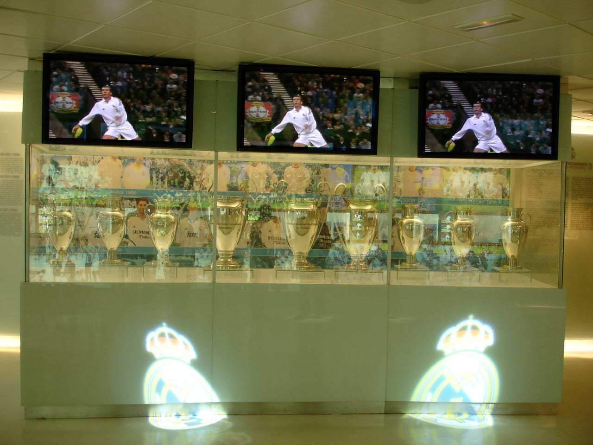

📌 3줄 요약
축구 트로피 종류는 크게 국가대표(월드컵·유로·코파)와 클럽(챔피언스리그·유로파·리그·FA컵)으로 갈리고, 발롱도르 같은 개인상은 따로입니다.

가장 권위 있는 둘은 국가대표의 FIFA 월드컵 트로피(18K 금)와 클럽의 챔피언스리그 빅 이어(은)입니다.

우승해도 진짜 원본을 영구히 갖는 경우는 드뭅니다. 대부분 복제품을 받고 원본은 협회가 보관합니다.

축구를 보다 보면 우승팀이 들어 올리는 트로피가 다 달라서 헷갈리죠. 솔직히 저도 처음엔 월드컵 트로피랑 챔피언스리그 트로피가 뭐가 다른지, 우승하면 저 금트로피를 진짜 집에 가져가는 건지 한참 헷갈렸어요. 결론부터 말하면요, **축구 트로피 종류**는 누가 겨루느냐(국가대표냐 클럽이냐)로 먼저 나누면 깔끔하게 정리됩니다. 이 글에서는 주요 트로피의 재질·무게·별명부터, 많이들 궁금해하는 "영구 소장 규칙"까지 제가 자료를 직접 찾아 표로 묶어봤습니다. 이거 한 편 읽으면 다시는 안 헷갈릴 거예요.

## 축구 트로피, 먼저 두 갈래로 나눠보세요

여기서 많이들 헷갈리는데, 트로피를 외우려 하지 말고 **누가 겨루는 대회인지**로 나누면 쉽습니다. 크게 세 묶음입니다.

- **국가대표 트로피** — FIFA 월드컵 트로피, 유로(유럽선수권), 코파 아메리카(남미) 등 나라끼리 겨루는 대회의 우승컵.
- **클럽 트로피** — UEFA 챔피언스리그(빅 이어), 유로파리그 같은 대륙 클럽 대회, 그리고 프리미어리그·분데스리가 같은 각국 리그 우승 트로피와 FA컵 같은 컵대회 우승컵.
- **개인상** — 발롱도르처럼 팀이 아니라 선수 개인에게 주는 상. 흔히 "트로피"라 부르지만 성격이 다릅니다.

이렇게 세 칸으로 나눠 놓고 보면, 새로운 트로피를 봐도 "아, 이건 클럽 대륙 대회 쪽이구나" 하고 위치를 잡을 수 있습니다. 그럼 가장 권위 있는 것부터 하나씩 보겠습니다.

## FIFA 월드컵 트로피 — 18K 금으로 만든 정점

국가대표 축구의 정점은 단연 **FIFA 월드컵 트로피**입니다. 두 사람이 지구를 떠받치는 형상인데, 제가 자료를 찾아보니 18캐럿(75%) 금에 받침대는 초록색 공작석(말라카이트)으로 되어 있고, 높이는 약 36.8cm, 무게는 약 6.175kg입니다. 1974년 대회부터 쓰였고, 이탈리아의 실비오 가자니가가 디자인했습니다.

여기서 많이들 오해하는 부분. 저도 우승국이 이 금트로피를 영구히 가져가는 줄 알았거든요. 그런데 지금은 **원본은 FIFA가 보관하고, 우승국은 도금된 복제품(위너스 트로피)을 받습니다.** 받침대 바닥에는 우승국 이름을 새기는데, 공간이 차서 2014년부터는 하단을 원형으로 교체해 더 많은 우승국을 새길 수 있게 했습니다.

지금 트로피 이전에는 **쥘리메컵**(Jules Rimet Cup)이 있었습니다. 1930년부터 1970년까지 쓰였고, 규정상 세 번 우승한 나라가 영구 소장하게 되어 있어 1970년 브라질이 가져갔죠. 그런데 이 트로피는 1983년 도난당한 뒤 끝내 회수되지 못했습니다. 지금의 "영구 소장 불가" 규정이 생긴 배경에는 이런 역사도 깔려 있습니다.

## 빅 이어 — UEFA 챔피언스리그 트로피

클럽 축구에서 가장 권위 있는 트로피가 바로 **빅 이어**(Big Ear)입니다. UEFA 챔피언스리그 우승컵인데, 양옆 손잡이가 사람 귀처럼 크게 달려 있어서 "큰 귀"라는 별명이 붙었어요. 영어로 그대로 "Big Ears", 스페인에서는 "라 오레호나"라고 부릅니다.

제가 스펙을 찾아보니 빅 이어는 은(silver)으로 만들어졌고 높이는 약 74cm로, 월드컵 트로피보다 훨씬 큽니다. 무게는 자료에 따라 차이가 있는데 대략 11kg 안팎으로 전해집니다. 1967년부터 지금 디자인이 쓰였고, 스위스 베른의 보석세공사 위르크 슈타델만이 만들었습니다.

*▲ 챔피언스리그(빅 이어) 트로피 — 사진 ⓒ Ian Dick, CC BY 2.0 (Wikimedia Commons)*

빅 이어도 예전에는 영구 소장 규칙이 있었습니다. 한 클럽이 5번 우승하거나 3연패하면 원본을 가질 수 있었죠. 그래서 레알 마드리드·아약스·바이에른·AC밀란·리버풀 같은 팀이 원본을 받기도 했습니다. 다만 이 규정은 2008-09 시즌 이후 폐지됐고, 지금은 원본을 UEFA가 보관하면서 우승팀은 다음 시즌 추첨 전까지만 원본을 보유하고 이후엔 복제품을 갖습니다.

## 그 밖의 주요 트로피 — 유로파리그·유로·코파·FA컵

정점만 있는 게 아닙니다. 알아두면 중계가 더 재미있어지는 트로피들을 모아봤어요.

- **UEFA 유로파리그 트로피** — 챔피언스리그 다음가는 유럽 클럽 대회 우승컵입니다. 월드컵 트로피를 만든 실비오 가자니가가 1972년에 디자인했고, 은 재질에 무게가 약 15kg으로 주요 클럽 트로피 중에서도 묵직한 편입니다.
- **유로(UEFA 유럽선수권) 트로피** — 정식 명칭은 **앙리 들로네컵**(Henri Delaunay Cup)으로, 대회 창설을 주도한 인물의 이름을 땄습니다.
- **코파 아메리카 트로피** — 남미 국가대항전 우승컵으로, 국가대표 대회 중 역사가 매우 오래된 축에 듭니다.
- **FA컵 트로피** — 잉글랜드의 컵대회로, 축구에서 가장 오래된 대회 트로피 중 하나로 꼽힙니다. 현재 디자인은 1911년 브래드퍼드의 패토리니 앤드 선스가 만들었고 높이는 약 61.5cm입니다.

각국 리그 우승 트로피(프리미어리그·분데스리가·라리가 등)도 저마다 디자인과 별명이 있습니다. 이렇게 보면 "축구 트로피"라는 한 단어 안에 정말 다양한 컵이 들어 있는 셈이에요.

## 트로피 영구 소장 규칙 — 진짜 가져갈 수 있을까

많이들 궁금해하는 부분만 따로 묶었습니다. 결론부터 말하면, **요즘 주요 트로피는 원본을 영구히 가져가지 못하는 쪽으로 정리됐습니다.**

월드컵 트로피는 앞서 봤듯 원본을 FIFA가 보관하고 우승국은 복제품을 받습니다. 빅 이어도 2008-09 이후 영구 소장 규정이 사라졌어요. FA컵은 우승팀이 일정 기간 보관하지만 매년 정해진 시점까지 협회에 반환해야 합니다. 즉 트로피를 번쩍 들어 올리는 그 순간의 감동은 진짜지만, 그 원본을 집 거실에 영원히 두는 그림은 대부분 사실이 아닌 거죠.

그래서 우승팀들은 공식 복제품(레플리카)을 제작해 구단 박물관에 전시하는 경우가 많습니다. 맨체스터·밀라노 같은 도시의 구단 박물관에 가면 이런 복제 트로피들을 볼 수 있는 이유입니다.

## 트로피 vs 개인상 — 발롱도르는 트로피가 아니다

마지막으로 자주 섞이는 지점 하나. 저도 트로피에 상금이 붙는 줄, 그리고 발롱도르도 팀 우승컵의 한 종류인 줄 알았거든요. 그런데 **발롱도르**(Ballon d'Or)는 팀 트로피가 아니라 **선수 개인에게 주는 상**입니다. 프랑스 매체 프랑스풋볼이 1956년부터 그 시즌 가장 뛰어난 선수에게 수여하는 상으로, 황금 공 모양이라 "골든 볼"로도 불립니다.

그래서 발롱도르는 대회 우승과 직접 연결되지 않습니다. 소속팀이 우승하지 못해도 개인 활약이 압도적이면 받을 수 있죠. 같은 "황금빛 트로피"라도 월드컵 트로피·빅 이어가 **팀의 우승**을 상징한다면, 발롱도르는 **개인의 한 시즌**을 상징합니다.

이 구분만 잡아도 "이 선수는 발롱도르는 받았는데 왜 챔스 우승은 없지?" 같은 이야기가 자연스럽게 이해됩니다. 트로피의 주인이 팀이냐 개인이냐가 핵심이에요.

## 한눈에 정리 — 주요 축구 트로피 비교표

제가 위 내용을 표로 묶어봤습니다(수치는 자료에 따라 약간씩 차이가 있어 대략값으로 봐 주세요).

| 트로피 | 대회 | 구분 | 재질 | 대략 크기·무게 |
| --- | --- | --- | --- | --- |
| FIFA 월드컵 트로피 | 월드컵 | 국가대표 | 18K 금 | 약 36.8cm · 6.175kg |
| 빅 이어 | 챔피언스리그 | 클럽(대륙) | 은 | 약 74cm · 약 11kg |
| 유로파리그 트로피 | 유로파리그 | 클럽(대륙) | 은 | 약 15kg |
| 앙리 들로네컵 | 유로 | 국가대표 | 은 | — |
| FA컵 트로피 | FA컵 | 클럽(컵대회) | 은 | 약 61.5cm |
| 발롱도르 | 개인상 | 선수 개인 | 금빛 공 | — |

## 자주 묻는 질문(FAQ)

**Q. 월드컵 우승국은 진짜 금트로피를 가져가나요?**
A. 아닙니다. 원본은 FIFA가 보관하고, 우승국은 도금된 복제품인 위너스 트로피를 받습니다. 과거 쥘리메컵 시절에는 세 번 우승하면 영구 소장이 가능했지만, 그 트로피가 도난당한 이후 지금 방식으로 바뀌었습니다.

**Q. 챔피언스리그 트로피를 왜 빅 이어라고 부르나요?**
A. 트로피 양옆에 달린 손잡이가 사람 귀처럼 크고 둥글게 생겨서 "큰 귀(Big Ear)"라는 별명이 붙었습니다. 정식 명칭은 유러피언 챔피언 클럽스 컵이지만, 팬들 사이에서는 빅 이어로 더 많이 불립니다.

**Q. 월드컵 트로피와 빅 이어 중 뭐가 더 큰가요?**
A. 크기는 빅 이어가 훨씬 큽니다. 빅 이어는 높이 약 74cm인 반면 월드컵 트로피는 약 36.8cm입니다. 다만 월드컵 트로피는 18K 금으로 만들어 권위와 상징성에서 정점으로 꼽힙니다.

**Q. 발롱도르도 트로피인가요?**
A. 발롱도르는 팀 우승 트로피가 아니라 선수 개인에게 주는 상입니다. 프랑스풋볼이 1956년부터 그 시즌 최고의 선수에게 수여합니다. 대회 우승과 별개로 개인 활약을 기준으로 뽑습니다.

## 정리 — 이거 하나만 기억하세요

축구 트로피 종류는 **국가대표·클럽·개인상** 세 칸으로 나누면 끝입니다. 국가대표의 정점은 18K 금으로 만든 월드컵 트로피, 클럽의 정점은 은으로 만든 빅 이어, 그리고 발롱도르는 팀이 아니라 선수 개인의 상이라는 것. 여기에 "요즘은 원본을 영구히 가져가지 못한다"는 사실만 더하면, 어떤 우승 장면을 봐도 저 트로피가 뭔지 바로 감이 올 겁니다. 트로피와 상금이 어떻게 다른지 더 궁금하면 [2026 월드컵 상금 규모와 역대 우승국](/worldcup-2026-prize-money-champions/) 글도 같이 보세요. 더 자세한 월드컵 트로피 이야기는 [FIFA 월드컵 트로피의 12가지 사실](https://www.coca-cola.com/kr/ko/about-us/history/fifaworldcuptrophy)에서도 확인할 수 있습니다.

## 이미지 출처

- 대표 이미지(FIFA 월드컵 트로피) — 사진 ⓒ Ank Kumar, CC BY-SA 4.0 (Wikimedia Commons)
- 본문 이미지(챔피언스리그 빅 이어 트로피) — 사진 ⓒ Ian Dick, CC BY 2.0 (Wikimedia Commons)

---

**관련 키워드** — #축구트로피종류 #월드컵트로피 #빅이어 #챔피언스리그트로피 #쥘리메컵 #트로피영구소장 #발롱도르 #유로파리그트로피 #FA컵트로피 #월드컵트로피재질 #축구우승컵 #앙리들로네컵
